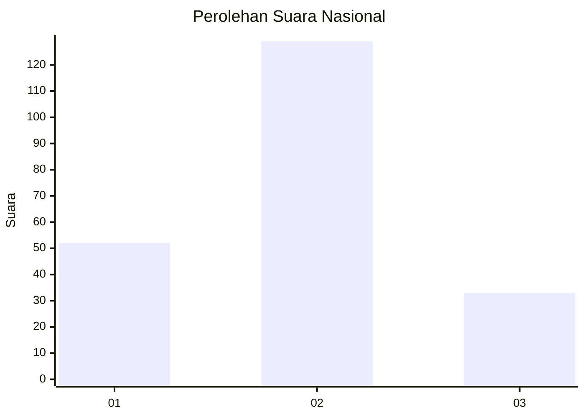

# Hasil

## Grafik

## Tabel

| No.    | Nama Paslon    | Suara | Suara (raw) | Persentase |
|:------ |:-------------- | -----:| -----------:| ----------:|
| 100025 | ANIES MUHAIMIN | 52    | [52][p-1]   | 24,30      |
| 100026 | PRABOWO GIBRAN | 129   | [129][p-2]  | 60,28      |
| 100027 | GANJAR MAHFUD  | 33    | [33][p-3]   | 15,42      |

[p-1]: https://github.com/gigit-pemilu/pemilu-2024/blob/main/pilpres/hitung-suara/sub/31-dki-jakarta/sub/73-jakarta-barat/sub/01-cengkareng/sub/1005-kapuk/sub/449-tps/sub/paslon-1.txt
[p-2]: https://github.com/gigit-pemilu/pemilu-2024/blob/main/pilpres/hitung-suara/sub/31-dki-jakarta/sub/73-jakarta-barat/sub/01-cengkareng/sub/1005-kapuk/sub/449-tps/sub/paslon-2.txt
[p-3]: https://github.com/gigit-pemilu/pemilu-2024/blob/main/pilpres/hitung-suara/sub/31-dki-jakarta/sub/73-jakarta-barat/sub/01-cengkareng/sub/1005-kapuk/sub/449-tps/sub/paslon-3.txt

## Foto C Plano

https://sirekap-obj-formc.kpu.go.id/6b46/pemilu/ppwp/31/73/01/10/05/3173011005449-20240214-155657--b553d64d-6d84-4643-8474-97688cf8296d.jpg

https://sirekap-obj-formc.kpu.go.id/6b46/pemilu/ppwp/31/73/01/10/05/3173011005449-20240214-155507--2d1a0722-c295-472d-aa68-7aeac3a7873f.jpg

https://sirekap-obj-formc.kpu.go.id/6b46/pemilu/ppwp/31/73/01/10/05/3173011005449-20240214-160129--0f3fee35-d7b1-41d2-a085-72501756645b.jpg

## Metadata

| Key        | Value               |
| ---------- | ------------------- |
| Time Stamp | 2024-02-19 06:16:00 |

