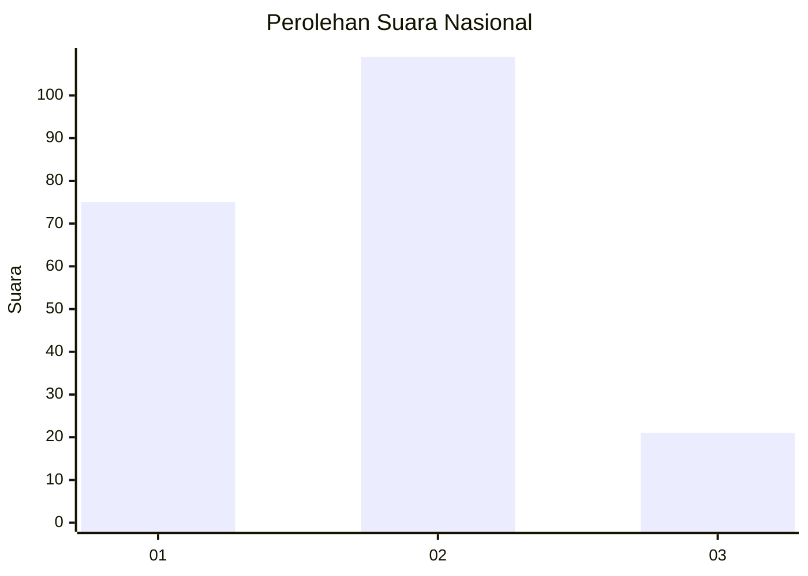

# Hasil

## Grafik

## Tabel

| No.    | Nama Paslon    | Suara | Suara (raw) | Persentase |
|:------ |:-------------- | -----:| -----------:| ----------:|
| 100025 | ANIES MUHAIMIN | 75    | [75][p-1]   | 36,59      |
| 100026 | PRABOWO GIBRAN | 109   | [109][p-2]  | 53,17      |
| 100027 | GANJAR MAHFUD  | 21    | [21][p-3]   | 10,24      |

[p-1]: https://github.com/gigit-pemilu/pemilu-2024/blob/main/pilpres/hitung-suara/sub/31-dki-jakarta/sub/73-jakarta-barat/sub/01-cengkareng/sub/1006-cengkareng-timur/sub/024-tps/sub/paslon-1.txt
[p-2]: https://github.com/gigit-pemilu/pemilu-2024/blob/main/pilpres/hitung-suara/sub/31-dki-jakarta/sub/73-jakarta-barat/sub/01-cengkareng/sub/1006-cengkareng-timur/sub/024-tps/sub/paslon-2.txt
[p-3]: https://github.com/gigit-pemilu/pemilu-2024/blob/main/pilpres/hitung-suara/sub/31-dki-jakarta/sub/73-jakarta-barat/sub/01-cengkareng/sub/1006-cengkareng-timur/sub/024-tps/sub/paslon-3.txt

## Foto C Plano

https://sirekap-obj-formc.kpu.go.id/0436/pemilu/ppwp/31/73/01/10/06/3173011006024-20240215-010521--6f624d0f-e7c4-4992-b498-97422089845b.jpg

https://sirekap-obj-formc.kpu.go.id/0436/pemilu/ppwp/31/73/01/10/06/3173011006024-20240215-035007--c03ca402-c207-4a16-82aa-abbc386ab225.jpg

https://sirekap-obj-formc.kpu.go.id/0436/pemilu/ppwp/31/73/01/10/06/3173011006024-20240215-010840--7ef55794-3e14-4ab5-b42c-c2c17ac9f33d.jpg

## Metadata

| Key        | Value               |
| ---------- | ------------------- |
| Time Stamp | 2024-02-17 19:30:00 |

