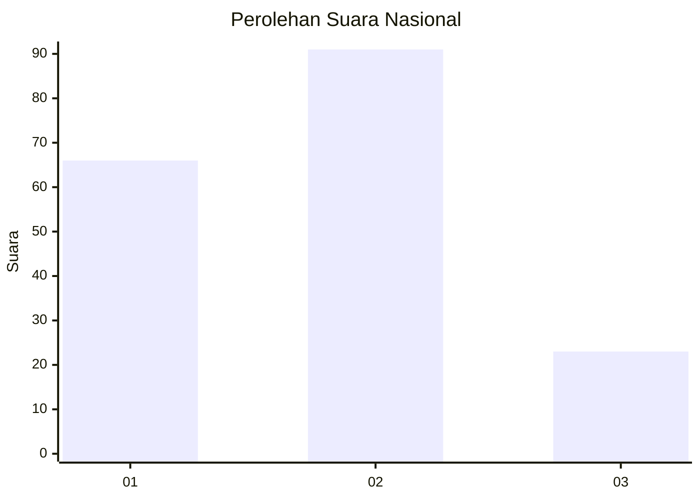
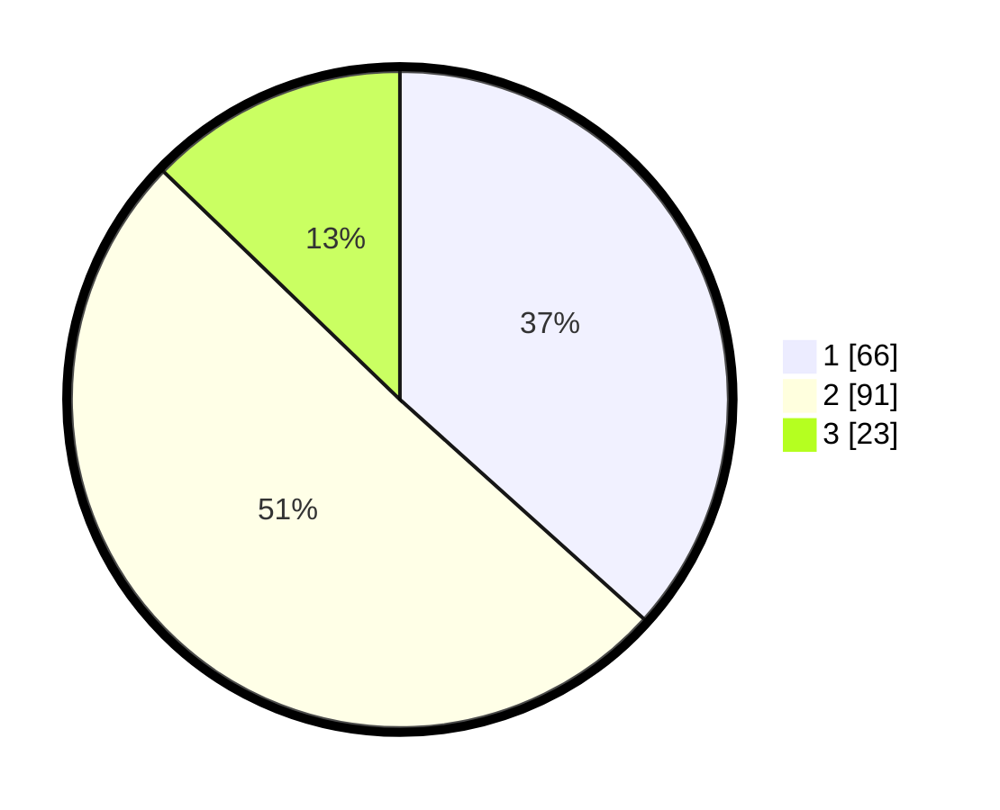

# Hasil

## Grafik

## Tabel

| No.    | Nama Paslon    | Suara | Suara (raw) | Persentase |
|:------ |:-------------- | -----:| -----------:| ----------:|
| 100025 | ANIES MUHAIMIN | 66    | [66][p-1]   | 36,67      |
| 100026 | PRABOWO GIBRAN | 91    | [91][p-2]   | 50,56      |
| 100027 | GANJAR MAHFUD  | 23    | [23][p-3]   | 12,78      |

[p-1]: https://github.com/gigit-pemilu/pemilu-2024/blob/main/pilpres/hitung-suara/sub/31-dki-jakarta/sub/73-jakarta-barat/sub/01-cengkareng/sub/1006-cengkareng-timur/sub/025-tps/sub/paslon-1.txt
[p-2]: https://github.com/gigit-pemilu/pemilu-2024/blob/main/pilpres/hitung-suara/sub/31-dki-jakarta/sub/73-jakarta-barat/sub/01-cengkareng/sub/1006-cengkareng-timur/sub/025-tps/sub/paslon-2.txt
[p-3]: https://github.com/gigit-pemilu/pemilu-2024/blob/main/pilpres/hitung-suara/sub/31-dki-jakarta/sub/73-jakarta-barat/sub/01-cengkareng/sub/1006-cengkareng-timur/sub/025-tps/sub/paslon-3.txt

## Foto C Plano

https://sirekap-obj-formc.kpu.go.id/cc38/pemilu/ppwp/31/73/01/10/06/3173011006025-20240214-225948--3d207a76-7077-4027-ad80-1d3a37a22b7b.jpg

https://sirekap-obj-formc.kpu.go.id/cc38/pemilu/ppwp/31/73/01/10/06/3173011006025-20240214-230107--db98934e-5651-4017-a7c9-7a676f57ee2e.jpg

https://sirekap-obj-formc.kpu.go.id/cc38/pemilu/ppwp/31/73/01/10/06/3173011006025-20240214-213131--1d0d35cb-a6e0-4492-b597-90e4ed994c42.jpg

## Metadata

| Key        | Value               |
| ---------- | ------------------- |
| Time Stamp | 2024-02-21 16:00:00 |

