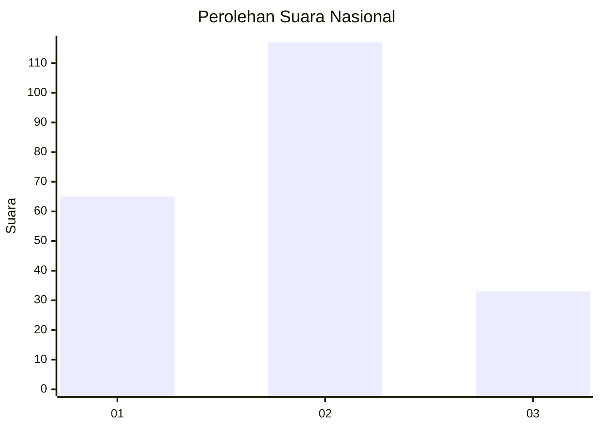
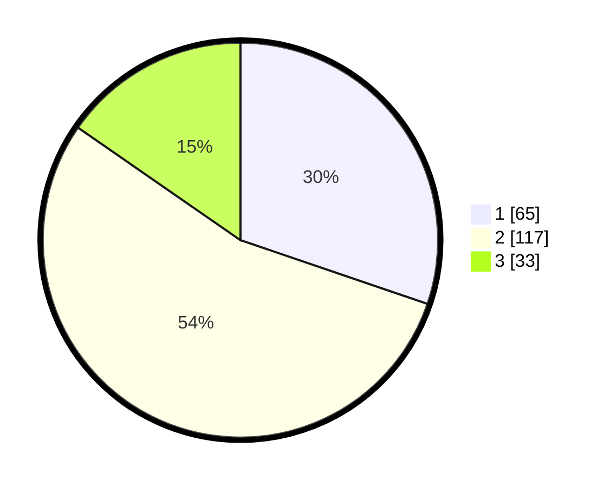

# Hasil

## Grafik

## Tabel

| No.    | Nama Paslon    | Suara | Suara (raw) | Persentase |
|:------ |:-------------- | -----:| -----------:| ----------:|
| 100025 | ANIES MUHAIMIN | 65    | [65][p-1]   | 30,23      |
| 100026 | PRABOWO GIBRAN | 117   | [117][p-2]  | 54,42      |
| 100027 | GANJAR MAHFUD  | 33    | [33][p-3]   | 15,35      |

[p-1]: https://github.com/gigit-pemilu/pemilu-2024/blob/main/pilpres/hitung-suara/sub/31-dki-jakarta/sub/73-jakarta-barat/sub/01-cengkareng/sub/1006-cengkareng-timur/sub/026-tps/sub/paslon-1.txt
[p-2]: https://github.com/gigit-pemilu/pemilu-2024/blob/main/pilpres/hitung-suara/sub/31-dki-jakarta/sub/73-jakarta-barat/sub/01-cengkareng/sub/1006-cengkareng-timur/sub/026-tps/sub/paslon-2.txt
[p-3]: https://github.com/gigit-pemilu/pemilu-2024/blob/main/pilpres/hitung-suara/sub/31-dki-jakarta/sub/73-jakarta-barat/sub/01-cengkareng/sub/1006-cengkareng-timur/sub/026-tps/sub/paslon-3.txt

## Foto C Plano

https://sirekap-obj-formc.kpu.go.id/b4cd/pemilu/ppwp/31/73/01/10/06/3173011006026-20240214-234422--f8fe5124-3107-44ae-adf2-39ba7180f317.jpg

https://sirekap-obj-formc.kpu.go.id/b4cd/pemilu/ppwp/31/73/01/10/06/3173011006026-20240214-234425--e9580483-8616-4a70-b572-4d2b9dcdd428.jpg

https://sirekap-obj-formc.kpu.go.id/b4cd/pemilu/ppwp/31/73/01/10/06/3173011006026-20240214-234429--78d82cb7-eec7-4567-a1fb-e78498d19d4c.jpg

## Metadata

| Key        | Value               |
| ---------- | ------------------- |
| Time Stamp | 2024-02-17 19:30:00 |

