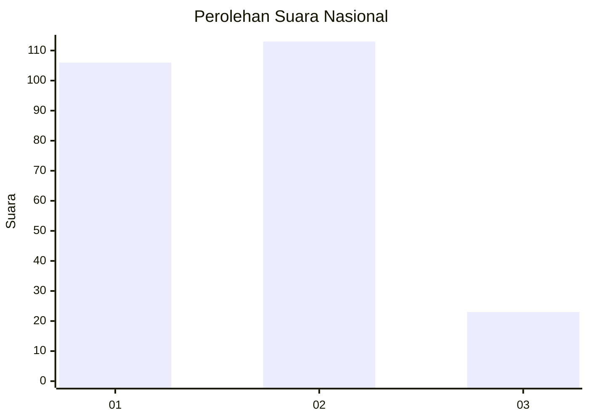
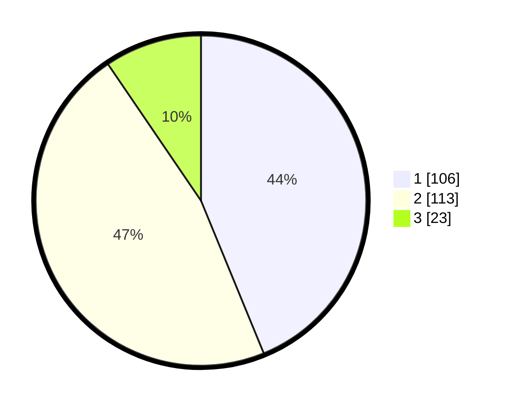

# Hasil

## Grafik

## Tabel

| No.    | Nama Paslon    | Suara | Suara (raw) | Persentase |
|:------ |:-------------- | -----:| -----------:| ----------:|
| 100025 | ANIES MUHAIMIN | 106   | [106][p-1]  | 43,80      |
| 100026 | PRABOWO GIBRAN | 113   | [113][p-2]  | 46,69      |
| 100027 | GANJAR MAHFUD  | 23    | [23][p-3]   | 9,50       |

[p-1]: https://github.com/gigit-pemilu/pemilu-2024/blob/main/pilpres/hitung-suara/sub/31-dki-jakarta/sub/73-jakarta-barat/sub/01-cengkareng/sub/1006-cengkareng-timur/sub/048-tps/sub/paslon-1.txt
[p-2]: https://github.com/gigit-pemilu/pemilu-2024/blob/main/pilpres/hitung-suara/sub/31-dki-jakarta/sub/73-jakarta-barat/sub/01-cengkareng/sub/1006-cengkareng-timur/sub/048-tps/sub/paslon-2.txt
[p-3]: https://github.com/gigit-pemilu/pemilu-2024/blob/main/pilpres/hitung-suara/sub/31-dki-jakarta/sub/73-jakarta-barat/sub/01-cengkareng/sub/1006-cengkareng-timur/sub/048-tps/sub/paslon-3.txt

## Foto C Plano

https://sirekap-obj-formc.kpu.go.id/40b1/pemilu/ppwp/31/73/01/10/06/3173011006048-20240214-203426--e84dcf6f-65b8-463a-88c4-7cb435500aa5.jpg

https://sirekap-obj-formc.kpu.go.id/40b1/pemilu/ppwp/31/73/01/10/06/3173011006048-20240214-212101--f0c3f176-7d43-438c-847e-f15370d70d13.jpg

https://sirekap-obj-formc.kpu.go.id/40b1/pemilu/ppwp/31/73/01/10/06/3173011006048-20240214-212211--8129bd4e-2282-45ce-a37d-706a26c57fde.jpg

## Metadata

| Key        | Value               |
| ---------- | ------------------- |
| Time Stamp | 2024-02-17 19:30:00 |

