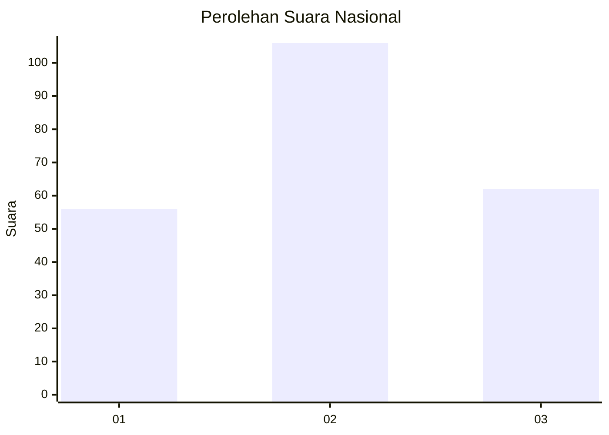
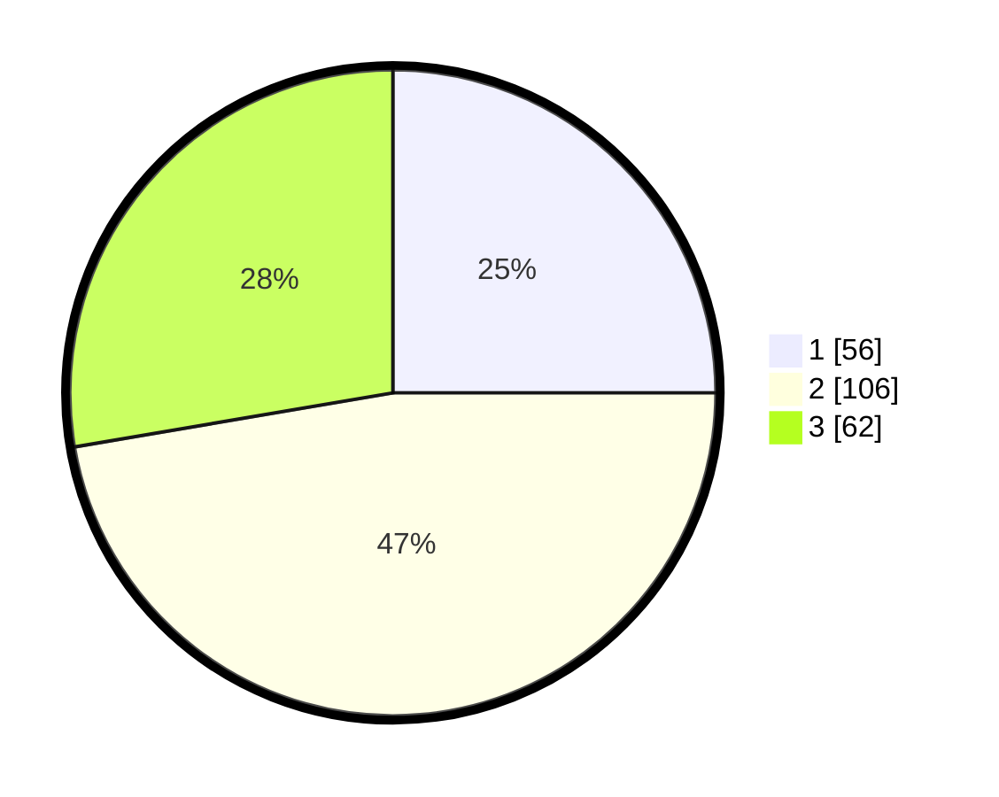

# Hasil

## Grafik

## Tabel

| No.    | Nama Paslon    | Suara | Suara (raw) | Persentase |
|:------ |:-------------- | -----:| -----------:| ----------:|
| 100025 | ANIES MUHAIMIN | 56    | [56][p-1]   | 25,00      |
| 100026 | PRABOWO GIBRAN | 106   | [106][p-2]  | 47,32      |
| 100027 | GANJAR MAHFUD  | 62    | [62][p-3]   | 27,68      |

[p-1]: https://github.com/gigit-pemilu/pemilu-2024/blob/main/pilpres/hitung-suara/sub/31-dki-jakarta/sub/73-jakarta-barat/sub/01-cengkareng/sub/1006-cengkareng-timur/sub/055-tps/sub/paslon-1.txt
[p-2]: https://github.com/gigit-pemilu/pemilu-2024/blob/main/pilpres/hitung-suara/sub/31-dki-jakarta/sub/73-jakarta-barat/sub/01-cengkareng/sub/1006-cengkareng-timur/sub/055-tps/sub/paslon-2.txt
[p-3]: https://github.com/gigit-pemilu/pemilu-2024/blob/main/pilpres/hitung-suara/sub/31-dki-jakarta/sub/73-jakarta-barat/sub/01-cengkareng/sub/1006-cengkareng-timur/sub/055-tps/sub/paslon-3.txt

## Foto C Plano

https://sirekap-obj-formc.kpu.go.id/fdaf/pemilu/ppwp/31/73/01/10/06/3173011006055-20240214-194324--f3d4cf04-2790-46d8-804b-1554f22b24d9.jpg

https://sirekap-obj-formc.kpu.go.id/fdaf/pemilu/ppwp/31/73/01/10/06/3173011006055-20240214-194430--023dca56-46e0-4dca-a56c-430b935add42.jpg

https://sirekap-obj-formc.kpu.go.id/fdaf/pemilu/ppwp/31/73/01/10/06/3173011006055-20240214-234034--f5b5069b-215a-4fac-85d3-11cec4859fd3.jpg

## Metadata

| Key        | Value               |
| ---------- | ------------------- |
| Time Stamp | 2024-02-15 03:06:03 |

