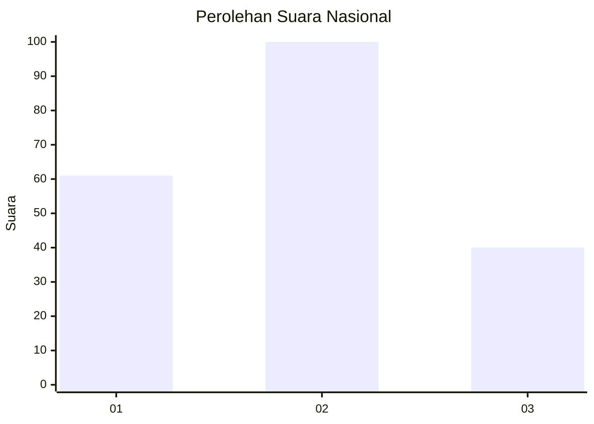
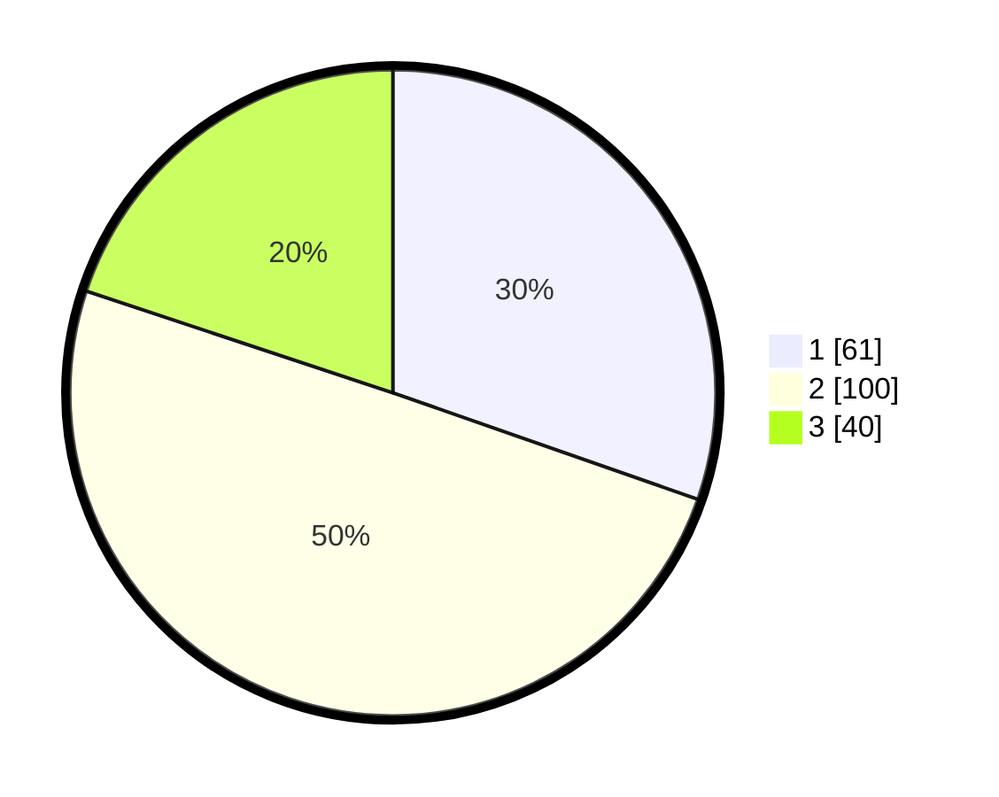

# Hasil

## Grafik

## Tabel

| No.    | Nama Paslon    | Suara | Suara (raw) | Persentase |
|:------ |:-------------- | -----:| -----------:| ----------:|
| 100025 | ANIES MUHAIMIN | 61    | [61][p-1]   | 30,35      |
| 100026 | PRABOWO GIBRAN | 100   | [100][p-2]  | 49,75      |
| 100027 | GANJAR MAHFUD  | 40    | [40][p-3]   | 19,90      |

[p-1]: https://github.com/gigit-pemilu/pemilu-2024/blob/main/pilpres/hitung-suara/sub/31-dki-jakarta/sub/73-jakarta-barat/sub/01-cengkareng/sub/1006-cengkareng-timur/sub/109-tps/sub/paslon-1.txt
[p-2]: https://github.com/gigit-pemilu/pemilu-2024/blob/main/pilpres/hitung-suara/sub/31-dki-jakarta/sub/73-jakarta-barat/sub/01-cengkareng/sub/1006-cengkareng-timur/sub/109-tps/sub/paslon-2.txt
[p-3]: https://github.com/gigit-pemilu/pemilu-2024/blob/main/pilpres/hitung-suara/sub/31-dki-jakarta/sub/73-jakarta-barat/sub/01-cengkareng/sub/1006-cengkareng-timur/sub/109-tps/sub/paslon-3.txt

## Foto C Plano

https://sirekap-obj-formc.kpu.go.id/eb48/pemilu/ppwp/31/73/01/10/06/3173011006109-20240219-143623--fbe021c7-82dd-4f41-8f35-a82dfa4fb2d3.jpg

https://sirekap-obj-formc.kpu.go.id/eb48/pemilu/ppwp/31/73/01/10/06/3173011006109-20240215-165353--a46bb27f-29fe-44bf-a33b-f116520b12e6.jpg

https://sirekap-obj-formc.kpu.go.id/eb48/pemilu/ppwp/31/73/01/10/06/3173011006109-20240215-165438--32948fcc-adec-4a17-9493-bd57fca04ee8.jpg

## Metadata

| Key        | Value               |
| ---------- | ------------------- |
| Time Stamp | 2024-02-19 21:00:00 |

