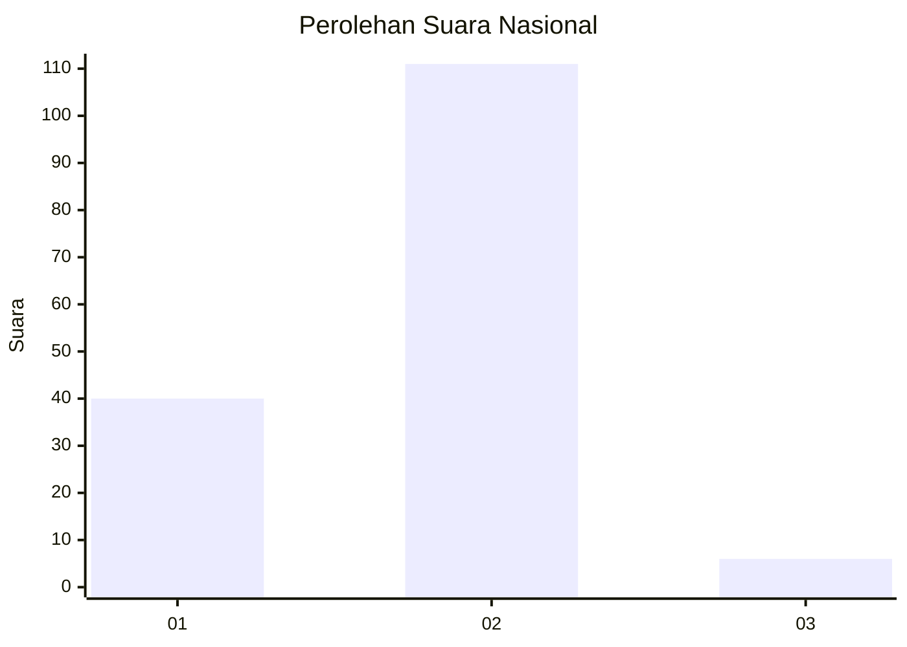
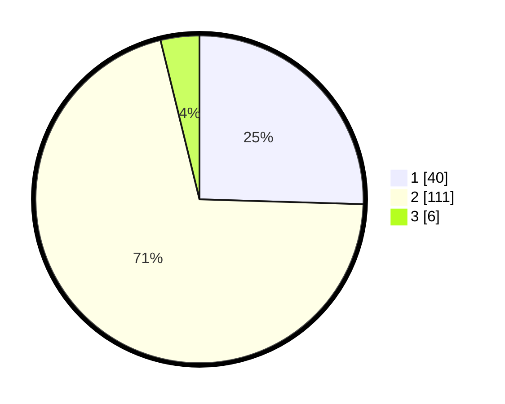

# Hasil

## Grafik

## Tabel

| No.    | Nama Paslon    | Suara | Suara (raw) | Persentase |
|:------ |:-------------- | -----:| -----------:| ----------:|
| 100025 | ANIES MUHAIMIN | 40    | [40][p-1]   | 25,48      |
| 100026 | PRABOWO GIBRAN | 111   | [111][p-2]  | 70,70      |
| 100027 | GANJAR MAHFUD  | 6     | [6][p-3]    | 3,82       |

[p-1]: https://github.com/gigit-pemilu/pemilu-2024/blob/main/pilpres/hitung-suara/sub/31-dki-jakarta/sub/73-jakarta-barat/sub/01-cengkareng/sub/1006-cengkareng-timur/sub/114-tps/sub/paslon-1.txt
[p-2]: https://github.com/gigit-pemilu/pemilu-2024/blob/main/pilpres/hitung-suara/sub/31-dki-jakarta/sub/73-jakarta-barat/sub/01-cengkareng/sub/1006-cengkareng-timur/sub/114-tps/sub/paslon-2.txt
[p-3]: https://github.com/gigit-pemilu/pemilu-2024/blob/main/pilpres/hitung-suara/sub/31-dki-jakarta/sub/73-jakarta-barat/sub/01-cengkareng/sub/1006-cengkareng-timur/sub/114-tps/sub/paslon-3.txt

## Foto C Plano

https://sirekap-obj-formc.kpu.go.id/dc89/pemilu/ppwp/31/73/01/10/06/3173011006114-20240214-235543--0a0e5501-d91a-4f56-9962-cc0bbeb5f69a.jpg

https://sirekap-obj-formc.kpu.go.id/dc89/pemilu/ppwp/31/73/01/10/06/3173011006114-20240214-224207--d4fd22dc-90d2-40c5-a805-148e7984343e.jpg

https://sirekap-obj-formc.kpu.go.id/dc89/pemilu/ppwp/31/73/01/10/06/3173011006114-20240214-224254--95e42b6a-15c4-4316-ad3b-2dacad3e111b.jpg

## Metadata

| Key        | Value               |
| ---------- | ------------------- |
| Time Stamp | 2024-02-17 19:30:00 |

