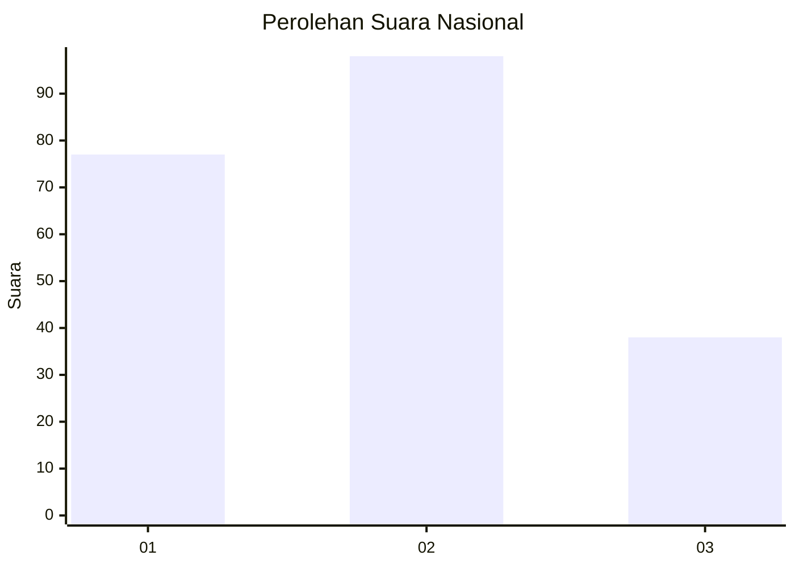
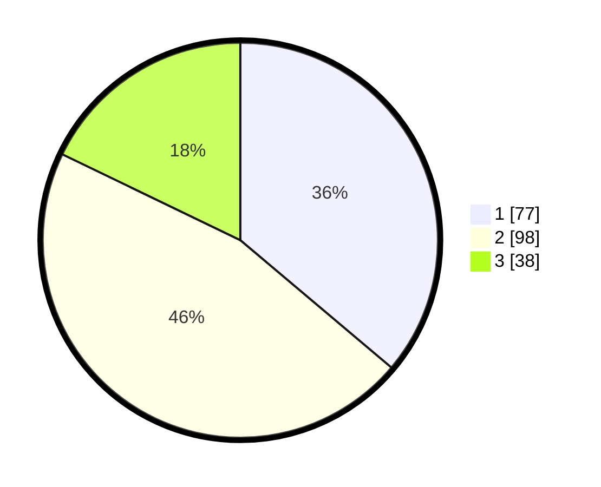

# Hasil

## Grafik

## Tabel

| No.    | Nama Paslon    | Suara | Suara (raw) | Persentase |
|:------ |:-------------- | -----:| -----------:| ----------:|
| 100025 | ANIES MUHAIMIN | 77    | [77][p-1]   | 36,15      |
| 100026 | PRABOWO GIBRAN | 98    | [98][p-2]   | 46,01      |
| 100027 | GANJAR MAHFUD  | 38    | [38][p-3]   | 17,84      |

[p-1]: https://github.com/gigit-pemilu/pemilu-2024/blob/main/pilpres/hitung-suara/sub/31-dki-jakarta/sub/73-jakarta-barat/sub/01-cengkareng/sub/1006-cengkareng-timur/sub/126-tps/sub/paslon-1.txt
[p-2]: https://github.com/gigit-pemilu/pemilu-2024/blob/main/pilpres/hitung-suara/sub/31-dki-jakarta/sub/73-jakarta-barat/sub/01-cengkareng/sub/1006-cengkareng-timur/sub/126-tps/sub/paslon-2.txt
[p-3]: https://github.com/gigit-pemilu/pemilu-2024/blob/main/pilpres/hitung-suara/sub/31-dki-jakarta/sub/73-jakarta-barat/sub/01-cengkareng/sub/1006-cengkareng-timur/sub/126-tps/sub/paslon-3.txt

## Foto C Plano

https://sirekap-obj-formc.kpu.go.id/cdde/pemilu/ppwp/31/73/01/10/06/3173011006126-20240214-235726--173f0f79-25ec-442d-a936-b4256a2215ae.jpg

https://sirekap-obj-formc.kpu.go.id/cdde/pemilu/ppwp/31/73/01/10/06/3173011006126-20240214-235847--59998e54-ecf3-4e53-8fbb-045630e287e1.jpg

https://sirekap-obj-formc.kpu.go.id/cdde/pemilu/ppwp/31/73/01/10/06/3173011006126-20240215-000011--50c4cd4f-67ab-4779-a2c7-63fbe63f0ac7.jpg

## Metadata

| Key        | Value               |
| ---------- | ------------------- |
| Time Stamp | 2024-02-19 15:00:00 |

