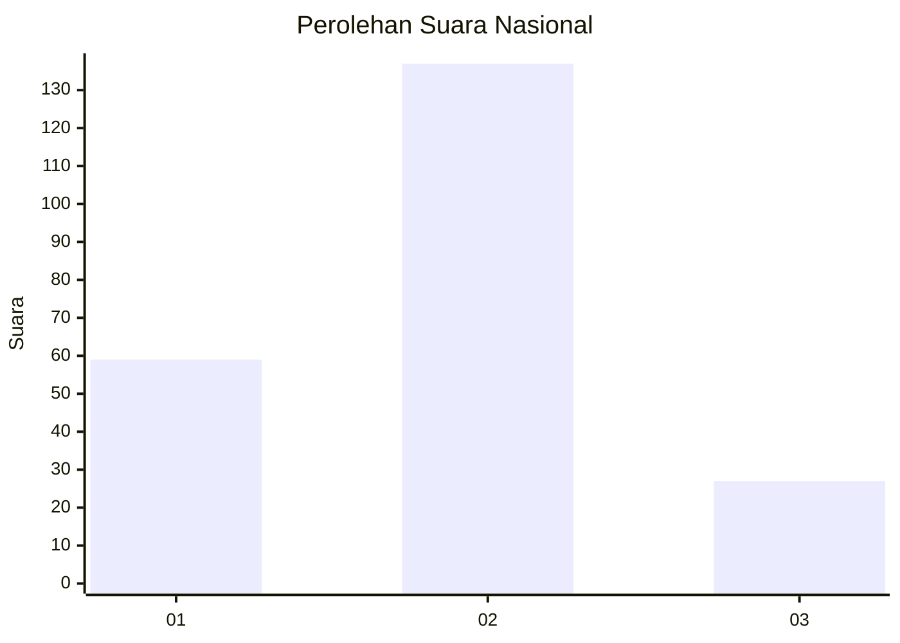
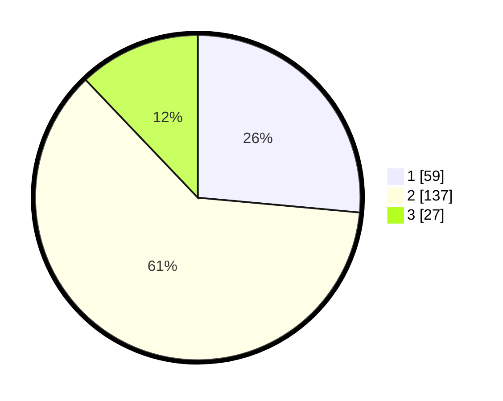

# Hasil

## Grafik

## Tabel

| No.    | Nama Paslon    | Suara | Suara (raw) | Persentase |
|:------ |:-------------- | -----:| -----------:| ----------:|
| 100025 | ANIES MUHAIMIN | 59    | [59][p-1]   | 26,46      |
| 100026 | PRABOWO GIBRAN | 137   | [137][p-2]  | 61,43      |
| 100027 | GANJAR MAHFUD  | 27    | [27][p-3]   | 12,11      |

[p-1]: https://github.com/gigit-pemilu/pemilu-2024/blob/main/pilpres/hitung-suara/sub/31-dki-jakarta/sub/73-jakarta-barat/sub/01-cengkareng/sub/1006-cengkareng-timur/sub/145-tps/sub/paslon-1.txt
[p-2]: https://github.com/gigit-pemilu/pemilu-2024/blob/main/pilpres/hitung-suara/sub/31-dki-jakarta/sub/73-jakarta-barat/sub/01-cengkareng/sub/1006-cengkareng-timur/sub/145-tps/sub/paslon-2.txt
[p-3]: https://github.com/gigit-pemilu/pemilu-2024/blob/main/pilpres/hitung-suara/sub/31-dki-jakarta/sub/73-jakarta-barat/sub/01-cengkareng/sub/1006-cengkareng-timur/sub/145-tps/sub/paslon-3.txt

## Foto C Plano

https://sirekap-obj-formc.kpu.go.id/7c0d/pemilu/ppwp/31/73/01/10/06/3173011006145-20240215-002217--f3ebeb82-11f5-4e22-8386-6b804f7c87eb.jpg

https://sirekap-obj-formc.kpu.go.id/7c0d/pemilu/ppwp/31/73/01/10/06/3173011006145-20240215-000745--73491926-8fad-4452-b6af-deb838e0a811.jpg

https://sirekap-obj-formc.kpu.go.id/7c0d/pemilu/ppwp/31/73/01/10/06/3173011006145-20240215-001953--42f699e2-d720-430a-9a52-e2967e9963bd.jpg

## Metadata

| Key        | Value               |
| ---------- | ------------------- |
| Time Stamp | 2024-02-19 21:00:00 |

