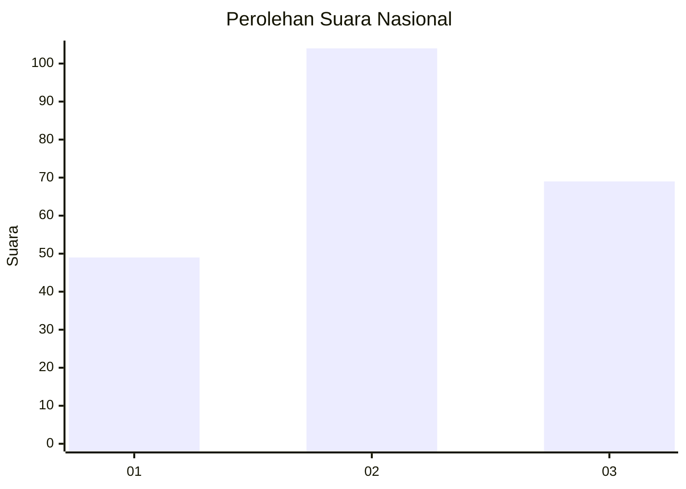
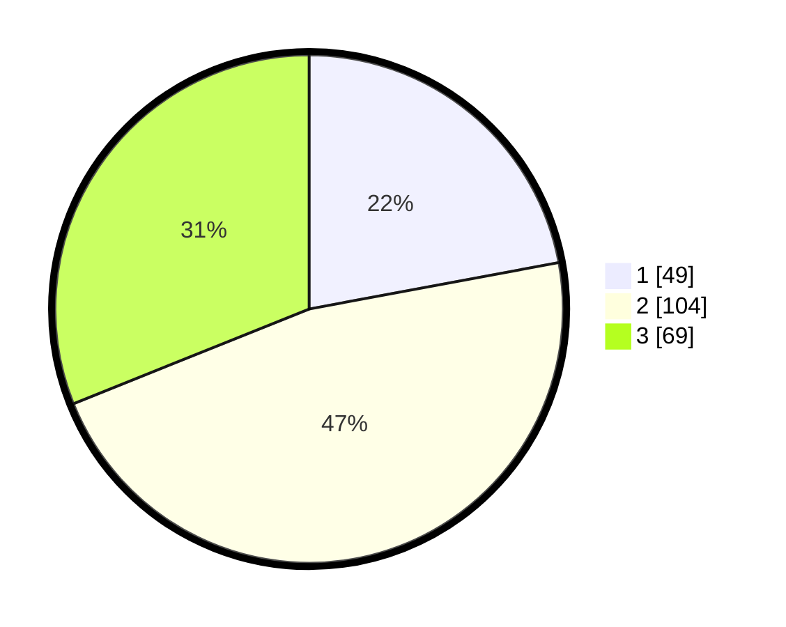

# Hasil

## Grafik

## Tabel

| No.    | Nama Paslon    | Suara | Suara (raw) | Persentase |
|:------ |:-------------- | -----:| -----------:| ----------:|
| 100025 | ANIES MUHAIMIN | 49    | [49][p-1]   | 22,07      |
| 100026 | PRABOWO GIBRAN | 104   | [104][p-2]  | 46,85      |
| 100027 | GANJAR MAHFUD  | 69    | [69][p-3]   | 31,08      |

[p-1]: https://github.com/gigit-pemilu/pemilu-2024/blob/main/pilpres/hitung-suara/sub/31-dki-jakarta/sub/73-jakarta-barat/sub/01-cengkareng/sub/1006-cengkareng-timur/sub/163-tps/sub/paslon-1.txt
[p-2]: https://github.com/gigit-pemilu/pemilu-2024/blob/main/pilpres/hitung-suara/sub/31-dki-jakarta/sub/73-jakarta-barat/sub/01-cengkareng/sub/1006-cengkareng-timur/sub/163-tps/sub/paslon-2.txt
[p-3]: https://github.com/gigit-pemilu/pemilu-2024/blob/main/pilpres/hitung-suara/sub/31-dki-jakarta/sub/73-jakarta-barat/sub/01-cengkareng/sub/1006-cengkareng-timur/sub/163-tps/sub/paslon-3.txt

## Foto C Plano

https://sirekap-obj-formc.kpu.go.id/0e7c/pemilu/ppwp/31/73/01/10/06/3173011006163-20240214-232339--e21774e8-63fe-4a5a-b377-ecca339447ae.jpg

https://sirekap-obj-formc.kpu.go.id/0e7c/pemilu/ppwp/31/73/01/10/06/3173011006163-20240214-232517--948e2751-3e0c-415d-8064-e6bbbf241842.jpg

https://sirekap-obj-formc.kpu.go.id/0e7c/pemilu/ppwp/31/73/01/10/06/3173011006163-20240214-232627--8b407fb1-fed3-4643-8ff0-767e30abe094.jpg

## Metadata

| Key        | Value               |
| ---------- | ------------------- |
| Time Stamp | 2024-02-17 19:30:00 |

