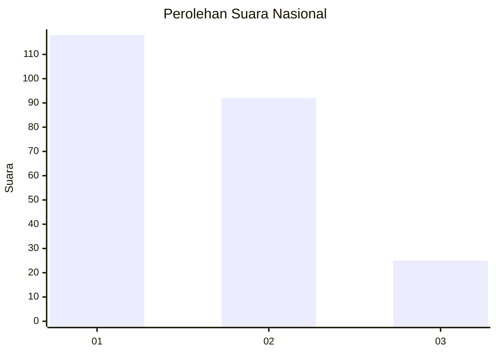
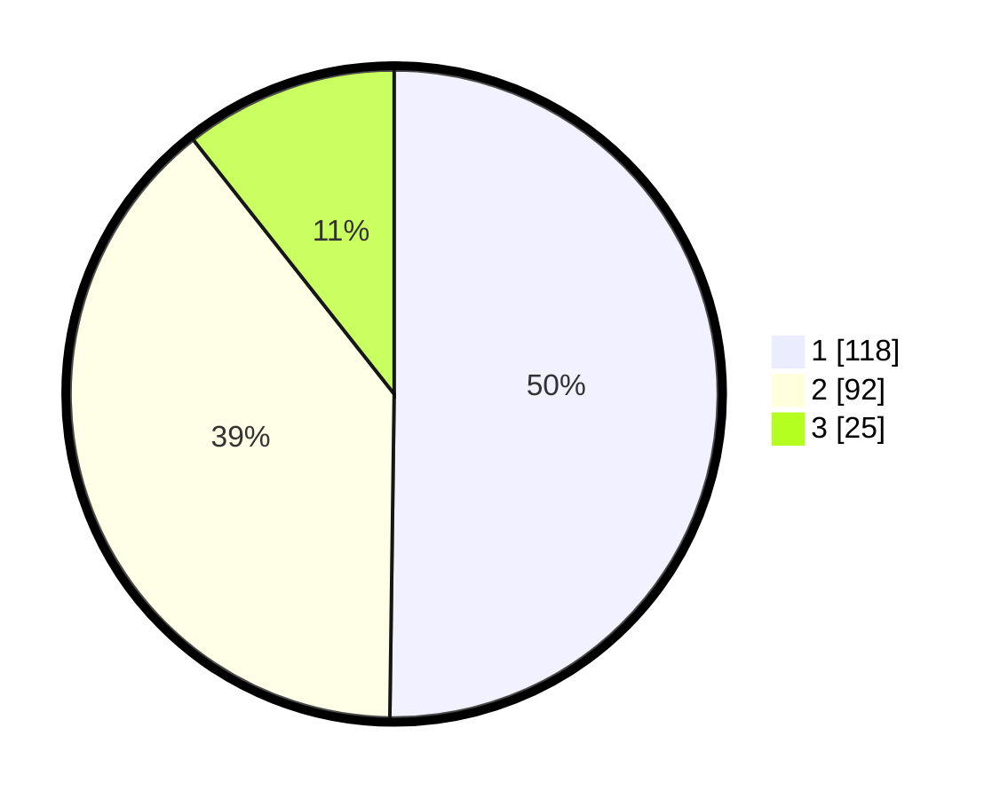

# Hasil

## Grafik

## Tabel

| No.    | Nama Paslon    | Suara | Suara (raw) | Persentase |
|:------ |:-------------- | -----:| -----------:| ----------:|
| 100025 | ANIES MUHAIMIN | 118   | [118][p-1]  | 50,21      |
| 100026 | PRABOWO GIBRAN | 92    | [92][p-2]   | 39,15      |
| 100027 | GANJAR MAHFUD  | 25    | [25][p-3]   | 10,64      |

[p-1]: https://github.com/gigit-pemilu/pemilu-2024/blob/main/pilpres/hitung-suara/sub/31-dki-jakarta/sub/73-jakarta-barat/sub/01-cengkareng/sub/1006-cengkareng-timur/sub/194-tps/sub/paslon-1.txt
[p-2]: https://github.com/gigit-pemilu/pemilu-2024/blob/main/pilpres/hitung-suara/sub/31-dki-jakarta/sub/73-jakarta-barat/sub/01-cengkareng/sub/1006-cengkareng-timur/sub/194-tps/sub/paslon-2.txt
[p-3]: https://github.com/gigit-pemilu/pemilu-2024/blob/main/pilpres/hitung-suara/sub/31-dki-jakarta/sub/73-jakarta-barat/sub/01-cengkareng/sub/1006-cengkareng-timur/sub/194-tps/sub/paslon-3.txt

## Foto C Plano

https://sirekap-obj-formc.kpu.go.id/57a3/pemilu/ppwp/31/73/01/10/06/3173011006194-20240214-231719--3da92c4c-d918-4bd0-b1a5-3f72968e6381.jpg

https://sirekap-obj-formc.kpu.go.id/57a3/pemilu/ppwp/31/73/01/10/06/3173011006194-20240214-231906--e703c066-f5df-4e24-b4bf-377d90932734.jpg

https://sirekap-obj-formc.kpu.go.id/57a3/pemilu/ppwp/31/73/01/10/06/3173011006194-20240214-232034--ac782992-76f4-4c22-baca-f62dc20c7eae.jpg

## Metadata

| Key        | Value               |
| ---------- | ------------------- |
| Time Stamp | 2024-02-19 21:00:00 |

