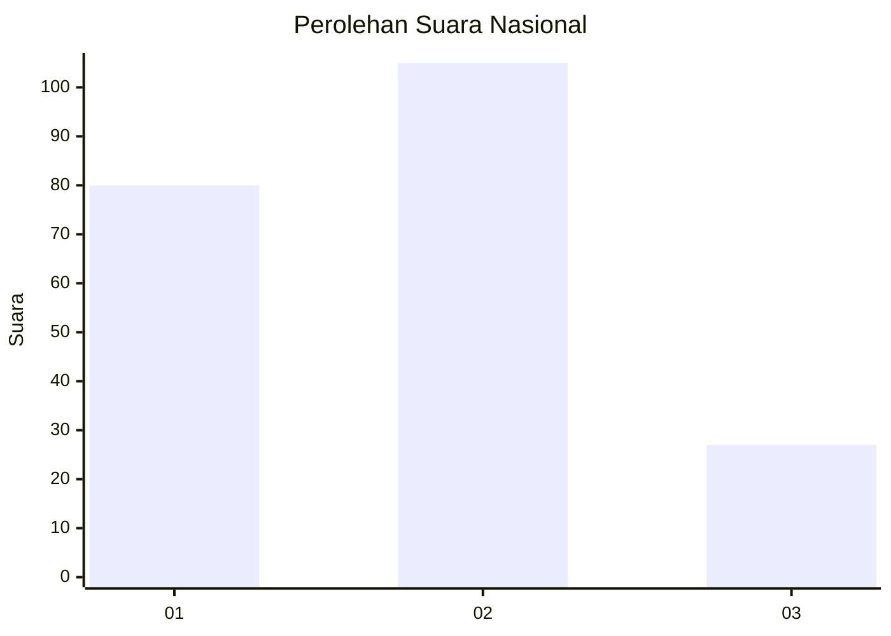
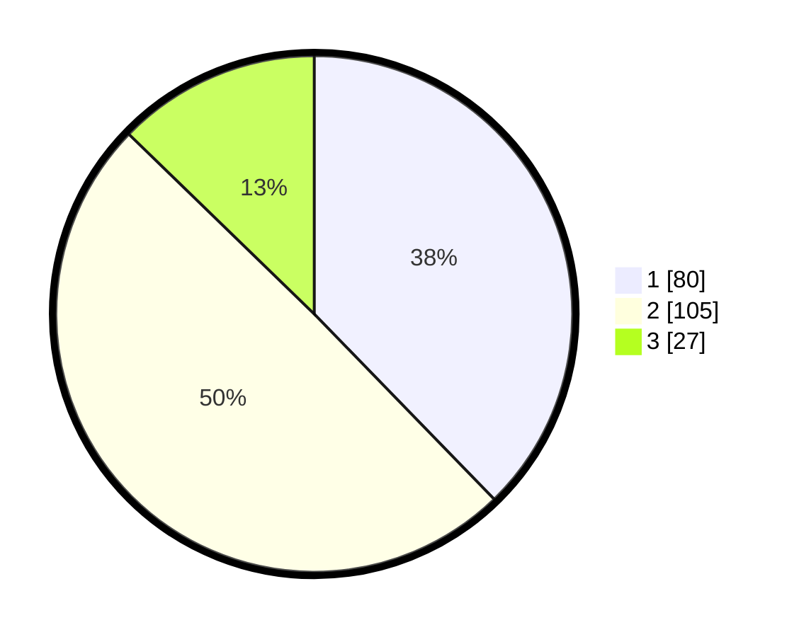

# Hasil

## Grafik

## Tabel

| No.    | Nama Paslon    | Suara | Suara (raw) | Persentase |
|:------ |:-------------- | -----:| -----------:| ----------:|
| 100025 | ANIES MUHAIMIN | 80    | [80][p-1]   | 37,74      |
| 100026 | PRABOWO GIBRAN | 105   | [105][p-2]  | 49,53      |
| 100027 | GANJAR MAHFUD  | 27    | [27][p-3]   | 12,74      |

[p-1]: https://github.com/gigit-pemilu/pemilu-2024/blob/main/pilpres/hitung-suara/sub/31-dki-jakarta/sub/73-jakarta-barat/sub/01-cengkareng/sub/1006-cengkareng-timur/sub/204-tps/sub/paslon-1.txt
[p-2]: https://github.com/gigit-pemilu/pemilu-2024/blob/main/pilpres/hitung-suara/sub/31-dki-jakarta/sub/73-jakarta-barat/sub/01-cengkareng/sub/1006-cengkareng-timur/sub/204-tps/sub/paslon-2.txt
[p-3]: https://github.com/gigit-pemilu/pemilu-2024/blob/main/pilpres/hitung-suara/sub/31-dki-jakarta/sub/73-jakarta-barat/sub/01-cengkareng/sub/1006-cengkareng-timur/sub/204-tps/sub/paslon-3.txt

## Foto C Plano

https://sirekap-obj-formc.kpu.go.id/fae6/pemilu/ppwp/31/73/01/10/06/3173011006204-20240214-223042--5cb3d0d3-db05-4f85-be97-3a3117df5503.jpg

https://sirekap-obj-formc.kpu.go.id/fae6/pemilu/ppwp/31/73/01/10/06/3173011006204-20240214-223057--fdd3bad1-fc3d-4978-b06d-7b796b68f958.jpg

https://sirekap-obj-formc.kpu.go.id/fae6/pemilu/ppwp/31/73/01/10/06/3173011006204-20240214-223103--532326cc-8b45-49b8-8eb8-aea3a39bc580.jpg

## Metadata

| Key        | Value               |
| ---------- | ------------------- |
| Time Stamp | 2024-02-17 19:30:00 |

