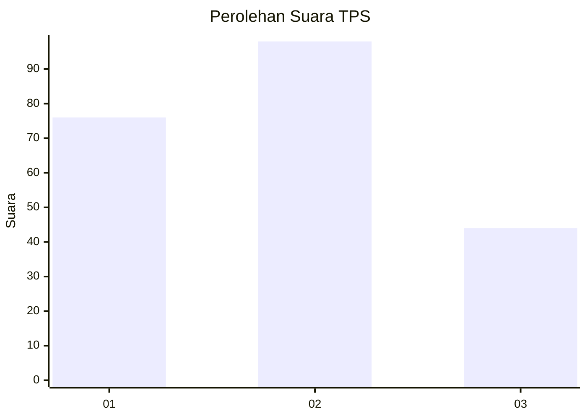
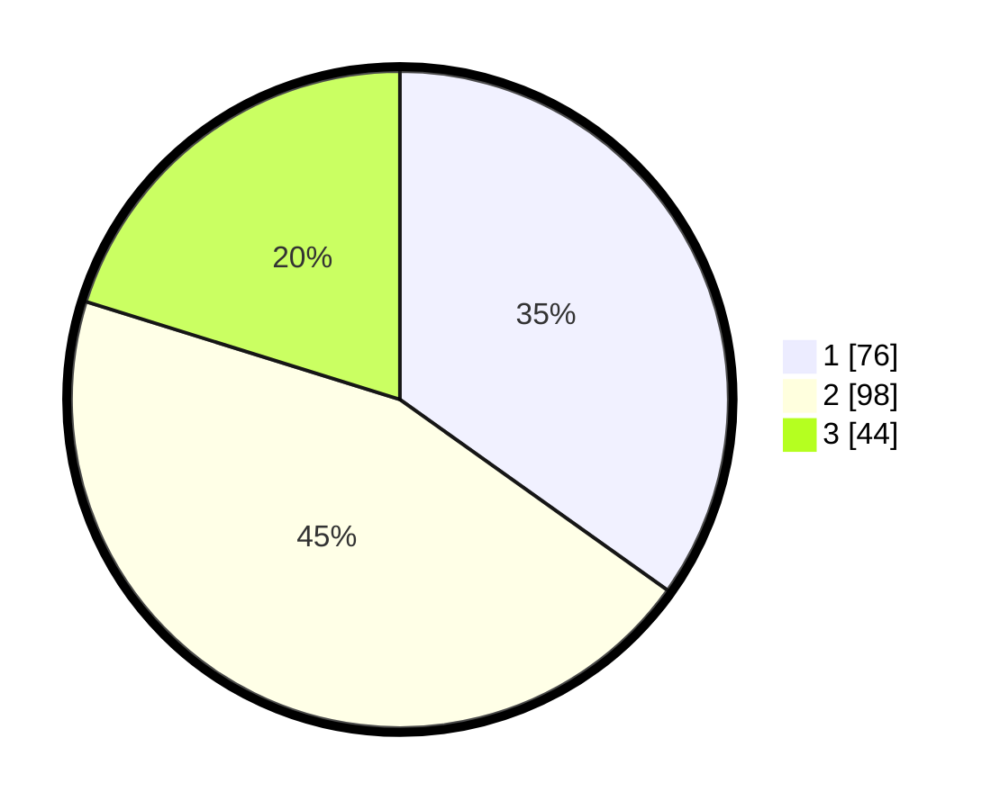

# Hasil

## Grafik

## Tabel

| No. | Nama Paslon    | Suara | Suara (raw) | Persentase |
|:--- |:-------------- | -----:| -----------:| ----------:|
| 1   | ANIES MUHAIMIN | 76    | [76][p-1]   | 34,86      |
| 2   | PRABOWO GIBRAN | 98    | [98][p-2]   | 44,95      |
| 3   | GANJAR MAHFUD  | 44    | [44][p-3]   | 20,18      |

[p-1]: https://github.com/gigit-pemilu/pemilu-2024-31-dki-jakarta/blob/main/pilpres/hitung-suara/sub/31-dki-jakarta/sub/73-jakarta-barat/sub/02-grogol-petamburan/sub/1001-grogol/sub/001-tps/sub/paslon-1.txt
[p-2]: https://github.com/gigit-pemilu/pemilu-2024-31-dki-jakarta/blob/main/pilpres/hitung-suara/sub/31-dki-jakarta/sub/73-jakarta-barat/sub/02-grogol-petamburan/sub/1001-grogol/sub/001-tps/sub/paslon-2.txt
[p-3]: https://github.com/gigit-pemilu/pemilu-2024-31-dki-jakarta/blob/main/pilpres/hitung-suara/sub/31-dki-jakarta/sub/73-jakarta-barat/sub/02-grogol-petamburan/sub/1001-grogol/sub/001-tps/sub/paslon-3.txt

## Foto C Plano

https://sirekap-obj-formc.kpu.go.id/5472/pemilu/ppwp/31/73/02/10/01/3173021001001-20240214-234914--b1a834d3-70a3-4a28-b560-2da217716c4a.jpg

https://sirekap-obj-formc.kpu.go.id/5472/pemilu/ppwp/31/73/02/10/01/3173021001001-20240214-235145--03b2117e-bf44-442a-ad02-80e27b256178.jpg

https://sirekap-obj-formc.kpu.go.id/5472/pemilu/ppwp/31/73/02/10/01/3173021001001-20240214-235456--c6932d6d-f38c-4c4b-a166-b8ac0b69448d.jpg

## Metadata

| Key        | Value               |
| ---------- | ------------------- |
| Time Stamp | 2024-02-15 19:00:26 |

