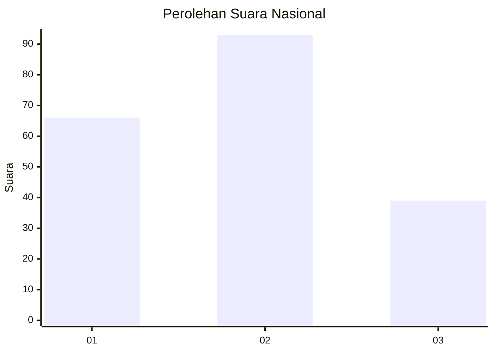
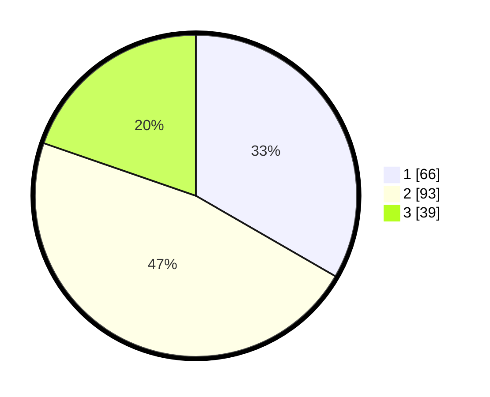

# Hasil

## Grafik

## Tabel

| No. | Nama Paslon    | Suara | Suara (raw) | Persentase |
|:--- |:-------------- | -----:| -----------:| ----------:|
| 1   | ANIES MUHAIMIN | 66    | [66][p-1]   | 33,33      |
| 2   | PRABOWO GIBRAN | 93    | [93][p-2]   | 46,97      |
| 3   | GANJAR MAHFUD  | 39    | [39][p-3]   | 19,70      |

[p-1]: https://github.com/gigit-pemilu/pemilu-2024/blob/main/pilpres/hitung-suara/sub/31-dki-jakarta/sub/73-jakarta-barat/sub/02-grogol-petamburan/sub/1001-grogol/sub/002-tps/sub/paslon-1.txt
[p-2]: https://github.com/gigit-pemilu/pemilu-2024/blob/main/pilpres/hitung-suara/sub/31-dki-jakarta/sub/73-jakarta-barat/sub/02-grogol-petamburan/sub/1001-grogol/sub/002-tps/sub/paslon-2.txt
[p-3]: https://github.com/gigit-pemilu/pemilu-2024/blob/main/pilpres/hitung-suara/sub/31-dki-jakarta/sub/73-jakarta-barat/sub/02-grogol-petamburan/sub/1001-grogol/sub/002-tps/sub/paslon-3.txt

## Foto C Plano

https://sirekap-obj-formc.kpu.go.id/21d4/pemilu/ppwp/31/73/02/10/01/3173021001002-20240215-012746--7f83e608-30be-49d2-9d79-e34d41ce3332.jpg

https://sirekap-obj-formc.kpu.go.id/21d4/pemilu/ppwp/31/73/02/10/01/3173021001002-20240215-011418--02b2b6a1-6d0e-4e7b-b522-38c0ca9178aa.jpg

https://sirekap-obj-formc.kpu.go.id/21d4/pemilu/ppwp/31/73/02/10/01/3173021001002-20240215-012946--c099314c-7d3b-4c90-8530-f034c8a173da.jpg

## Metadata

| Key        | Value               |
| ---------- | ------------------- |
| Time Stamp | 2024-02-16 22:01:00 |

