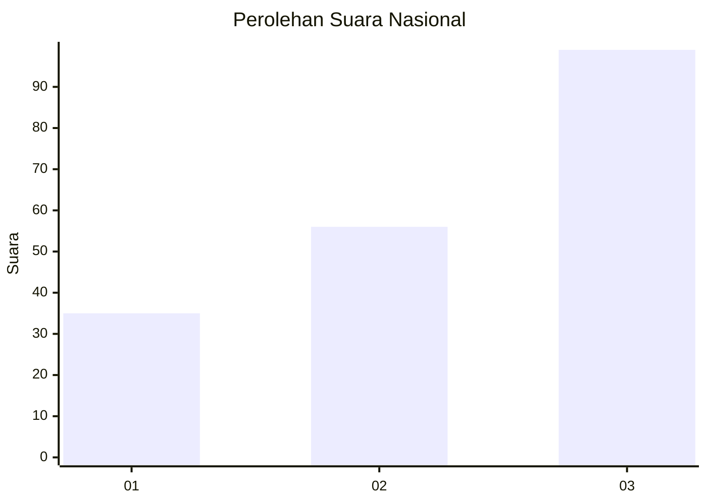
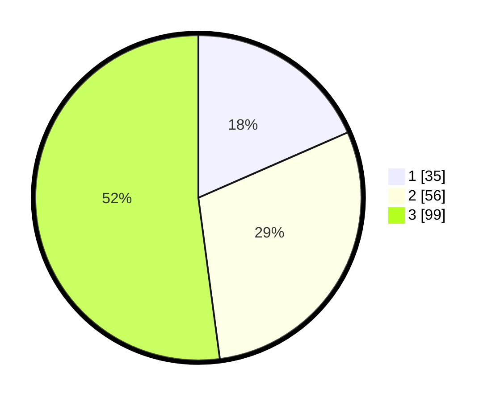

# Hasil

## Grafik

## Tabel

| No.    | Nama Paslon    | Suara | Suara (raw) | Persentase |
|:------ |:-------------- | -----:| -----------:| ----------:|
| 100025 | ANIES MUHAIMIN | 35    | [35][p-1]   | 18,42      |
| 100026 | PRABOWO GIBRAN | 56    | [56][p-2]   | 29,47      |
| 100027 | GANJAR MAHFUD  | 99    | [99][p-3]   | 52,11      |

[p-1]: https://github.com/gigit-pemilu/pemilu-2024/blob/main/pilpres/hitung-suara/sub/31-dki-jakarta/sub/73-jakarta-barat/sub/02-grogol-petamburan/sub/1001-grogol/sub/042-tps/sub/paslon-1.txt
[p-2]: https://github.com/gigit-pemilu/pemilu-2024/blob/main/pilpres/hitung-suara/sub/31-dki-jakarta/sub/73-jakarta-barat/sub/02-grogol-petamburan/sub/1001-grogol/sub/042-tps/sub/paslon-2.txt
[p-3]: https://github.com/gigit-pemilu/pemilu-2024/blob/main/pilpres/hitung-suara/sub/31-dki-jakarta/sub/73-jakarta-barat/sub/02-grogol-petamburan/sub/1001-grogol/sub/042-tps/sub/paslon-3.txt

## Foto C Plano

https://sirekap-obj-formc.kpu.go.id/5966/pemilu/ppwp/31/73/02/10/01/3173021001042-20240214-205143--df1907a7-ad56-4979-9713-0dc35ac679f6.jpg

https://sirekap-obj-formc.kpu.go.id/5966/pemilu/ppwp/31/73/02/10/01/3173021001042-20240214-155840--35655903-9bf3-4349-8316-5a9a9a0cef04.jpg

https://sirekap-obj-formc.kpu.go.id/5966/pemilu/ppwp/31/73/02/10/01/3173021001042-20240214-155917--4fe71405-7d6d-4e3a-82d5-f49ebe4c96e9.jpg

## Metadata

| Key        | Value               |
| ---------- | ------------------- |
| Time Stamp | 2024-02-16 00:30:27 |

