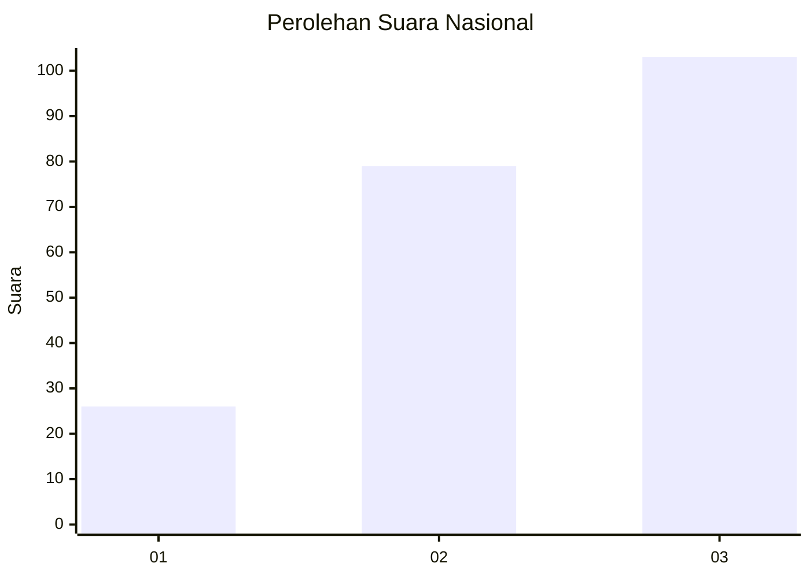
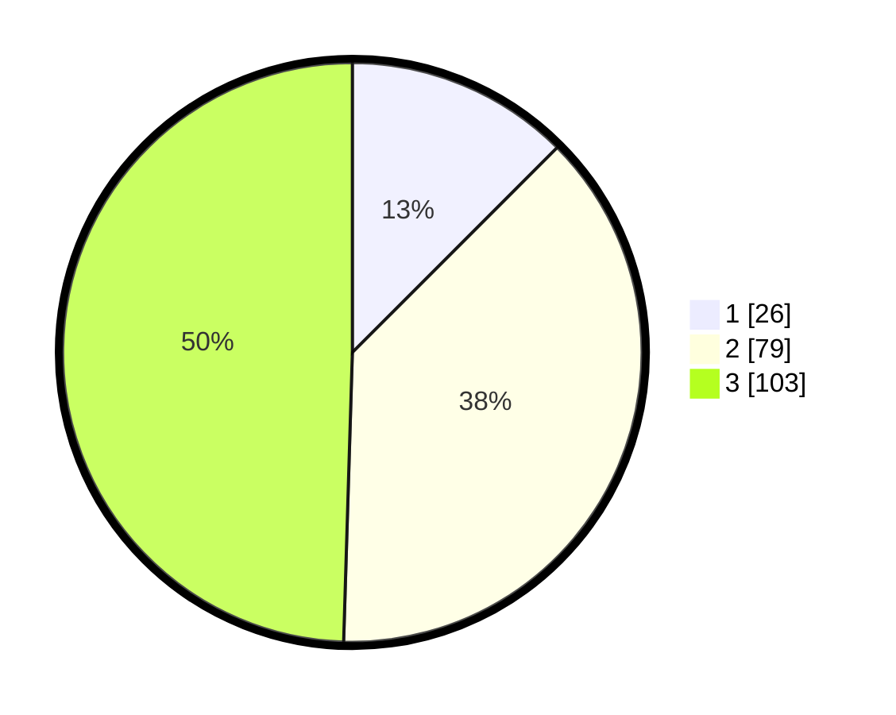

# Hasil

## Grafik

## Tabel

| No.    | Nama Paslon    | Suara | Suara (raw) | Persentase |
|:------ |:-------------- | -----:| -----------:| ----------:|
| 100025 | ANIES MUHAIMIN | 26    | [26][p-1]   | 12,50      |
| 100026 | PRABOWO GIBRAN | 79    | [79][p-2]   | 37,98      |
| 100027 | GANJAR MAHFUD  | 103   | [103][p-3]  | 49,52      |

[p-1]: https://github.com/gigit-pemilu/pemilu-2024/blob/main/pilpres/hitung-suara/sub/31-dki-jakarta/sub/73-jakarta-barat/sub/02-grogol-petamburan/sub/1001-grogol/sub/043-tps/sub/paslon-1.txt
[p-2]: https://github.com/gigit-pemilu/pemilu-2024/blob/main/pilpres/hitung-suara/sub/31-dki-jakarta/sub/73-jakarta-barat/sub/02-grogol-petamburan/sub/1001-grogol/sub/043-tps/sub/paslon-2.txt
[p-3]: https://github.com/gigit-pemilu/pemilu-2024/blob/main/pilpres/hitung-suara/sub/31-dki-jakarta/sub/73-jakarta-barat/sub/02-grogol-petamburan/sub/1001-grogol/sub/043-tps/sub/paslon-3.txt

## Foto C Plano

https://sirekap-obj-formc.kpu.go.id/2f57/pemilu/ppwp/31/73/02/10/01/3173021001043-20240215-005135--9d59fb4c-0c6a-43aa-8fdd-b9fe5f744584.jpg

https://sirekap-obj-formc.kpu.go.id/2f57/pemilu/ppwp/31/73/02/10/01/3173021001043-20240215-005213--f0692ebd-ece2-4a85-b577-cc59c809d6a7.jpg

https://sirekap-obj-formc.kpu.go.id/2f57/pemilu/ppwp/31/73/02/10/01/3173021001043-20240215-005248--a401e95d-0e41-40be-a3f5-9911275d416c.jpg

## Metadata

| Key        | Value               |
| ---------- | ------------------- |
| Time Stamp | 2024-02-19 06:16:00 |

