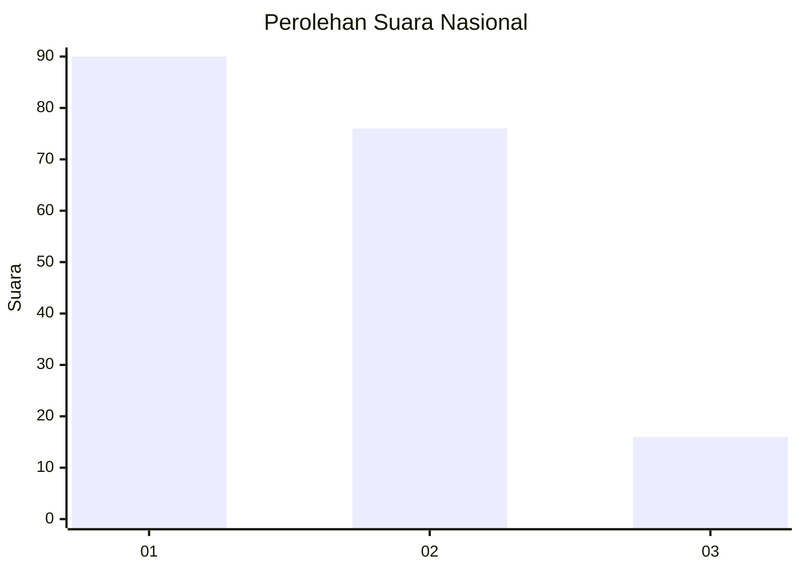
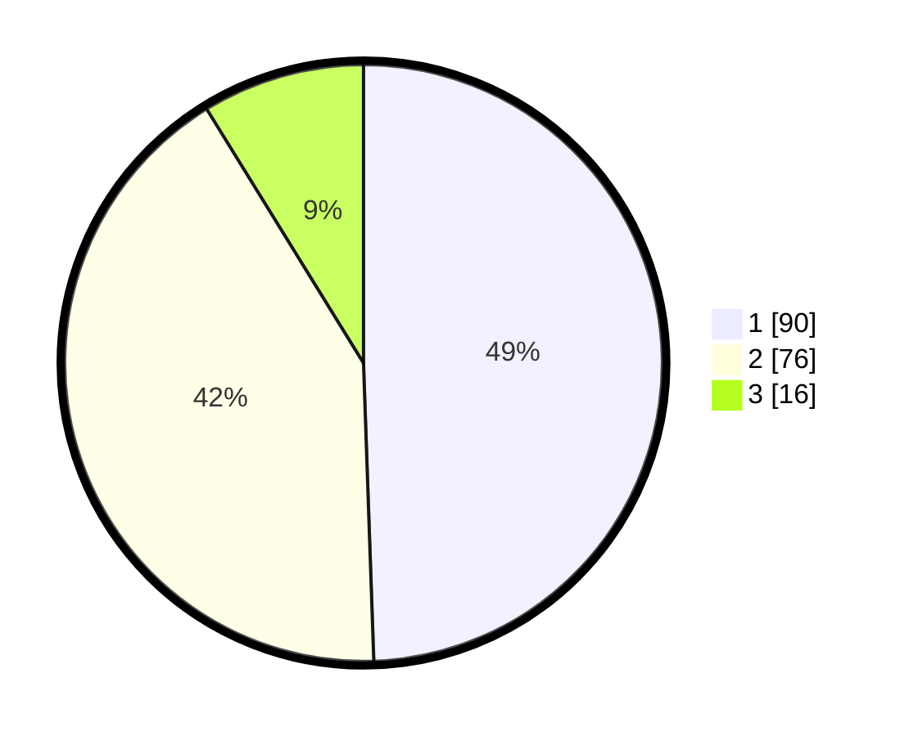

# Hasil

## Grafik

## Tabel

| No.    | Nama Paslon    | Suara | Suara (raw) | Persentase |
|:------ |:-------------- | -----:| -----------:| ----------:|
| 100025 | ANIES MUHAIMIN | 90    | [90][p-1]   | 49,45      |
| 100026 | PRABOWO GIBRAN | 76    | [76][p-2]   | 41,76      |
| 100027 | GANJAR MAHFUD  | 16    | [16][p-3]   | 8,79       |

[p-1]: https://github.com/gigit-pemilu/pemilu-2024/blob/main/pilpres/hitung-suara/sub/31-dki-jakarta/sub/73-jakarta-barat/sub/02-grogol-petamburan/sub/1001-grogol/sub/060-tps/sub/paslon-1.txt
[p-2]: https://github.com/gigit-pemilu/pemilu-2024/blob/main/pilpres/hitung-suara/sub/31-dki-jakarta/sub/73-jakarta-barat/sub/02-grogol-petamburan/sub/1001-grogol/sub/060-tps/sub/paslon-2.txt
[p-3]: https://github.com/gigit-pemilu/pemilu-2024/blob/main/pilpres/hitung-suara/sub/31-dki-jakarta/sub/73-jakarta-barat/sub/02-grogol-petamburan/sub/1001-grogol/sub/060-tps/sub/paslon-3.txt

## Foto C Plano

https://sirekap-obj-formc.kpu.go.id/f6e0/pemilu/ppwp/31/73/02/10/01/3173021001060-20240214-200654--1ac9830a-c296-438c-bb9e-c41bd721d418.jpg

https://sirekap-obj-formc.kpu.go.id/f6e0/pemilu/ppwp/31/73/02/10/01/3173021001060-20240214-200711--4360dd42-76a9-4ff8-9d31-c23ddf14d753.jpg

https://sirekap-obj-formc.kpu.go.id/f6e0/pemilu/ppwp/31/73/02/10/01/3173021001060-20240214-200728--03b2f788-36d4-4340-808f-aa97f48aac6a.jpg

## Metadata

| Key        | Value               |
| ---------- | ------------------- |
| Time Stamp | 2024-02-19 06:16:00 |

