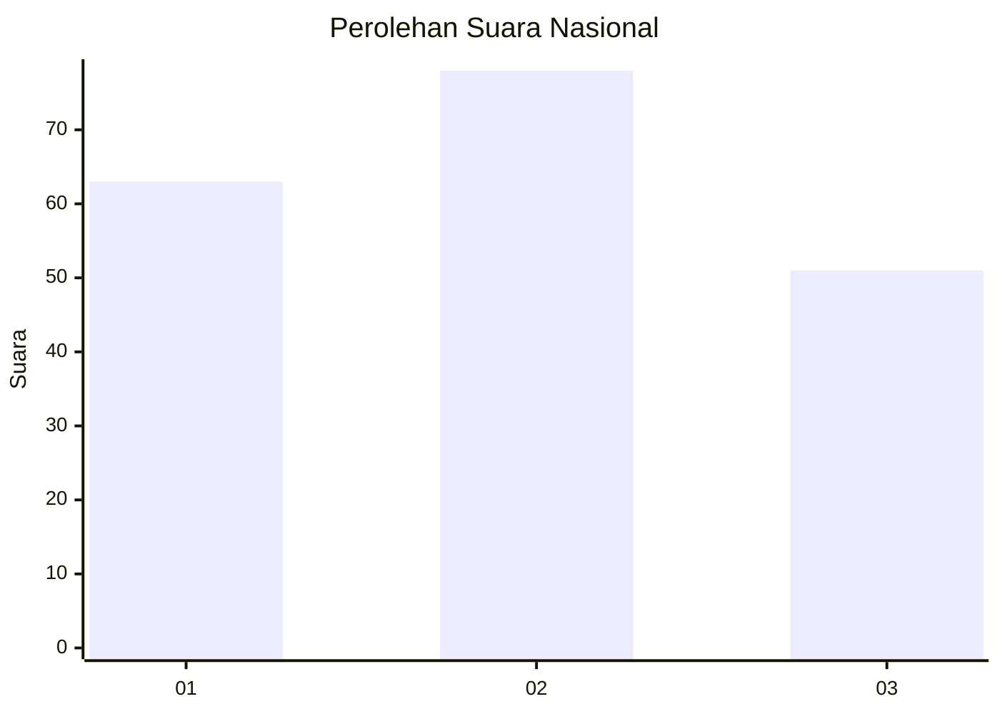
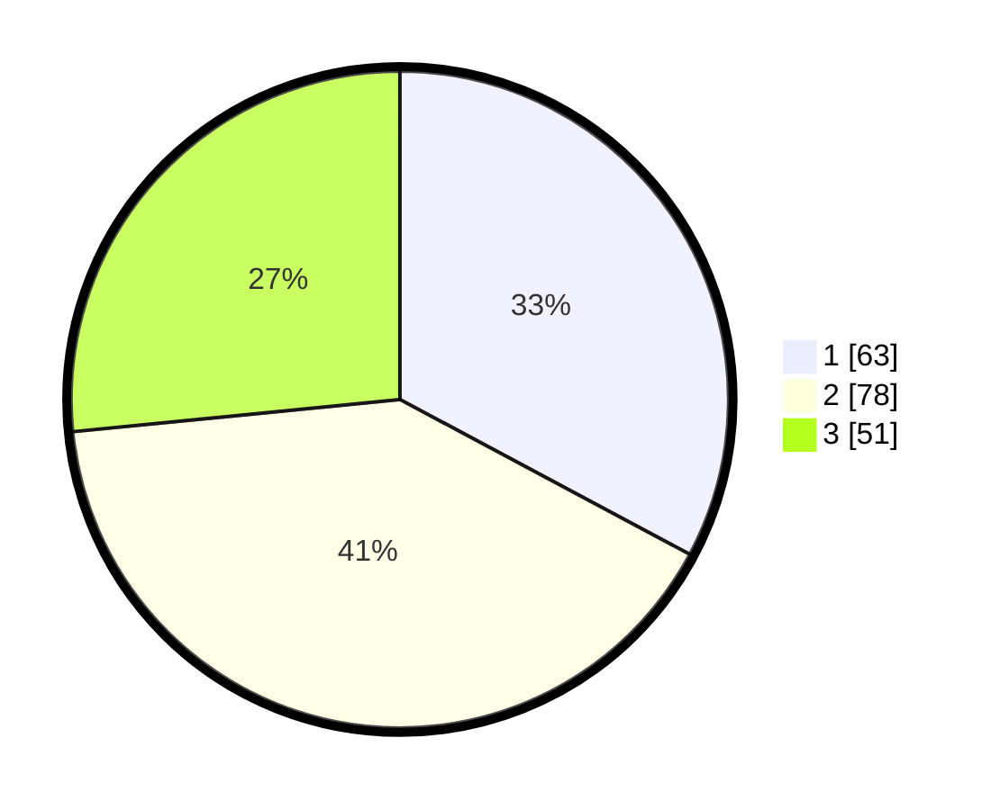

# Hasil

## Grafik

## Tabel

| No.    | Nama Paslon    | Suara | Suara (raw) | Persentase |
|:------ |:-------------- | -----:| -----------:| ----------:|
| 100025 | ANIES MUHAIMIN | 63    | [63][p-1]   | 32,81      |
| 100026 | PRABOWO GIBRAN | 78    | [78][p-2]   | 40,63      |
| 100027 | GANJAR MAHFUD  | 51    | [51][p-3]   | 26,56      |

[p-1]: https://github.com/gigit-pemilu/pemilu-2024/blob/main/pilpres/hitung-suara/sub/31-dki-jakarta/sub/73-jakarta-barat/sub/02-grogol-petamburan/sub/1002-tanjung-duren-utara/sub/011-tps/sub/paslon-1.txt
[p-2]: https://github.com/gigit-pemilu/pemilu-2024/blob/main/pilpres/hitung-suara/sub/31-dki-jakarta/sub/73-jakarta-barat/sub/02-grogol-petamburan/sub/1002-tanjung-duren-utara/sub/011-tps/sub/paslon-2.txt
[p-3]: https://github.com/gigit-pemilu/pemilu-2024/blob/main/pilpres/hitung-suara/sub/31-dki-jakarta/sub/73-jakarta-barat/sub/02-grogol-petamburan/sub/1002-tanjung-duren-utara/sub/011-tps/sub/paslon-3.txt

## Foto C Plano

https://sirekap-obj-formc.kpu.go.id/b0a9/pemilu/ppwp/31/73/02/10/02/3173021002011-20240214-231841--c6094458-6499-4a48-98c3-753a9dde2f27.jpg

https://sirekap-obj-formc.kpu.go.id/b0a9/pemilu/ppwp/31/73/02/10/02/3173021002011-20240214-231923--6c6e55ea-b889-4724-8a8e-283ce78fd4c0.jpg

https://sirekap-obj-formc.kpu.go.id/b0a9/pemilu/ppwp/31/73/02/10/02/3173021002011-20240214-232005--25ff51cf-1add-48f6-8823-c93663390524.jpg

## Metadata

| Key        | Value               |
| ---------- | ------------------- |
| Time Stamp | 2024-02-16 00:30:27 |

