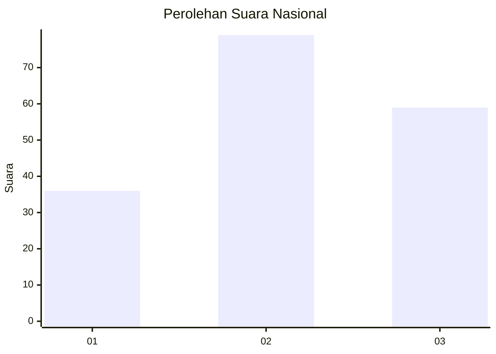
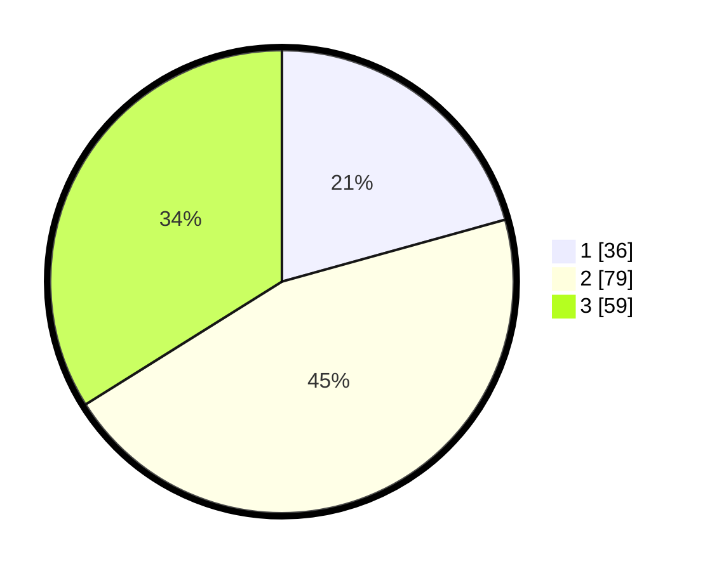

# Hasil

## Grafik

## Tabel

| No.    | Nama Paslon    | Suara | Suara (raw) | Persentase |
|:------ |:-------------- | -----:| -----------:| ----------:|
| 100025 | ANIES MUHAIMIN | 36    | [36][p-1]   | 20,69      |
| 100026 | PRABOWO GIBRAN | 79    | [79][p-2]   | 45,40      |
| 100027 | GANJAR MAHFUD  | 59    | [59][p-3]   | 33,91      |

[p-1]: https://github.com/gigit-pemilu/pemilu-2024/blob/main/pilpres/hitung-suara/sub/31-dki-jakarta/sub/73-jakarta-barat/sub/02-grogol-petamburan/sub/1002-tanjung-duren-utara/sub/015-tps/sub/paslon-1.txt
[p-2]: https://github.com/gigit-pemilu/pemilu-2024/blob/main/pilpres/hitung-suara/sub/31-dki-jakarta/sub/73-jakarta-barat/sub/02-grogol-petamburan/sub/1002-tanjung-duren-utara/sub/015-tps/sub/paslon-2.txt
[p-3]: https://github.com/gigit-pemilu/pemilu-2024/blob/main/pilpres/hitung-suara/sub/31-dki-jakarta/sub/73-jakarta-barat/sub/02-grogol-petamburan/sub/1002-tanjung-duren-utara/sub/015-tps/sub/paslon-3.txt

## Foto C Plano

https://sirekap-obj-formc.kpu.go.id/31a8/pemilu/ppwp/31/73/02/10/02/3173021002015-20240214-214748--38871b39-e755-4a3f-b830-42ea25ff787f.jpg

https://sirekap-obj-formc.kpu.go.id/31a8/pemilu/ppwp/31/73/02/10/02/3173021002015-20240214-220441--ab34eb40-8765-4ae6-adb9-7921750cf793.jpg

https://sirekap-obj-formc.kpu.go.id/31a8/pemilu/ppwp/31/73/02/10/02/3173021002015-20240214-220109--cf4f04dc-0a16-4d5b-abff-638acf9ec0e4.jpg

## Metadata

| Key        | Value               |
| ---------- | ------------------- |
| Time Stamp | 2024-02-16 00:30:27 |

