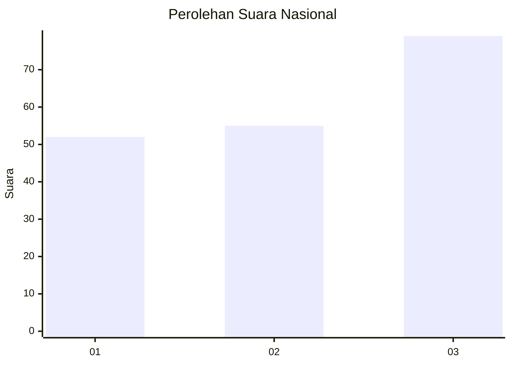
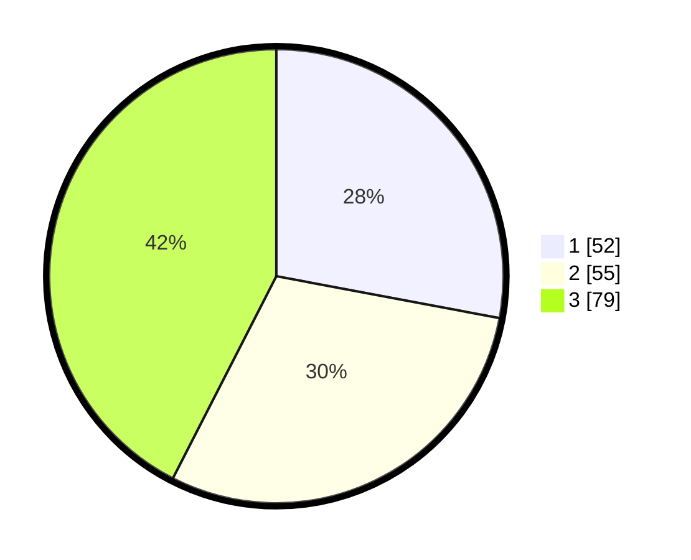

# Hasil

## Grafik

## Tabel

| No.    | Nama Paslon    | Suara | Suara (raw) | Persentase |
|:------ |:-------------- | -----:| -----------:| ----------:|
| 100025 | ANIES MUHAIMIN | 52    | [52][p-1]   | 27,96      |
| 100026 | PRABOWO GIBRAN | 55    | [55][p-2]   | 29,57      |
| 100027 | GANJAR MAHFUD  | 79    | [79][p-3]   | 42,47      |

[p-1]: https://github.com/gigit-pemilu/pemilu-2024/blob/main/pilpres/hitung-suara/sub/31-dki-jakarta/sub/73-jakarta-barat/sub/02-grogol-petamburan/sub/1002-tanjung-duren-utara/sub/016-tps/sub/paslon-1.txt
[p-2]: https://github.com/gigit-pemilu/pemilu-2024/blob/main/pilpres/hitung-suara/sub/31-dki-jakarta/sub/73-jakarta-barat/sub/02-grogol-petamburan/sub/1002-tanjung-duren-utara/sub/016-tps/sub/paslon-2.txt
[p-3]: https://github.com/gigit-pemilu/pemilu-2024/blob/main/pilpres/hitung-suara/sub/31-dki-jakarta/sub/73-jakarta-barat/sub/02-grogol-petamburan/sub/1002-tanjung-duren-utara/sub/016-tps/sub/paslon-3.txt

## Foto C Plano

https://sirekap-obj-formc.kpu.go.id/3879/pemilu/ppwp/31/73/02/10/02/3173021002016-20240214-204818--8394890a-4e75-469b-983f-4d3e3bf337b7.jpg

https://sirekap-obj-formc.kpu.go.id/3879/pemilu/ppwp/31/73/02/10/02/3173021002016-20240214-205020--4bbf1940-5630-48d0-bbcb-ab20336a9a2e.jpg

https://sirekap-obj-formc.kpu.go.id/3879/pemilu/ppwp/31/73/02/10/02/3173021002016-20240214-205212--6b36c19d-dfdf-480c-a2ce-c3bef1020a9b.jpg

## Metadata

| Key        | Value               |
| ---------- | ------------------- |
| Time Stamp | 2024-02-16 00:30:27 |

