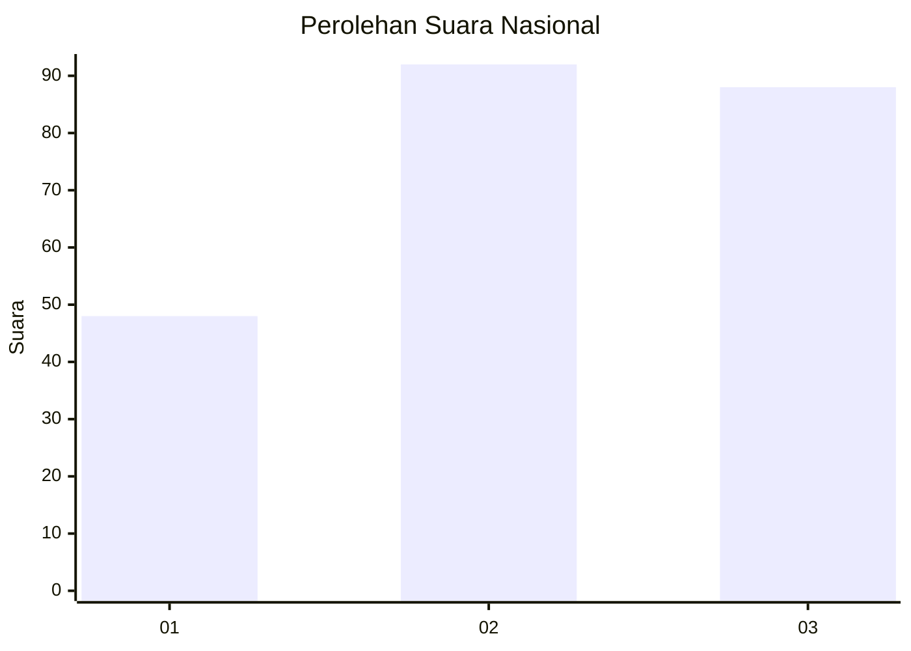
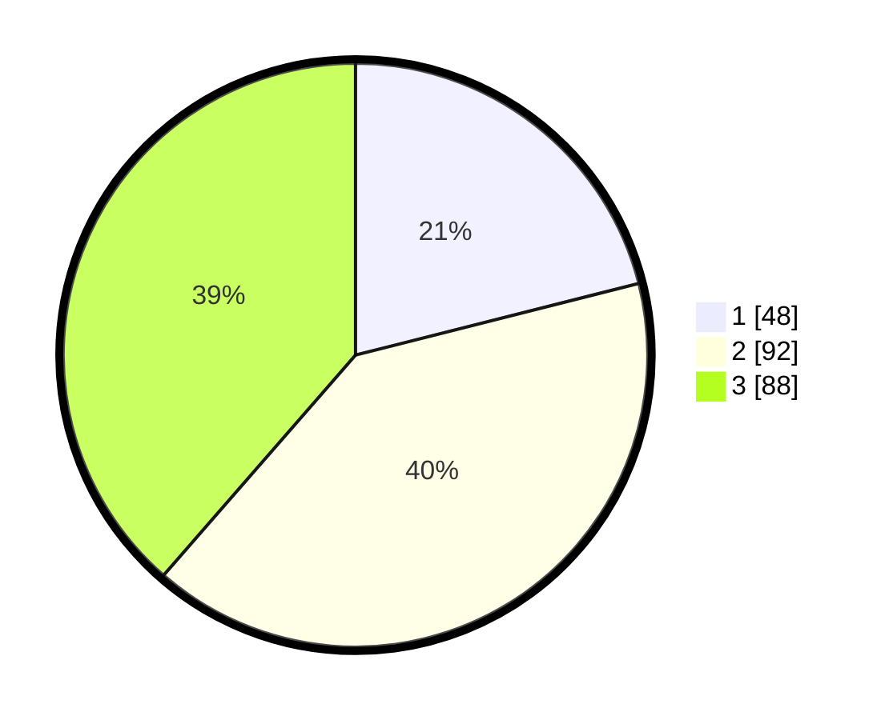

# Hasil

## Grafik

## Tabel

| No.    | Nama Paslon    | Suara | Suara (raw) | Persentase |
|:------ |:-------------- | -----:| -----------:| ----------:|
| 100025 | ANIES MUHAIMIN | 48    | [48][p-1]   | 21,05      |
| 100026 | PRABOWO GIBRAN | 92    | [92][p-2]   | 40,35      |
| 100027 | GANJAR MAHFUD  | 88    | [88][p-3]   | 38,60      |

[p-1]: https://github.com/gigit-pemilu/pemilu-2024/blob/main/pilpres/hitung-suara/sub/31-dki-jakarta/sub/73-jakarta-barat/sub/02-grogol-petamburan/sub/1002-tanjung-duren-utara/sub/029-tps/sub/paslon-1.txt
[p-2]: https://github.com/gigit-pemilu/pemilu-2024/blob/main/pilpres/hitung-suara/sub/31-dki-jakarta/sub/73-jakarta-barat/sub/02-grogol-petamburan/sub/1002-tanjung-duren-utara/sub/029-tps/sub/paslon-2.txt
[p-3]: https://github.com/gigit-pemilu/pemilu-2024/blob/main/pilpres/hitung-suara/sub/31-dki-jakarta/sub/73-jakarta-barat/sub/02-grogol-petamburan/sub/1002-tanjung-duren-utara/sub/029-tps/sub/paslon-3.txt

## Foto C Plano

https://sirekap-obj-formc.kpu.go.id/afe8/pemilu/ppwp/31/73/02/10/02/3173021002029-20240214-205849--6f086d94-40a7-4af0-9ad2-9055998de00f.jpg

https://sirekap-obj-formc.kpu.go.id/afe8/pemilu/ppwp/31/73/02/10/02/3173021002029-20240214-210100--a0109972-5938-4e70-82db-4b019c305528.jpg

https://sirekap-obj-formc.kpu.go.id/afe8/pemilu/ppwp/31/73/02/10/02/3173021002029-20240214-210320--9be62ab7-8e95-4f0b-804e-22d6bceb53b7.jpg

## Metadata

| Key        | Value               |
| ---------- | ------------------- |
| Time Stamp | 2024-02-21 16:00:00 |

