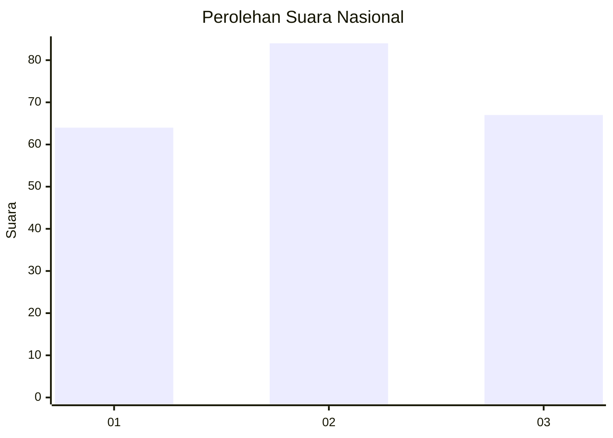
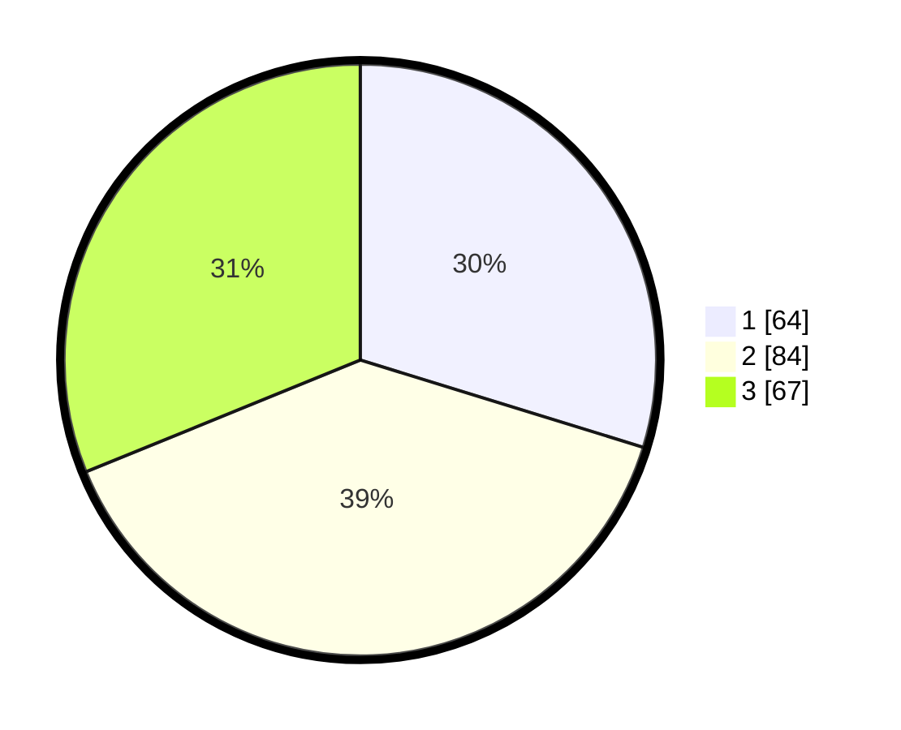

# Hasil

## Grafik

## Tabel

| No.    | Nama Paslon    | Suara | Suara (raw) | Persentase |
|:------ |:-------------- | -----:| -----------:| ----------:|
| 100025 | ANIES MUHAIMIN | 64    | [64][p-1]   | 29,77      |
| 100026 | PRABOWO GIBRAN | 84    | [84][p-2]   | 39,07      |
| 100027 | GANJAR MAHFUD  | 67    | [67][p-3]   | 31,16      |

[p-1]: https://github.com/gigit-pemilu/pemilu-2024/blob/main/pilpres/hitung-suara/sub/31-dki-jakarta/sub/73-jakarta-barat/sub/02-grogol-petamburan/sub/1002-tanjung-duren-utara/sub/032-tps/sub/paslon-1.txt
[p-2]: https://github.com/gigit-pemilu/pemilu-2024/blob/main/pilpres/hitung-suara/sub/31-dki-jakarta/sub/73-jakarta-barat/sub/02-grogol-petamburan/sub/1002-tanjung-duren-utara/sub/032-tps/sub/paslon-2.txt
[p-3]: https://github.com/gigit-pemilu/pemilu-2024/blob/main/pilpres/hitung-suara/sub/31-dki-jakarta/sub/73-jakarta-barat/sub/02-grogol-petamburan/sub/1002-tanjung-duren-utara/sub/032-tps/sub/paslon-3.txt

## Foto C Plano

https://sirekap-obj-formc.kpu.go.id/1591/pemilu/ppwp/31/73/02/10/02/3173021002032-20240215-012805--2c225ef4-d372-4991-a308-c0a4700f8713.jpg

https://sirekap-obj-formc.kpu.go.id/1591/pemilu/ppwp/31/73/02/10/02/3173021002032-20240215-021552--0e418e9f-ecc5-42e9-b994-8e44a2bdcf97.jpg

https://sirekap-obj-formc.kpu.go.id/1591/pemilu/ppwp/31/73/02/10/02/3173021002032-20240215-012953--97d8a645-cc00-429a-93be-60c328a6e31c.jpg

## Metadata

| Key        | Value               |
| ---------- | ------------------- |
| Time Stamp | 2024-02-20 14:00:00 |

