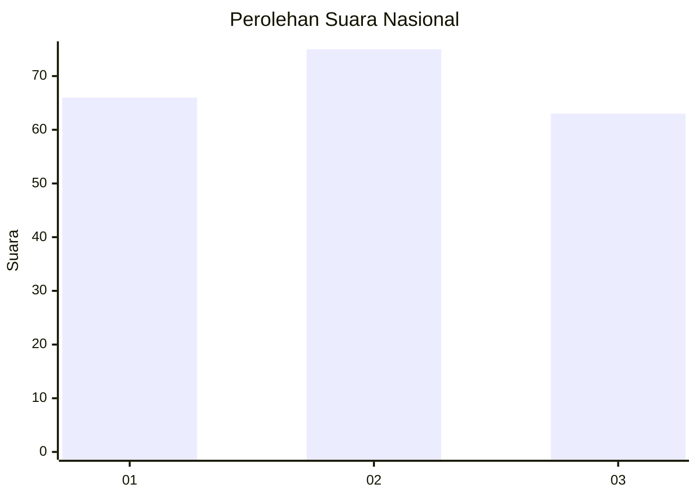
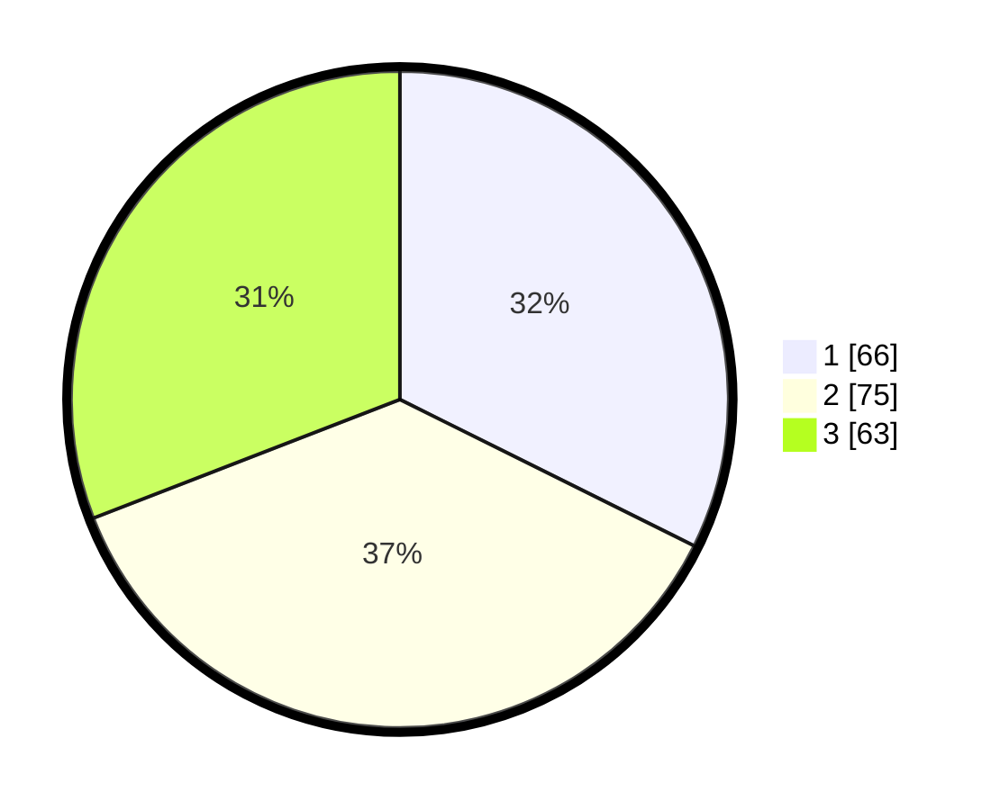

# Hasil

## Grafik

## Tabel

| No.    | Nama Paslon    | Suara | Suara (raw) | Persentase |
|:------ |:-------------- | -----:| -----------:| ----------:|
| 100025 | ANIES MUHAIMIN | 66    | [66][p-1]   | 32,35      |
| 100026 | PRABOWO GIBRAN | 75    | [75][p-2]   | 36,76      |
| 100027 | GANJAR MAHFUD  | 63    | [63][p-3]   | 30,88      |

[p-1]: https://github.com/gigit-pemilu/pemilu-2024/blob/main/pilpres/hitung-suara/sub/31-dki-jakarta/sub/73-jakarta-barat/sub/02-grogol-petamburan/sub/1002-tanjung-duren-utara/sub/048-tps/sub/paslon-1.txt
[p-2]: https://github.com/gigit-pemilu/pemilu-2024/blob/main/pilpres/hitung-suara/sub/31-dki-jakarta/sub/73-jakarta-barat/sub/02-grogol-petamburan/sub/1002-tanjung-duren-utara/sub/048-tps/sub/paslon-2.txt
[p-3]: https://github.com/gigit-pemilu/pemilu-2024/blob/main/pilpres/hitung-suara/sub/31-dki-jakarta/sub/73-jakarta-barat/sub/02-grogol-petamburan/sub/1002-tanjung-duren-utara/sub/048-tps/sub/paslon-3.txt

## Foto C Plano

https://sirekap-obj-formc.kpu.go.id/41cf/pemilu/ppwp/31/73/02/10/02/3173021002048-20240214-232435--90407ea4-5c27-42c6-8e97-1d2362ed408b.jpg

https://sirekap-obj-formc.kpu.go.id/41cf/pemilu/ppwp/31/73/02/10/02/3173021002048-20240214-232522--978b7bf9-1d40-473c-91ec-a38f309c36ce.jpg

https://sirekap-obj-formc.kpu.go.id/41cf/pemilu/ppwp/31/73/02/10/02/3173021002048-20240214-232608--990ff990-182e-4558-93c9-7b6f561ee0e1.jpg

## Metadata

| Key        | Value               |
| ---------- | ------------------- |
| Time Stamp | 2024-02-19 06:16:00 |

