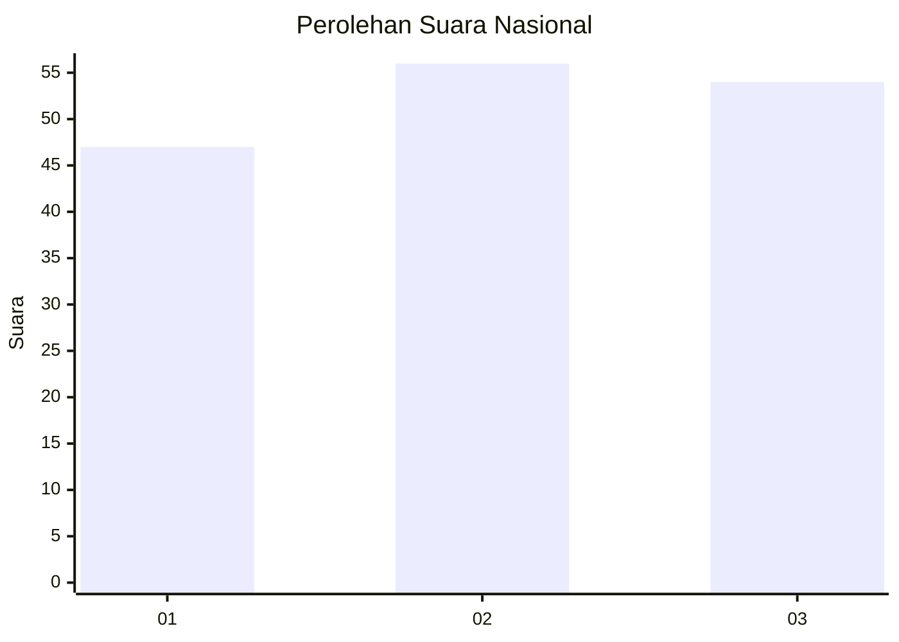
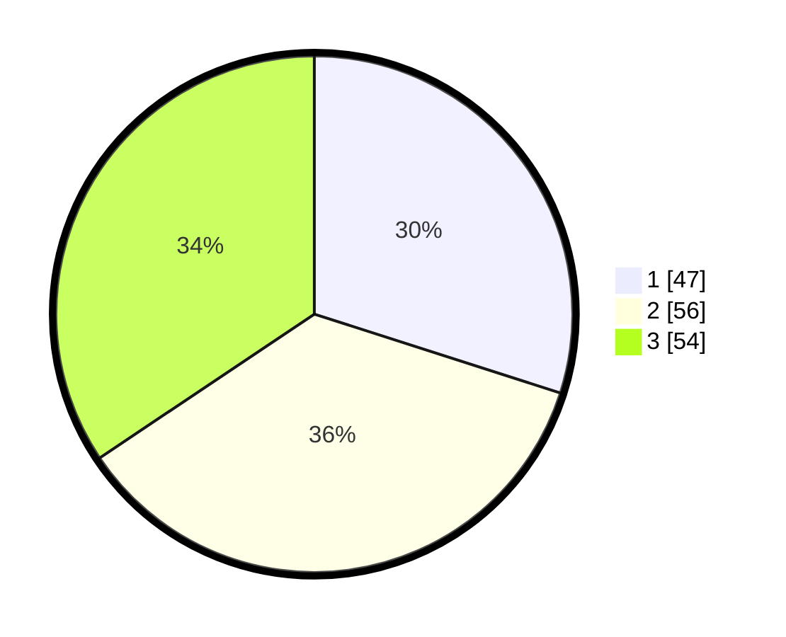

# Hasil

## Grafik

## Tabel

| No.    | Nama Paslon    | Suara | Suara (raw) | Persentase |
|:------ |:-------------- | -----:| -----------:| ----------:|
| 100025 | ANIES MUHAIMIN | 47    | [47][p-1]   | 29,94      |
| 100026 | PRABOWO GIBRAN | 56    | [56][p-2]   | 35,67      |
| 100027 | GANJAR MAHFUD  | 54    | [54][p-3]   | 34,39      |

[p-1]: https://github.com/gigit-pemilu/pemilu-2024/blob/main/pilpres/hitung-suara/sub/31-dki-jakarta/sub/73-jakarta-barat/sub/02-grogol-petamburan/sub/1002-tanjung-duren-utara/sub/054-tps/sub/paslon-1.txt
[p-2]: https://github.com/gigit-pemilu/pemilu-2024/blob/main/pilpres/hitung-suara/sub/31-dki-jakarta/sub/73-jakarta-barat/sub/02-grogol-petamburan/sub/1002-tanjung-duren-utara/sub/054-tps/sub/paslon-2.txt
[p-3]: https://github.com/gigit-pemilu/pemilu-2024/blob/main/pilpres/hitung-suara/sub/31-dki-jakarta/sub/73-jakarta-barat/sub/02-grogol-petamburan/sub/1002-tanjung-duren-utara/sub/054-tps/sub/paslon-3.txt

## Foto C Plano

https://sirekap-obj-formc.kpu.go.id/0e3b/pemilu/ppwp/31/73/02/10/02/3173021002054-20240214-232804--0f40b262-74dd-4a8b-8761-f8693d63b096.jpg

https://sirekap-obj-formc.kpu.go.id/0e3b/pemilu/ppwp/31/73/02/10/02/3173021002054-20240214-213315--127432f8-dbb9-4808-a471-2cb72432bd46.jpg

https://sirekap-obj-formc.kpu.go.id/0e3b/pemilu/ppwp/31/73/02/10/02/3173021002054-20240214-213404--de5875f7-8482-4df2-bdc8-ab8164f6300f.jpg

## Metadata

| Key        | Value               |
| ---------- | ------------------- |
| Time Stamp | 2024-02-19 06:16:00 |

