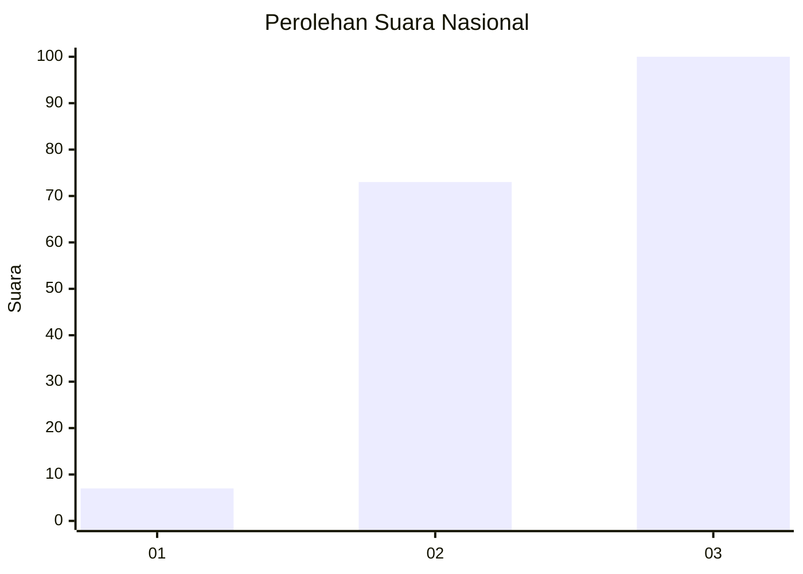
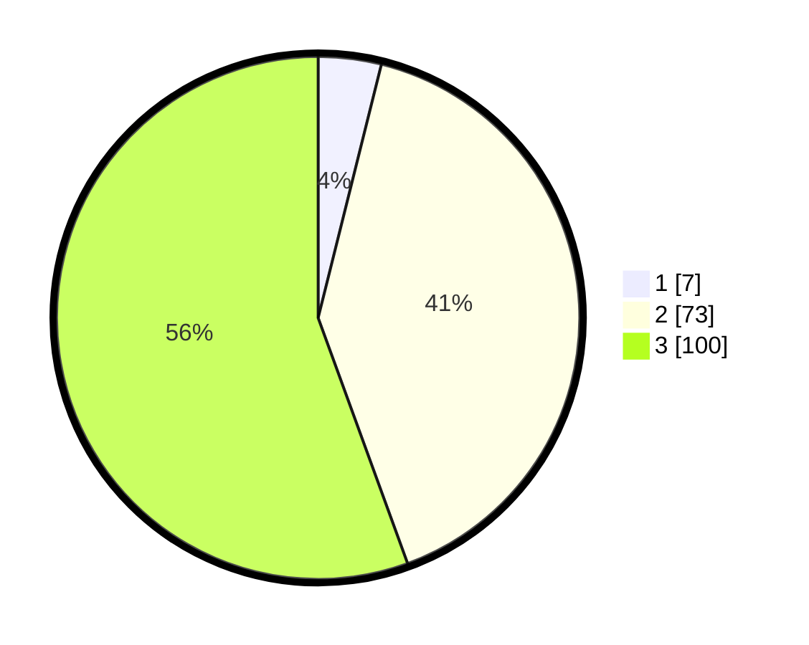

# Hasil

## Grafik

## Tabel

| No. | Nama Paslon    | Suara | Suara (raw) | Persentase |
|:--- |:-------------- | -----:| -----------:| ----------:|
| 1   | ANIES MUHAIMIN | 7     | [7][p-1]    | 3,89       |
| 2   | PRABOWO GIBRAN | 73    | [73][p-2]   | 40,56      |
| 3   | GANJAR MAHFUD  | 100   | [100][p-3]  | 55,56      |

[p-1]: https://github.com/gigit-pemilu/pemilu-2024/blob/main/pilpres/hitung-suara/sub/31-dki-jakarta/sub/73-jakarta-barat/sub/02-grogol-petamburan/sub/1004-jelambar/sub/002-tps/sub/paslon-1.txt
[p-2]: https://github.com/gigit-pemilu/pemilu-2024/blob/main/pilpres/hitung-suara/sub/31-dki-jakarta/sub/73-jakarta-barat/sub/02-grogol-petamburan/sub/1004-jelambar/sub/002-tps/sub/paslon-2.txt
[p-3]: https://github.com/gigit-pemilu/pemilu-2024/blob/main/pilpres/hitung-suara/sub/31-dki-jakarta/sub/73-jakarta-barat/sub/02-grogol-petamburan/sub/1004-jelambar/sub/002-tps/sub/paslon-3.txt

## Foto C Plano

https://sirekap-obj-formc.kpu.go.id/86bc/pemilu/ppwp/31/73/02/10/04/3173021004002-20240214-192658--e090070b-deda-4904-8abf-b3c12f10e2cc.jpg

https://sirekap-obj-formc.kpu.go.id/86bc/pemilu/ppwp/31/73/02/10/04/3173021004002-20240214-194917--6f9fdcad-3756-40ab-b8a5-78b9726bda95.jpg

https://sirekap-obj-formc.kpu.go.id/86bc/pemilu/ppwp/31/73/02/10/04/3173021004002-20240214-195041--11d951ef-68ec-4c59-b10a-99a2e36362df.jpg

## Metadata

| Key        | Value               |
| ---------- | ------------------- |
| Time Stamp | 2024-02-15 00:41:44 |

## DATA PEMILIH TETAP

Jumlah pemilih dalam DPT: **394**.
 * L: **703**.
 * P: **403**.

## DATA PENGGUNA HAK PILIH

Jumlah pengguna hak pilih dalam DPT: **45**.
 * L: **374**.
 * P: **100**.

Jumlah pengguna hak pilih dalam DPTb: **432**.
 * L: **555**.
 * P: **353**.

Jumlah pengguna hak pilih dalam DPK: **333**.
 * L: **353**.
 * P: **933**.

Jumlah pengguna hak pilih: **191**.
 * L: **375**.
 * P: **774**.

## JUMLAH SUARA SAH DAN TIDAK SAH

JUMLAH SELURUH SUARA SAH: **180**.

JUMLAH SUARA TIDAK SAH: **1**.

JUMLAH SELURUH SUARA SAH DAN SUARA TIDAK SAH: **181**.

