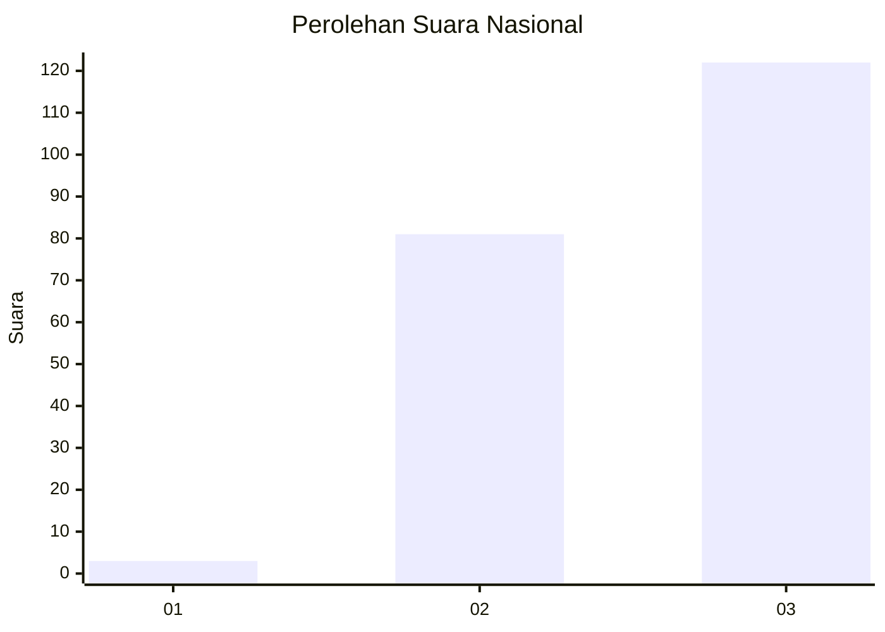
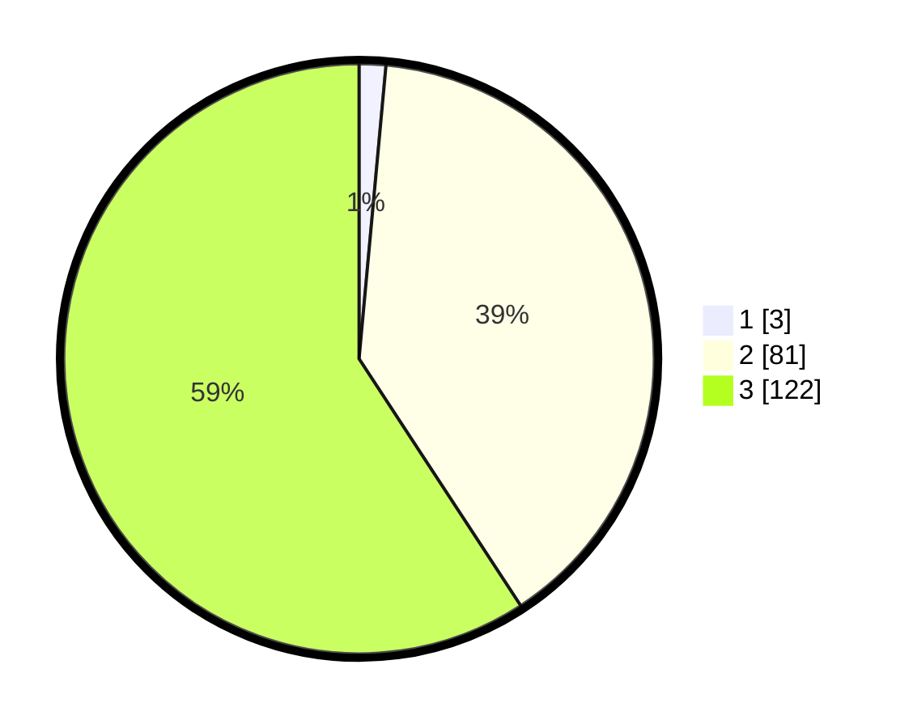

# Hasil

## Grafik

## Tabel

| No.    | Nama Paslon    | Suara | Suara (raw) | Persentase |
|:------ |:-------------- | -----:| -----------:| ----------:|
| 100025 | ANIES MUHAIMIN | 3     | [3][p-1]    | 1,46       |
| 100026 | PRABOWO GIBRAN | 81    | [81][p-2]   | 39,32      |
| 100027 | GANJAR MAHFUD  | 122   | [122][p-3]  | 59,22      |

[p-1]: https://github.com/gigit-pemilu/pemilu-2024/blob/main/pilpres/hitung-suara/sub/31-dki-jakarta/sub/73-jakarta-barat/sub/02-grogol-petamburan/sub/1004-jelambar/sub/006-tps/sub/paslon-1.txt
[p-2]: https://github.com/gigit-pemilu/pemilu-2024/blob/main/pilpres/hitung-suara/sub/31-dki-jakarta/sub/73-jakarta-barat/sub/02-grogol-petamburan/sub/1004-jelambar/sub/006-tps/sub/paslon-2.txt
[p-3]: https://github.com/gigit-pemilu/pemilu-2024/blob/main/pilpres/hitung-suara/sub/31-dki-jakarta/sub/73-jakarta-barat/sub/02-grogol-petamburan/sub/1004-jelambar/sub/006-tps/sub/paslon-3.txt

## Foto C Plano

https://sirekap-obj-formc.kpu.go.id/12e7/pemilu/ppwp/31/73/02/10/04/3173021004006-20240214-222314--57903d8e-db41-40da-96d9-5df68f3ec599.jpg

https://sirekap-obj-formc.kpu.go.id/12e7/pemilu/ppwp/31/73/02/10/04/3173021004006-20240214-234616--f63fa598-14aa-43df-906b-0be698a83781.jpg

https://sirekap-obj-formc.kpu.go.id/12e7/pemilu/ppwp/31/73/02/10/04/3173021004006-20240214-235052--90242224-4b02-45aa-adc4-d74b07704ff6.jpg

## Metadata

| Key        | Value               |
| ---------- | ------------------- |
| Time Stamp | 2024-02-16 01:00:27 |

