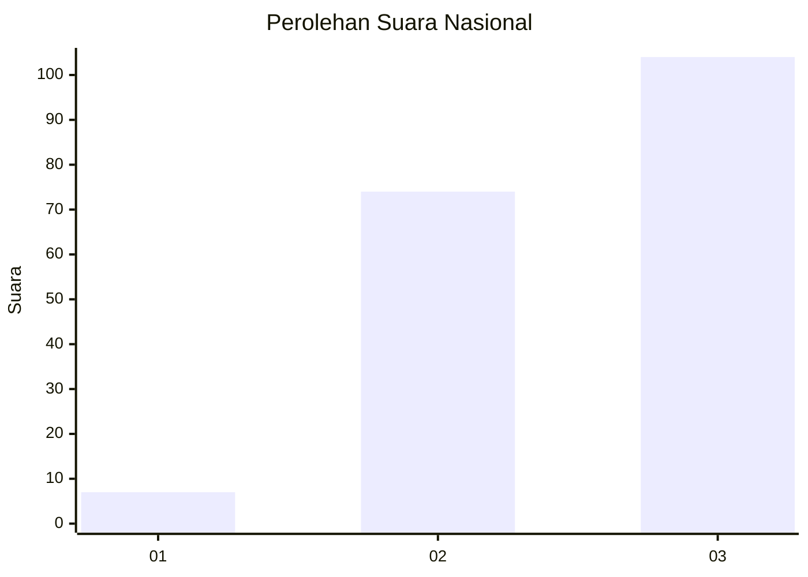
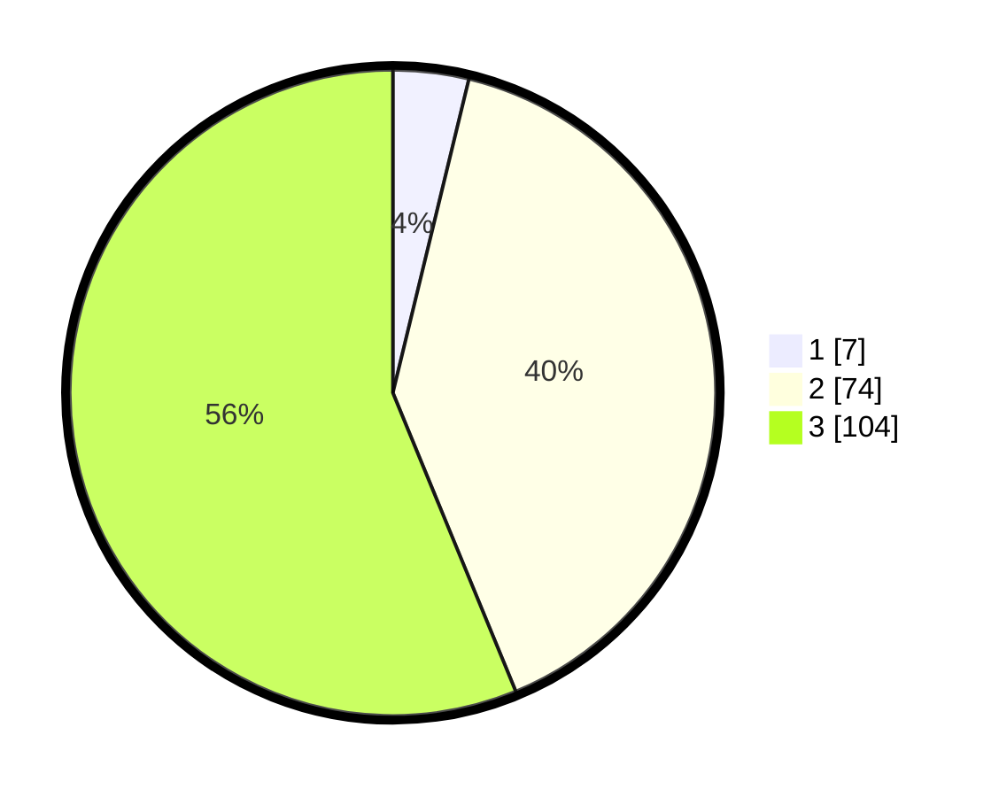

# Hasil

## Grafik

## Tabel

| No.    | Nama Paslon    | Suara | Suara (raw) | Persentase |
|:------ |:-------------- | -----:| -----------:| ----------:|
| 100025 | ANIES MUHAIMIN | 7     | [7][p-1]    | 3,78       |
| 100026 | PRABOWO GIBRAN | 74    | [74][p-2]   | 40,00      |
| 100027 | GANJAR MAHFUD  | 104   | [104][p-3]  | 56,22      |

[p-1]: https://github.com/gigit-pemilu/pemilu-2024/blob/main/pilpres/hitung-suara/sub/31-dki-jakarta/sub/73-jakarta-barat/sub/02-grogol-petamburan/sub/1004-jelambar/sub/010-tps/sub/paslon-1.txt
[p-2]: https://github.com/gigit-pemilu/pemilu-2024/blob/main/pilpres/hitung-suara/sub/31-dki-jakarta/sub/73-jakarta-barat/sub/02-grogol-petamburan/sub/1004-jelambar/sub/010-tps/sub/paslon-2.txt
[p-3]: https://github.com/gigit-pemilu/pemilu-2024/blob/main/pilpres/hitung-suara/sub/31-dki-jakarta/sub/73-jakarta-barat/sub/02-grogol-petamburan/sub/1004-jelambar/sub/010-tps/sub/paslon-3.txt

## Foto C Plano

https://sirekap-obj-formc.kpu.go.id/c194/pemilu/ppwp/31/73/02/10/04/3173021004010-20240214-211717--1774ad4d-faf8-46b6-83ef-c34a42d978ab.jpg

https://sirekap-obj-formc.kpu.go.id/c194/pemilu/ppwp/31/73/02/10/04/3173021004010-20240214-211803--cbe00beb-a527-4af3-af00-05d69d340059.jpg

https://sirekap-obj-formc.kpu.go.id/c194/pemilu/ppwp/31/73/02/10/04/3173021004010-20240214-211839--4e934a42-552d-4f41-bb18-1c35fc811289.jpg

## Metadata

| Key        | Value               |
| ---------- | ------------------- |
| Time Stamp | 2024-02-16 01:00:27 |

