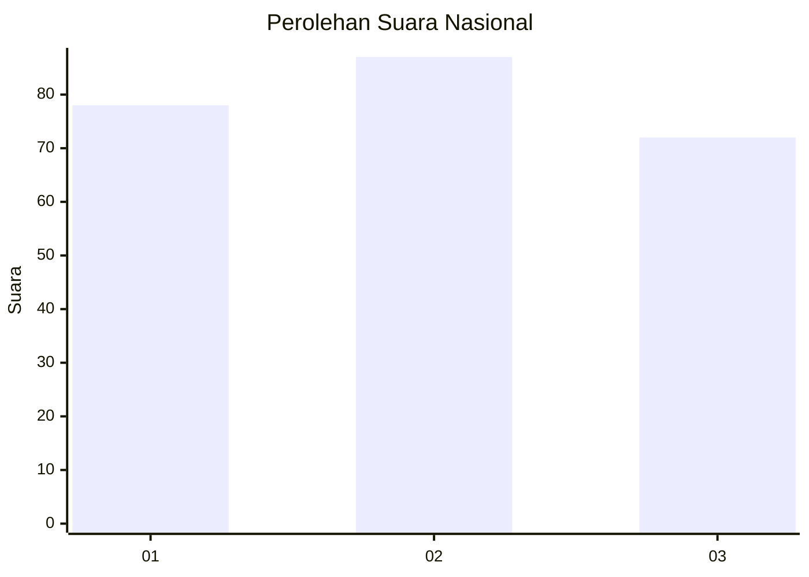
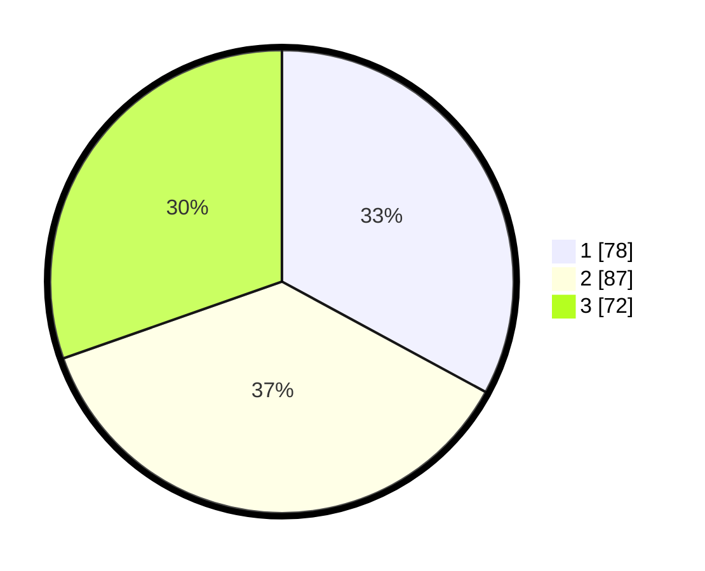

# Hasil

## Grafik

## Tabel

| No.    | Nama Paslon    | Suara | Suara (raw) | Persentase |
|:------ |:-------------- | -----:| -----------:| ----------:|
| 100025 | ANIES MUHAIMIN | 78    | [78][p-1]   | 32,91      |
| 100026 | PRABOWO GIBRAN | 87    | [87][p-2]   | 36,71      |
| 100027 | GANJAR MAHFUD  | 72    | [72][p-3]   | 30,38      |

[p-1]: https://github.com/gigit-pemilu/pemilu-2024/blob/main/pilpres/hitung-suara/sub/31-dki-jakarta/sub/73-jakarta-barat/sub/02-grogol-petamburan/sub/1004-jelambar/sub/017-tps/sub/paslon-1.txt
[p-2]: https://github.com/gigit-pemilu/pemilu-2024/blob/main/pilpres/hitung-suara/sub/31-dki-jakarta/sub/73-jakarta-barat/sub/02-grogol-petamburan/sub/1004-jelambar/sub/017-tps/sub/paslon-2.txt
[p-3]: https://github.com/gigit-pemilu/pemilu-2024/blob/main/pilpres/hitung-suara/sub/31-dki-jakarta/sub/73-jakarta-barat/sub/02-grogol-petamburan/sub/1004-jelambar/sub/017-tps/sub/paslon-3.txt

## Foto C Plano

https://sirekap-obj-formc.kpu.go.id/54f0/pemilu/ppwp/31/73/02/10/04/3173021004017-20240214-223005--bf9f4c2e-f4e7-4b6a-a061-fe6f35717c20.jpg

https://sirekap-obj-formc.kpu.go.id/54f0/pemilu/ppwp/31/73/02/10/04/3173021004017-20240214-223116--ac475b38-cc77-4d4e-b409-8a75ad15dfa1.jpg

https://sirekap-obj-formc.kpu.go.id/54f0/pemilu/ppwp/31/73/02/10/04/3173021004017-20240214-223248--5f962c72-2b21-4785-8829-f83024f94af7.jpg

## Metadata

| Key        | Value               |
| ---------- | ------------------- |
| Time Stamp | 2024-02-16 01:00:27 |

