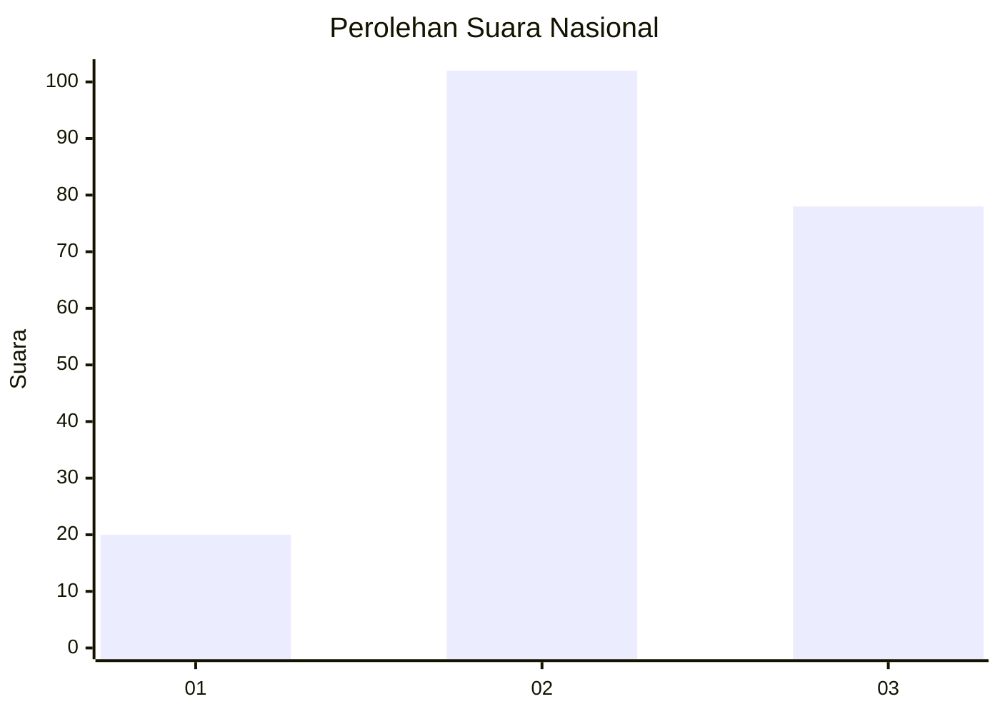
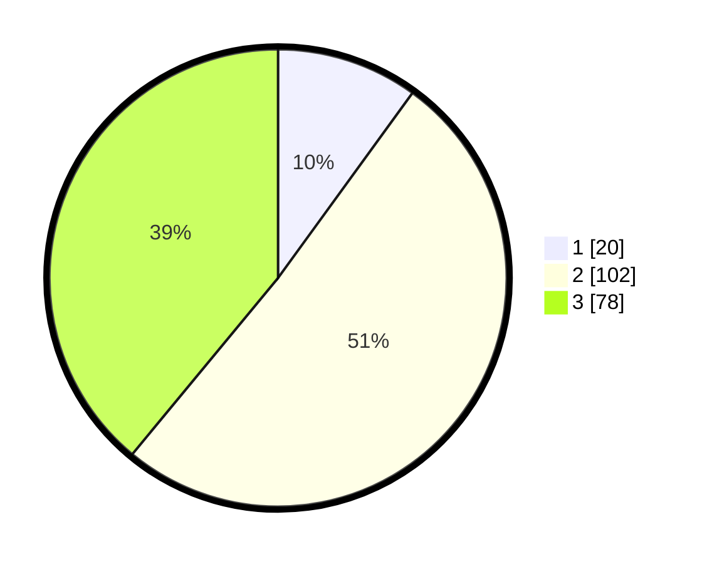

# Hasil

## Grafik

## Tabel

| No.    | Nama Paslon    | Suara | Suara (raw) | Persentase |
|:------ |:-------------- | -----:| -----------:| ----------:|
| 100025 | ANIES MUHAIMIN | 20    | [20][p-1]   | 10,00      |
| 100026 | PRABOWO GIBRAN | 102   | [102][p-2]  | 51,00      |
| 100027 | GANJAR MAHFUD  | 78    | [78][p-3]   | 39,00      |

[p-1]: https://github.com/gigit-pemilu/pemilu-2024/blob/main/pilpres/hitung-suara/sub/31-dki-jakarta/sub/73-jakarta-barat/sub/02-grogol-petamburan/sub/1004-jelambar/sub/020-tps/sub/paslon-1.txt
[p-2]: https://github.com/gigit-pemilu/pemilu-2024/blob/main/pilpres/hitung-suara/sub/31-dki-jakarta/sub/73-jakarta-barat/sub/02-grogol-petamburan/sub/1004-jelambar/sub/020-tps/sub/paslon-2.txt
[p-3]: https://github.com/gigit-pemilu/pemilu-2024/blob/main/pilpres/hitung-suara/sub/31-dki-jakarta/sub/73-jakarta-barat/sub/02-grogol-petamburan/sub/1004-jelambar/sub/020-tps/sub/paslon-3.txt

## Foto C Plano

https://sirekap-obj-formc.kpu.go.id/7f14/pemilu/ppwp/31/73/02/10/04/3173021004020-20240215-012017--3919392b-a51a-4e87-a4f1-9e9e3a644488.jpg

https://sirekap-obj-formc.kpu.go.id/7f14/pemilu/ppwp/31/73/02/10/04/3173021004020-20240215-012050--4d1ff769-3038-4d3c-ad42-8722d3bfba13.jpg

https://sirekap-obj-formc.kpu.go.id/7f14/pemilu/ppwp/31/73/02/10/04/3173021004020-20240215-012108--0da2cf44-9b91-44b3-95ca-4ab56ed67d59.jpg

## Metadata

| Key        | Value               |
| ---------- | ------------------- |
| Time Stamp | 2024-02-19 06:16:00 |

