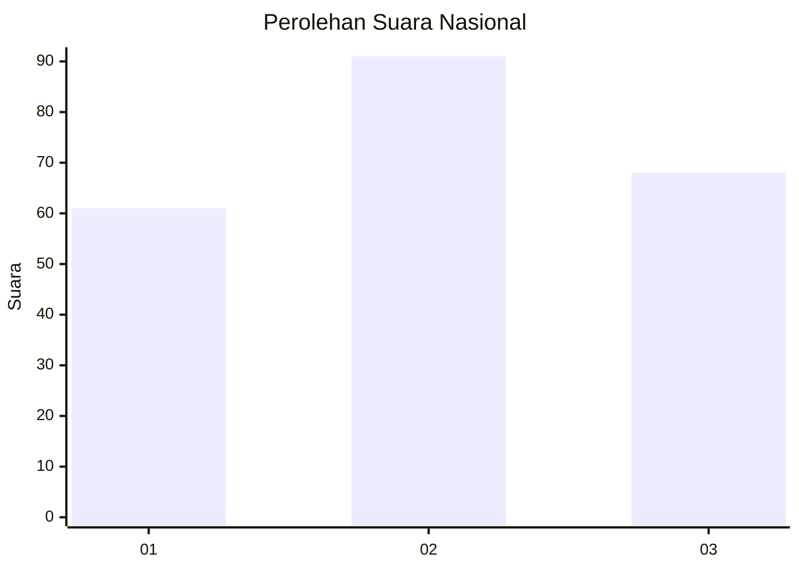
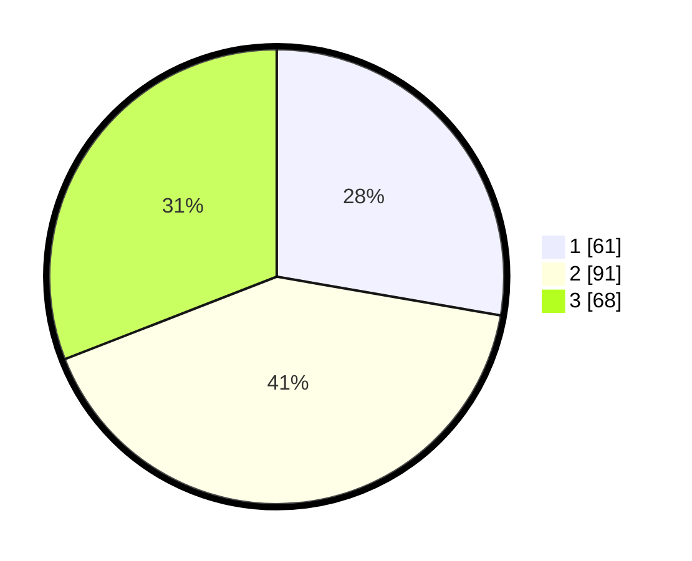

# Hasil

## Grafik

## Tabel

| No.    | Nama Paslon    | Suara | Suara (raw) | Persentase |
|:------ |:-------------- | -----:| -----------:| ----------:|
| 100025 | ANIES MUHAIMIN | 61    | [61][p-1]   | 27,73      |
| 100026 | PRABOWO GIBRAN | 91    | [91][p-2]   | 41,36      |
| 100027 | GANJAR MAHFUD  | 68    | [68][p-3]   | 30,91      |

[p-1]: https://github.com/gigit-pemilu/pemilu-2024/blob/main/pilpres/hitung-suara/sub/31-dki-jakarta/sub/73-jakarta-barat/sub/02-grogol-petamburan/sub/1004-jelambar/sub/021-tps/sub/paslon-1.txt
[p-2]: https://github.com/gigit-pemilu/pemilu-2024/blob/main/pilpres/hitung-suara/sub/31-dki-jakarta/sub/73-jakarta-barat/sub/02-grogol-petamburan/sub/1004-jelambar/sub/021-tps/sub/paslon-2.txt
[p-3]: https://github.com/gigit-pemilu/pemilu-2024/blob/main/pilpres/hitung-suara/sub/31-dki-jakarta/sub/73-jakarta-barat/sub/02-grogol-petamburan/sub/1004-jelambar/sub/021-tps/sub/paslon-3.txt

## Foto C Plano

https://sirekap-obj-formc.kpu.go.id/7788/pemilu/ppwp/31/73/02/10/04/3173021004021-20240214-194146--e119c368-a2b4-4f05-9b63-97df01fea272.jpg

https://sirekap-obj-formc.kpu.go.id/7788/pemilu/ppwp/31/73/02/10/04/3173021004021-20240214-194308--c6f1dcb2-18ba-40b3-9d0d-2a4ff7a03433.jpg

https://sirekap-obj-formc.kpu.go.id/7788/pemilu/ppwp/31/73/02/10/04/3173021004021-20240214-194540--95ad6475-cc52-4416-845c-b029d1369b1b.jpg

## Metadata

| Key        | Value               |
| ---------- | ------------------- |
| Time Stamp | 2024-02-19 22:00:00 |

