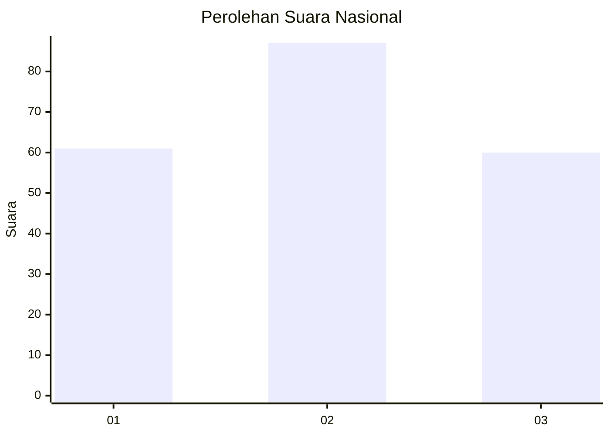
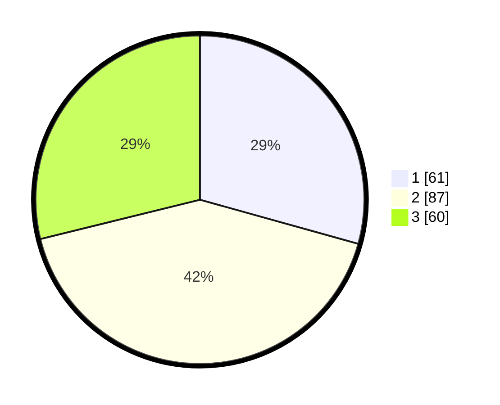

# Hasil

## Grafik

## Tabel

| No.    | Nama Paslon    | Suara | Suara (raw) | Persentase |
|:------ |:-------------- | -----:| -----------:| ----------:|
| 100025 | ANIES MUHAIMIN | 61    | [61][p-1]   | 29,33      |
| 100026 | PRABOWO GIBRAN | 87    | [87][p-2]   | 41,83      |
| 100027 | GANJAR MAHFUD  | 60    | [60][p-3]   | 28,85      |

[p-1]: https://github.com/gigit-pemilu/pemilu-2024/blob/main/pilpres/hitung-suara/sub/31-dki-jakarta/sub/73-jakarta-barat/sub/02-grogol-petamburan/sub/1004-jelambar/sub/034-tps/sub/paslon-1.txt
[p-2]: https://github.com/gigit-pemilu/pemilu-2024/blob/main/pilpres/hitung-suara/sub/31-dki-jakarta/sub/73-jakarta-barat/sub/02-grogol-petamburan/sub/1004-jelambar/sub/034-tps/sub/paslon-2.txt
[p-3]: https://github.com/gigit-pemilu/pemilu-2024/blob/main/pilpres/hitung-suara/sub/31-dki-jakarta/sub/73-jakarta-barat/sub/02-grogol-petamburan/sub/1004-jelambar/sub/034-tps/sub/paslon-3.txt

## Foto C Plano

https://sirekap-obj-formc.kpu.go.id/b650/pemilu/ppwp/31/73/02/10/04/3173021004034-20240216-222522--b2cab778-49e9-4cb5-b756-604285c738b6.jpg

https://sirekap-obj-formc.kpu.go.id/b650/pemilu/ppwp/31/73/02/10/04/3173021004034-20240216-222601--6919d9e3-41e9-464e-b715-7987ca326bb8.jpg

https://sirekap-obj-formc.kpu.go.id/b650/pemilu/ppwp/31/73/02/10/04/3173021004034-20240216-221742--6f5e0589-e733-475a-ab30-b1097ff51eb6.jpg

## Metadata

| Key        | Value               |
| ---------- | ------------------- |
| Time Stamp | 2024-02-19 21:00:00 |

