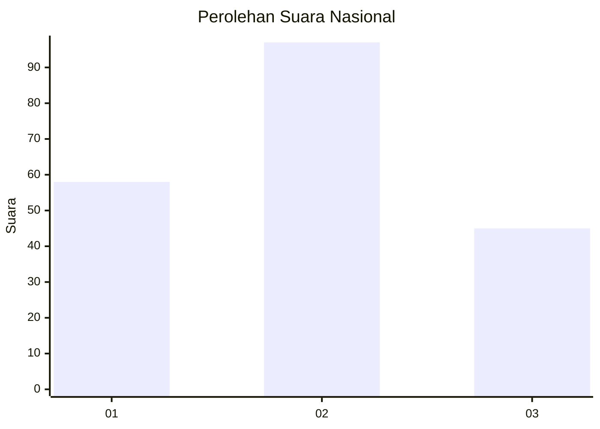
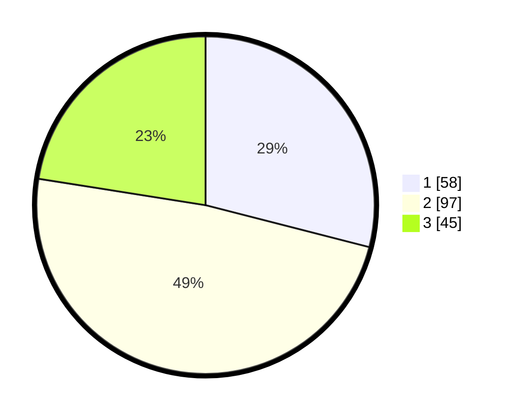

# Hasil

## Grafik

## Tabel

| No.    | Nama Paslon    | Suara | Suara (raw) | Persentase |
|:------ |:-------------- | -----:| -----------:| ----------:|
| 100025 | ANIES MUHAIMIN | 58    | [58][p-1]   | 29,00      |
| 100026 | PRABOWO GIBRAN | 97    | [97][p-2]   | 48,50      |
| 100027 | GANJAR MAHFUD  | 45    | [45][p-3]   | 22,50      |

[p-1]: https://github.com/gigit-pemilu/pemilu-2024/blob/main/pilpres/hitung-suara/sub/31-dki-jakarta/sub/73-jakarta-barat/sub/02-grogol-petamburan/sub/1004-jelambar/sub/041-tps/sub/paslon-1.txt
[p-2]: https://github.com/gigit-pemilu/pemilu-2024/blob/main/pilpres/hitung-suara/sub/31-dki-jakarta/sub/73-jakarta-barat/sub/02-grogol-petamburan/sub/1004-jelambar/sub/041-tps/sub/paslon-2.txt
[p-3]: https://github.com/gigit-pemilu/pemilu-2024/blob/main/pilpres/hitung-suara/sub/31-dki-jakarta/sub/73-jakarta-barat/sub/02-grogol-petamburan/sub/1004-jelambar/sub/041-tps/sub/paslon-3.txt

## Foto C Plano

https://sirekap-obj-formc.kpu.go.id/4cd3/pemilu/ppwp/31/73/02/10/04/3173021004041-20240215-000139--bb0542c1-252e-4bf4-9840-61e8d161f2a9.jpg

https://sirekap-obj-formc.kpu.go.id/4cd3/pemilu/ppwp/31/73/02/10/04/3173021004041-20240215-000229--ed78474e-00f3-412b-b8f5-89cfeff85497.jpg

https://sirekap-obj-formc.kpu.go.id/4cd3/pemilu/ppwp/31/73/02/10/04/3173021004041-20240215-000432--592c16a7-e9f5-4158-ad7b-5c17b081725e.jpg

## Metadata

| Key        | Value               |
| ---------- | ------------------- |
| Time Stamp | 2024-02-19 06:16:00 |

