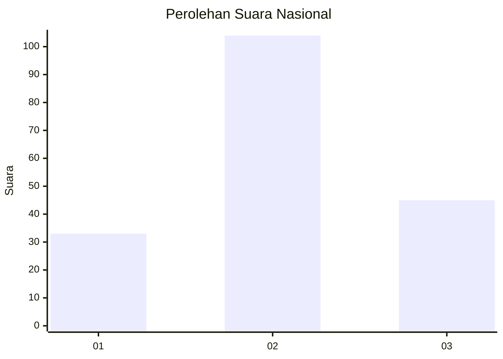
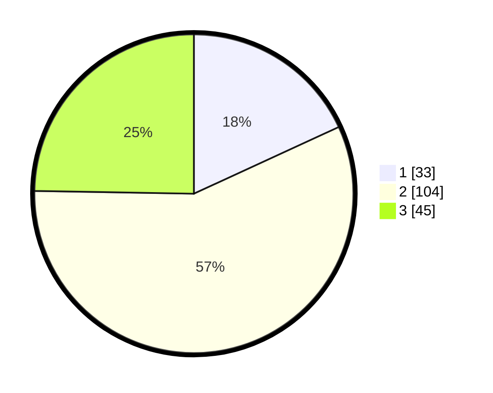

# Hasil

## Grafik

## Tabel

| No.    | Nama Paslon    | Suara | Suara (raw) | Persentase |
|:------ |:-------------- | -----:| -----------:| ----------:|
| 100025 | ANIES MUHAIMIN | 33    | [33][p-1]   | 18,13      |
| 100026 | PRABOWO GIBRAN | 104   | [104][p-2]  | 57,14      |
| 100027 | GANJAR MAHFUD  | 45    | [45][p-3]   | 24,73      |

[p-1]: https://github.com/gigit-pemilu/pemilu-2024/blob/main/pilpres/hitung-suara/sub/31-dki-jakarta/sub/73-jakarta-barat/sub/02-grogol-petamburan/sub/1004-jelambar/sub/051-tps/sub/paslon-1.txt
[p-2]: https://github.com/gigit-pemilu/pemilu-2024/blob/main/pilpres/hitung-suara/sub/31-dki-jakarta/sub/73-jakarta-barat/sub/02-grogol-petamburan/sub/1004-jelambar/sub/051-tps/sub/paslon-2.txt
[p-3]: https://github.com/gigit-pemilu/pemilu-2024/blob/main/pilpres/hitung-suara/sub/31-dki-jakarta/sub/73-jakarta-barat/sub/02-grogol-petamburan/sub/1004-jelambar/sub/051-tps/sub/paslon-3.txt

## Foto C Plano

https://sirekap-obj-formc.kpu.go.id/b119/pemilu/ppwp/31/73/02/10/04/3173021004051-20240214-234724--25cd480d-8868-4551-b2d2-ce0d1d59e58e.jpg

https://sirekap-obj-formc.kpu.go.id/b119/pemilu/ppwp/31/73/02/10/04/3173021004051-20240214-234826--716643e7-4e8a-448c-bae7-654fb359d6ec.jpg

https://sirekap-obj-formc.kpu.go.id/b119/pemilu/ppwp/31/73/02/10/04/3173021004051-20240214-234911--4e1504d4-3fba-4bf9-ae92-b709de318438.jpg

## Metadata

| Key        | Value               |
| ---------- | ------------------- |
| Time Stamp | 2024-02-19 06:16:00 |

