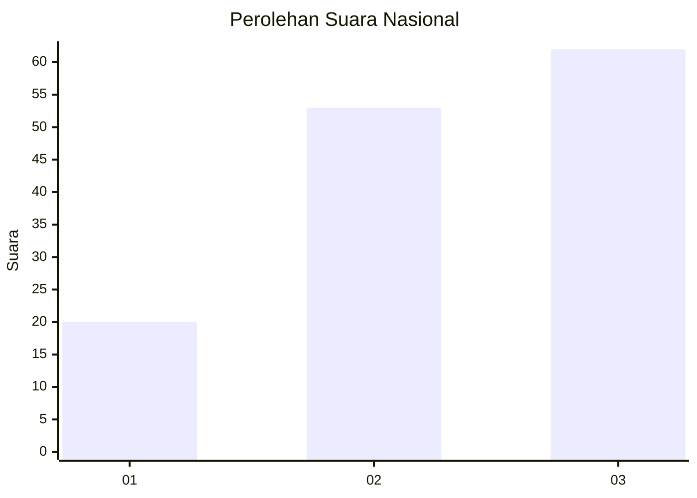
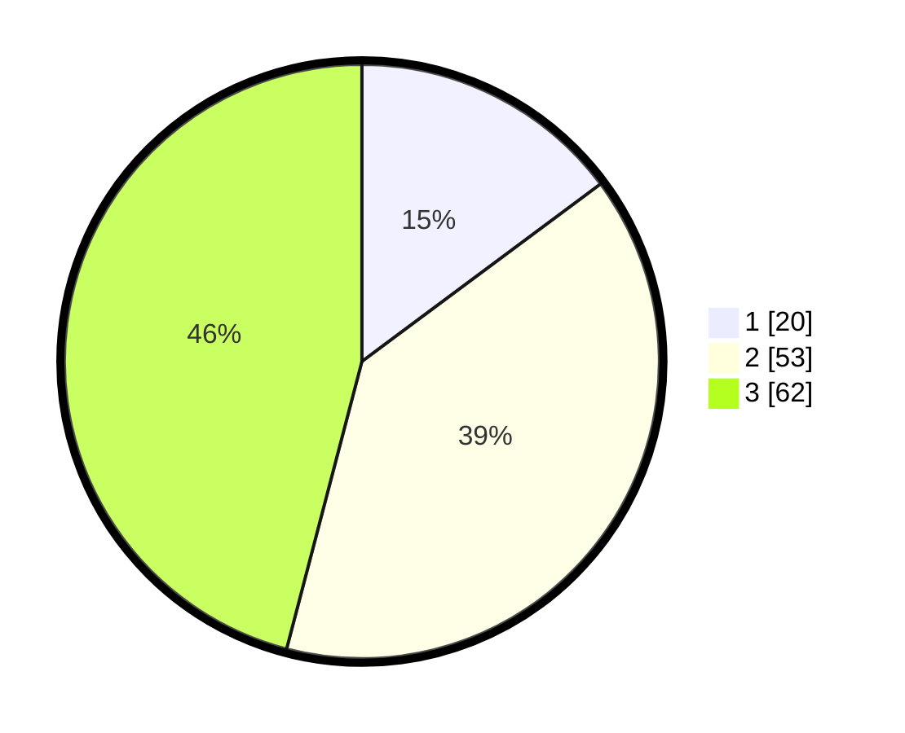

# Hasil

## Grafik

## Tabel

| No.    | Nama Paslon    | Suara | Suara (raw) | Persentase |
|:------ |:-------------- | -----:| -----------:| ----------:|
| 100025 | ANIES MUHAIMIN | 20    | [20][p-1]   | 14,81      |
| 100026 | PRABOWO GIBRAN | 53    | [53][p-2]   | 39,26      |
| 100027 | GANJAR MAHFUD  | 62    | [62][p-3]   | 45,93      |

[p-1]: https://github.com/gigit-pemilu/pemilu-2024/blob/main/pilpres/hitung-suara/sub/31-dki-jakarta/sub/73-jakarta-barat/sub/02-grogol-petamburan/sub/1004-jelambar/sub/064-tps/sub/paslon-1.txt
[p-2]: https://github.com/gigit-pemilu/pemilu-2024/blob/main/pilpres/hitung-suara/sub/31-dki-jakarta/sub/73-jakarta-barat/sub/02-grogol-petamburan/sub/1004-jelambar/sub/064-tps/sub/paslon-2.txt
[p-3]: https://github.com/gigit-pemilu/pemilu-2024/blob/main/pilpres/hitung-suara/sub/31-dki-jakarta/sub/73-jakarta-barat/sub/02-grogol-petamburan/sub/1004-jelambar/sub/064-tps/sub/paslon-3.txt

## Foto C Plano

https://sirekap-obj-formc.kpu.go.id/4e23/pemilu/ppwp/31/73/02/10/04/3173021004064-20240214-222802--899f4aa6-06da-4aee-b88e-ddca5e95dfb6.jpg

https://sirekap-obj-formc.kpu.go.id/4e23/pemilu/ppwp/31/73/02/10/04/3173021004064-20240214-224008--6a37fbeb-cb9b-441e-858c-490efd1417fb.jpg

https://sirekap-obj-formc.kpu.go.id/4e23/pemilu/ppwp/31/73/02/10/04/3173021004064-20240214-224111--d51d8c2d-b76b-436e-a41e-23aee8abbdb5.jpg

## Metadata

| Key        | Value               |
| ---------- | ------------------- |
| Time Stamp | 2024-02-16 01:00:27 |

