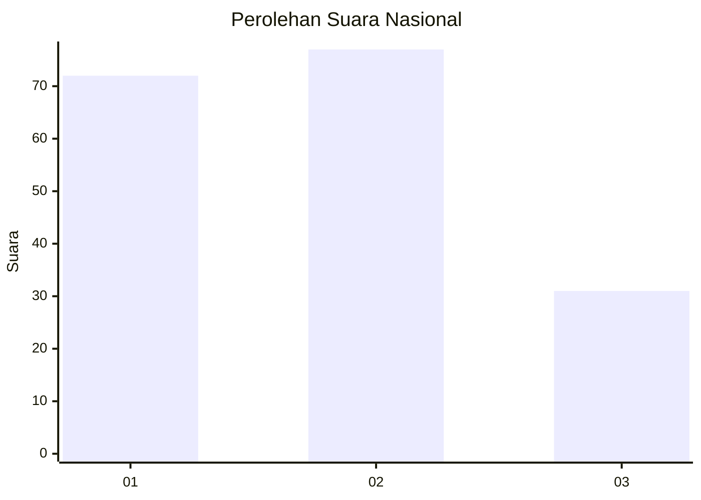
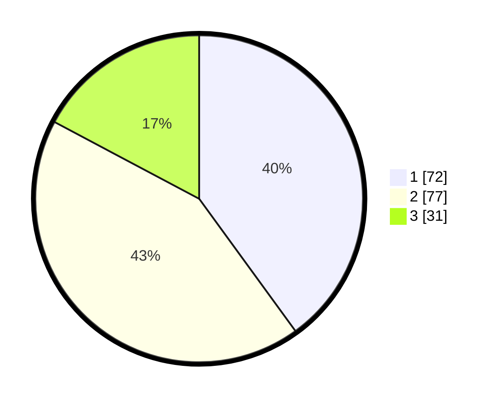

# Hasil

## Grafik

## Tabel

| No. | Nama Paslon    | Suara | Suara (raw) | Persentase |
|:--- |:-------------- | -----:| -----------:| ----------:|
| 1   | ANIES MUHAIMIN | 72    | [72][p-1]   | 40,00      |
| 2   | PRABOWO GIBRAN | 77    | [77][p-2]   | 42,78      |
| 3   | GANJAR MAHFUD  | 31    | [31][p-3]   | 17,22      |

[p-1]: https://github.com/gigit-pemilu/pemilu-2024/blob/main/pilpres/hitung-suara/sub/31-dki-jakarta/sub/73-jakarta-barat/sub/02-grogol-petamburan/sub/1004-jelambar/sub/070-tps/sub/paslon-1.txt
[p-2]: https://github.com/gigit-pemilu/pemilu-2024/blob/main/pilpres/hitung-suara/sub/31-dki-jakarta/sub/73-jakarta-barat/sub/02-grogol-petamburan/sub/1004-jelambar/sub/070-tps/sub/paslon-2.txt
[p-3]: https://github.com/gigit-pemilu/pemilu-2024/blob/main/pilpres/hitung-suara/sub/31-dki-jakarta/sub/73-jakarta-barat/sub/02-grogol-petamburan/sub/1004-jelambar/sub/070-tps/sub/paslon-3.txt

## Foto C Plano

https://sirekap-obj-formc.kpu.go.id/4baf/pemilu/ppwp/31/73/02/10/04/3173021004070-20240215-013102--4048e7c8-678d-43c0-b633-08bef89aeb29.jpg

https://sirekap-obj-formc.kpu.go.id/4baf/pemilu/ppwp/31/73/02/10/04/3173021004070-20240215-013349--51acd887-8e78-4956-ac16-1ed958b84bd9.jpg

https://sirekap-obj-formc.kpu.go.id/4baf/pemilu/ppwp/31/73/02/10/04/3173021004070-20240215-013535--a2c9def5-196c-4ba2-9267-c47d05a230b2.jpg

## Metadata

| Key        | Value               |
| ---------- | ------------------- |
| Time Stamp | 2024-02-19 06:16:00 |

## DATA PEMILIH TETAP

Jumlah pemilih dalam DPT: **242**.
 * L: **774**.
 * P: **278**.

## DATA PENGGUNA HAK PILIH

Jumlah pengguna hak pilih dalam DPT: **378**.
 * L: **84**.
 * P: **94**.

Jumlah pengguna hak pilih dalam DPTb: **277**.
 * L: **888**.
 * P: **782**.

Jumlah pengguna hak pilih dalam DPK: **3**.
 * L: **6**.
 * P: **2**.

Jumlah pengguna hak pilih: **181**.
 * L: **885**.
 * P: **96**.

## JUMLAH SUARA SAH DAN TIDAK SAH

JUMLAH SELURUH SUARA SAH: **180**.

JUMLAH SUARA TIDAK SAH: **1**.

JUMLAH SELURUH SUARA SAH DAN SUARA TIDAK SAH: **181**.

