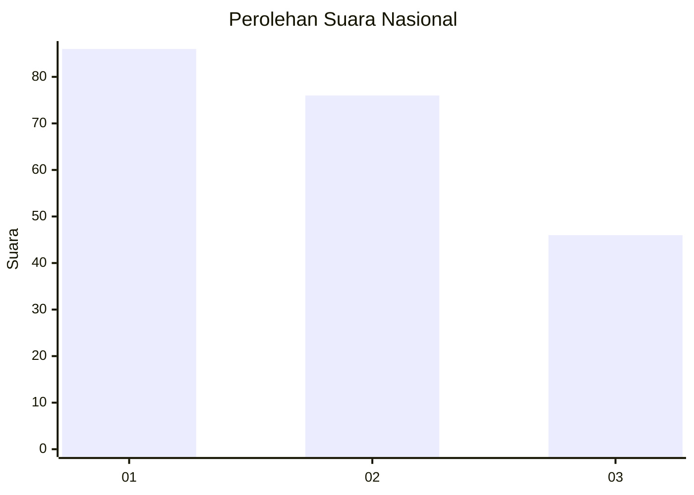
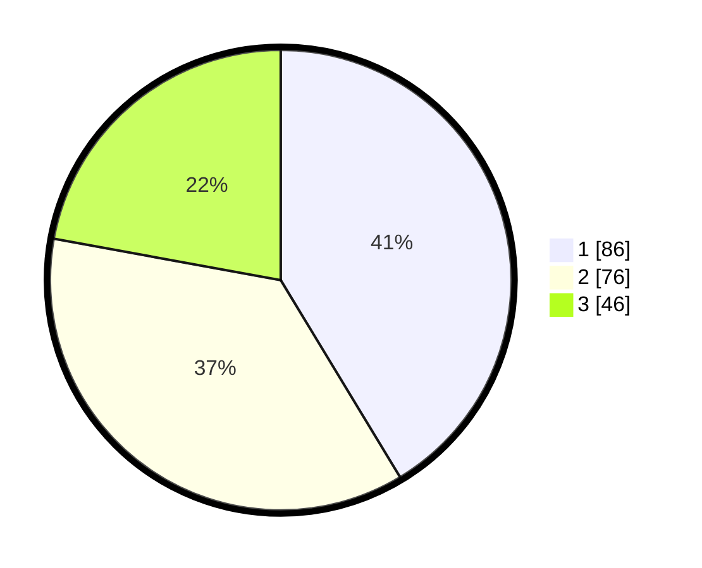

# Hasil

## Grafik

## Tabel

| No.    | Nama Paslon    | Suara | Suara (raw) | Persentase |
|:------ |:-------------- | -----:| -----------:| ----------:|
| 100025 | ANIES MUHAIMIN | 86    | [86][p-1]   | 41,35      |
| 100026 | PRABOWO GIBRAN | 76    | [76][p-2]   | 36,54      |
| 100027 | GANJAR MAHFUD  | 46    | [46][p-3]   | 22,12      |

[p-1]: https://github.com/gigit-pemilu/pemilu-2024/blob/main/pilpres/hitung-suara/sub/31-dki-jakarta/sub/73-jakarta-barat/sub/02-grogol-petamburan/sub/1004-jelambar/sub/077-tps/sub/paslon-1.txt
[p-2]: https://github.com/gigit-pemilu/pemilu-2024/blob/main/pilpres/hitung-suara/sub/31-dki-jakarta/sub/73-jakarta-barat/sub/02-grogol-petamburan/sub/1004-jelambar/sub/077-tps/sub/paslon-2.txt
[p-3]: https://github.com/gigit-pemilu/pemilu-2024/blob/main/pilpres/hitung-suara/sub/31-dki-jakarta/sub/73-jakarta-barat/sub/02-grogol-petamburan/sub/1004-jelambar/sub/077-tps/sub/paslon-3.txt

## Foto C Plano

https://sirekap-obj-formc.kpu.go.id/eef7/pemilu/ppwp/31/73/02/10/04/3173021004077-20240215-004553--08d3b4a7-1a9e-4b81-8246-3d0e1307c396.jpg

https://sirekap-obj-formc.kpu.go.id/eef7/pemilu/ppwp/31/73/02/10/04/3173021004077-20240215-004631--55ffb2d8-c491-4cda-8bff-f61e40cb8d26.jpg

https://sirekap-obj-formc.kpu.go.id/eef7/pemilu/ppwp/31/73/02/10/04/3173021004077-20240215-004732--2fe9dc61-398c-4ac9-a26e-3965d3811e04.jpg

## Metadata

| Key        | Value               |
| ---------- | ------------------- |
| Time Stamp | 2024-02-15 12:00:28 |

