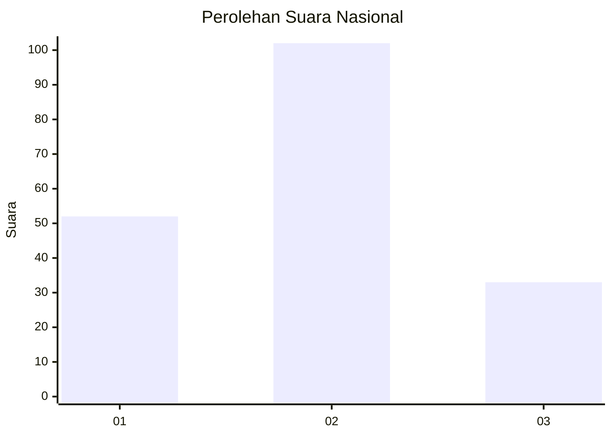
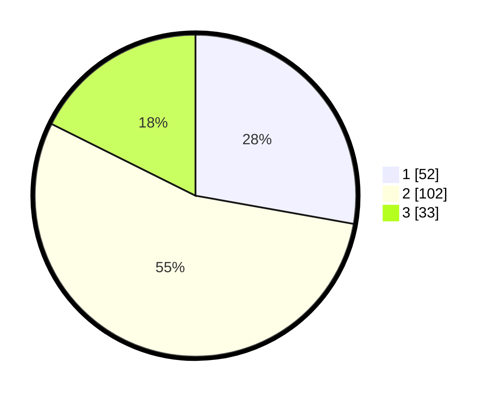

# Hasil

## Grafik

## Tabel

| No.    | Nama Paslon    | Suara | Suara (raw) | Persentase |
|:------ |:-------------- | -----:| -----------:| ----------:|
| 100025 | ANIES MUHAIMIN | 52    | [52][p-1]   | 27,81      |
| 100026 | PRABOWO GIBRAN | 102   | [102][p-2]  | 54,55      |
| 100027 | GANJAR MAHFUD  | 33    | [33][p-3]   | 17,65      |

[p-1]: https://github.com/gigit-pemilu/pemilu-2024/blob/main/pilpres/hitung-suara/sub/31-dki-jakarta/sub/73-jakarta-barat/sub/02-grogol-petamburan/sub/1004-jelambar/sub/079-tps/sub/paslon-1.txt
[p-2]: https://github.com/gigit-pemilu/pemilu-2024/blob/main/pilpres/hitung-suara/sub/31-dki-jakarta/sub/73-jakarta-barat/sub/02-grogol-petamburan/sub/1004-jelambar/sub/079-tps/sub/paslon-2.txt
[p-3]: https://github.com/gigit-pemilu/pemilu-2024/blob/main/pilpres/hitung-suara/sub/31-dki-jakarta/sub/73-jakarta-barat/sub/02-grogol-petamburan/sub/1004-jelambar/sub/079-tps/sub/paslon-3.txt

## Foto C Plano

https://sirekap-obj-formc.kpu.go.id/89d4/pemilu/ppwp/31/73/02/10/04/3173021004079-20240214-200025--5217a796-5fa3-45c7-8be8-71941bab44f4.jpg

https://sirekap-obj-formc.kpu.go.id/89d4/pemilu/ppwp/31/73/02/10/04/3173021004079-20240214-200813--4ccee6c7-ead9-4f91-a94e-62cf67584f7a.jpg

https://sirekap-obj-formc.kpu.go.id/89d4/pemilu/ppwp/31/73/02/10/04/3173021004079-20240214-200454--6efc4ba7-f5f3-4037-8de2-1fa11590bb24.jpg

## Metadata

| Key        | Value               |
| ---------- | ------------------- |
| Time Stamp | 2024-02-19 06:16:00 |

