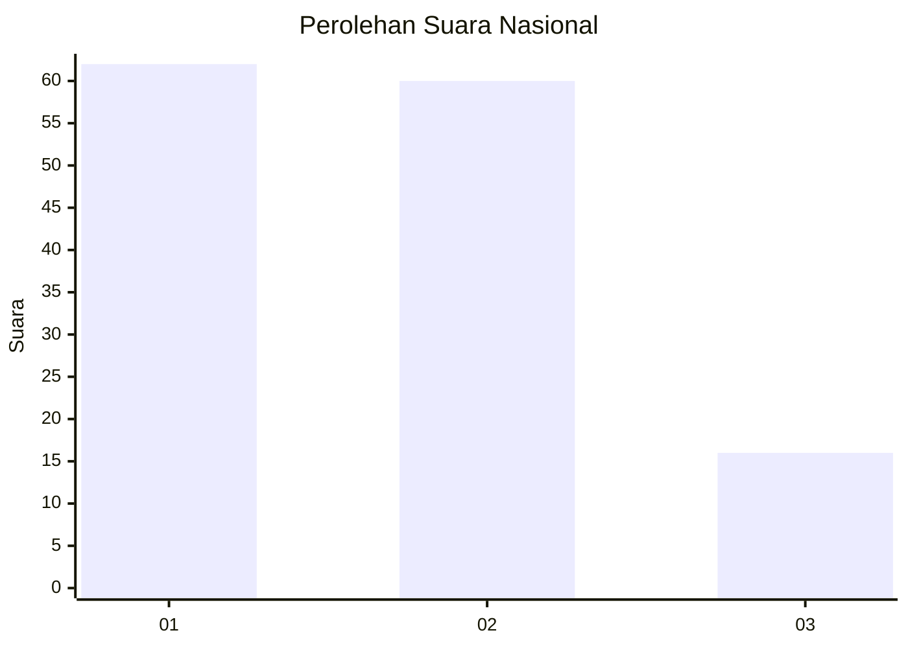
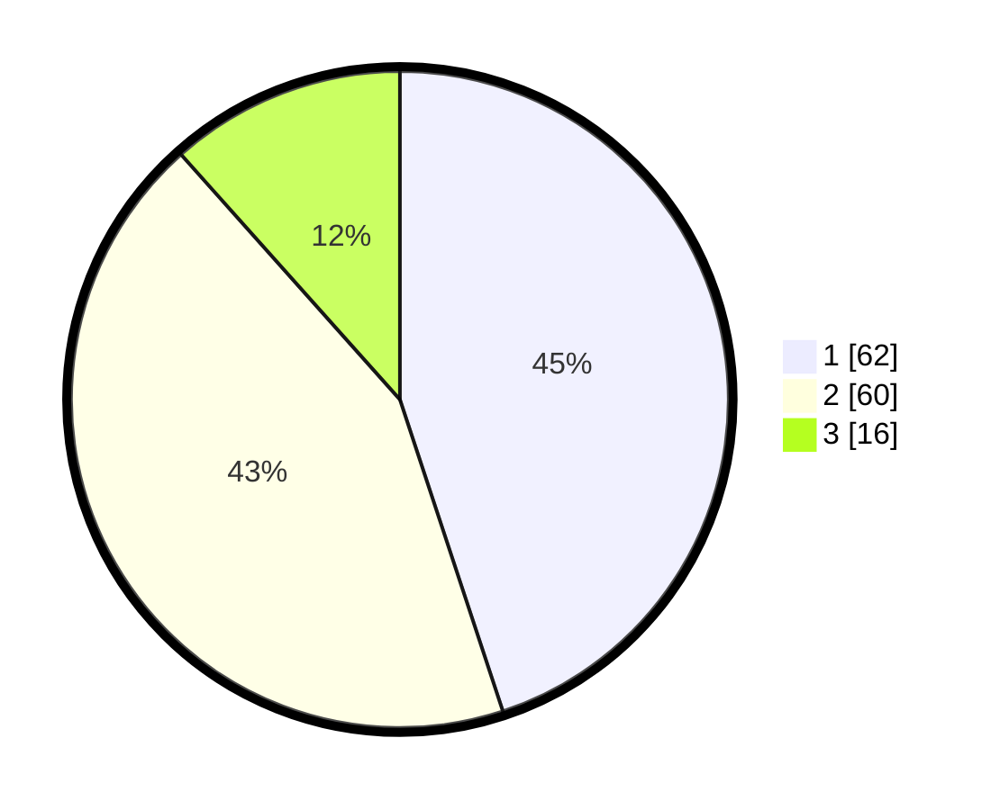

# Hasil

## Grafik

## Tabel

| No.    | Nama Paslon    | Suara | Suara (raw) | Persentase |
|:------ |:-------------- | -----:| -----------:| ----------:|
| 100025 | ANIES MUHAIMIN | 62    | [62][p-1]   | 44,93      |
| 100026 | PRABOWO GIBRAN | 60    | [60][p-2]   | 43,48      |
| 100027 | GANJAR MAHFUD  | 16    | [16][p-3]   | 11,59      |

[p-1]: https://github.com/gigit-pemilu/pemilu-2024/blob/main/pilpres/hitung-suara/sub/31-dki-jakarta/sub/73-jakarta-barat/sub/02-grogol-petamburan/sub/1004-jelambar/sub/083-tps/sub/paslon-1.txt
[p-2]: https://github.com/gigit-pemilu/pemilu-2024/blob/main/pilpres/hitung-suara/sub/31-dki-jakarta/sub/73-jakarta-barat/sub/02-grogol-petamburan/sub/1004-jelambar/sub/083-tps/sub/paslon-2.txt
[p-3]: https://github.com/gigit-pemilu/pemilu-2024/blob/main/pilpres/hitung-suara/sub/31-dki-jakarta/sub/73-jakarta-barat/sub/02-grogol-petamburan/sub/1004-jelambar/sub/083-tps/sub/paslon-3.txt

## Foto C Plano

https://sirekap-obj-formc.kpu.go.id/dbc7/pemilu/ppwp/31/73/02/10/04/3173021004083-20240214-192957--926b1403-b3be-48f0-8525-147eede81025.jpg

https://sirekap-obj-formc.kpu.go.id/dbc7/pemilu/ppwp/31/73/02/10/04/3173021004083-20240214-193052--b996a423-88dd-432a-acb2-6fbba72c3c5a.jpg

https://sirekap-obj-formc.kpu.go.id/dbc7/pemilu/ppwp/31/73/02/10/04/3173021004083-20240214-192815--40a2fe6b-d44a-485e-994b-4ccc7988e8db.jpg

## Metadata

| Key        | Value               |
| ---------- | ------------------- |
| Time Stamp | 2024-02-19 06:16:00 |

