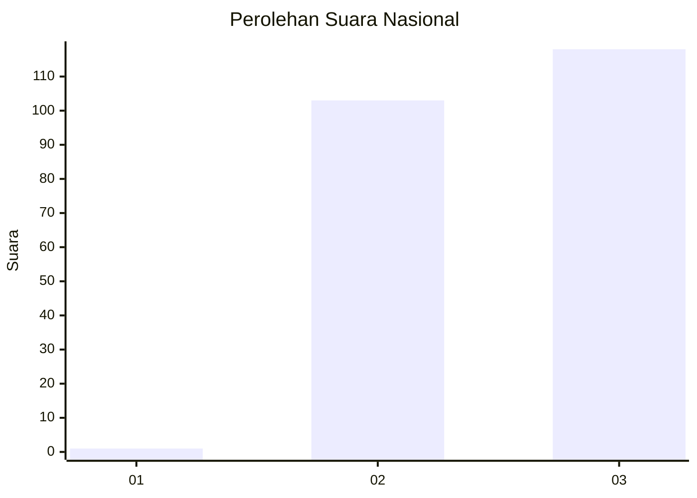
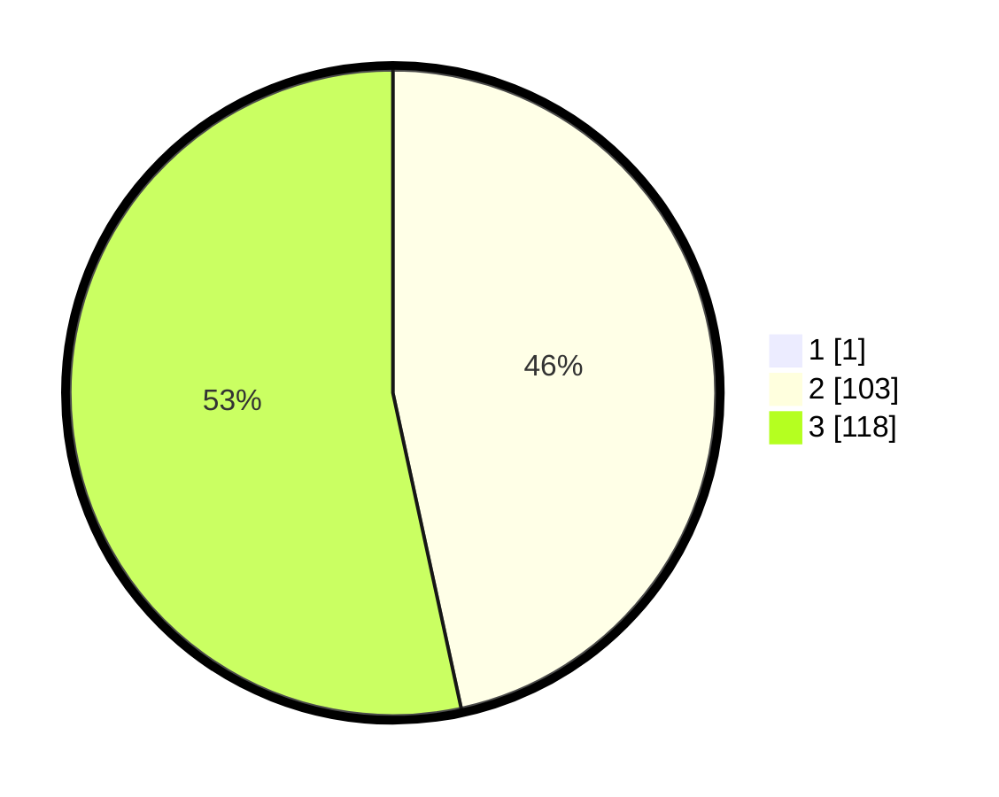

# Hasil

## Grafik

## Tabel

| No.    | Nama Paslon    | Suara | Suara (raw) | Persentase |
|:------ |:-------------- | -----:| -----------:| ----------:|
| 100025 | ANIES MUHAIMIN | 1     | [1][p-1]    | 0,45       |
| 100026 | PRABOWO GIBRAN | 103   | [103][p-2]  | 46,40      |
| 100027 | GANJAR MAHFUD  | 118   | [118][p-3]  | 53,15      |

[p-1]: https://github.com/gigit-pemilu/pemilu-2024/blob/main/pilpres/hitung-suara/sub/31-dki-jakarta/sub/73-jakarta-barat/sub/02-grogol-petamburan/sub/1004-jelambar/sub/085-tps/sub/paslon-1.txt
[p-2]: https://github.com/gigit-pemilu/pemilu-2024/blob/main/pilpres/hitung-suara/sub/31-dki-jakarta/sub/73-jakarta-barat/sub/02-grogol-petamburan/sub/1004-jelambar/sub/085-tps/sub/paslon-2.txt
[p-3]: https://github.com/gigit-pemilu/pemilu-2024/blob/main/pilpres/hitung-suara/sub/31-dki-jakarta/sub/73-jakarta-barat/sub/02-grogol-petamburan/sub/1004-jelambar/sub/085-tps/sub/paslon-3.txt

## Foto C Plano

https://sirekap-obj-formc.kpu.go.id/82ff/pemilu/ppwp/31/73/02/10/04/3173021004085-20240214-220336--8387da5e-6fc8-4a86-bb2b-cb2f41a6c9af.jpg

https://sirekap-obj-formc.kpu.go.id/82ff/pemilu/ppwp/31/73/02/10/04/3173021004085-20240214-220433--48d1cc6a-a447-40e4-9b6e-b69da40d789b.jpg

https://sirekap-obj-formc.kpu.go.id/82ff/pemilu/ppwp/31/73/02/10/04/3173021004085-20240214-220557--7c6ee0da-0e36-4945-9794-ae9d4ef7584e.jpg

## Metadata

| Key        | Value               |
| ---------- | ------------------- |
| Time Stamp | 2024-02-19 06:16:00 |

