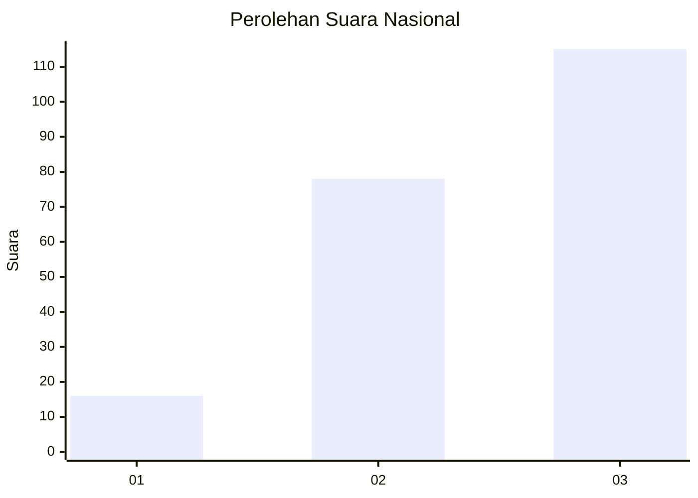
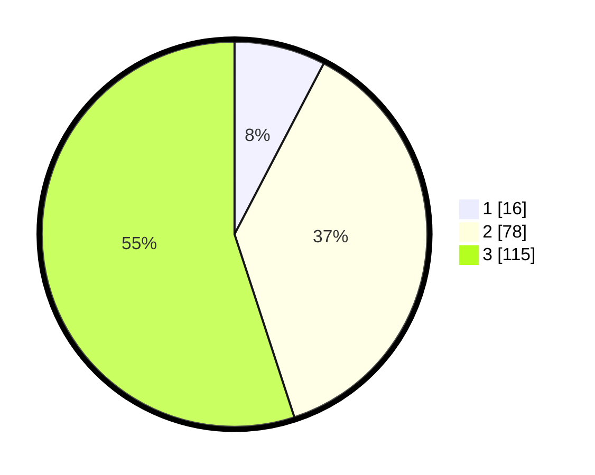

# Hasil

## Grafik

## Tabel

| No.    | Nama Paslon    | Suara | Suara (raw) | Persentase |
|:------ |:-------------- | -----:| -----------:| ----------:|
| 100025 | ANIES MUHAIMIN | 16    | [16][p-1]   | 7,66       |
| 100026 | PRABOWO GIBRAN | 78    | [78][p-2]   | 37,32      |
| 100027 | GANJAR MAHFUD  | 115   | [115][p-3]  | 55,02      |

[p-1]: https://github.com/gigit-pemilu/pemilu-2024/blob/main/pilpres/hitung-suara/sub/31-dki-jakarta/sub/73-jakarta-barat/sub/02-grogol-petamburan/sub/1004-jelambar/sub/089-tps/sub/paslon-1.txt
[p-2]: https://github.com/gigit-pemilu/pemilu-2024/blob/main/pilpres/hitung-suara/sub/31-dki-jakarta/sub/73-jakarta-barat/sub/02-grogol-petamburan/sub/1004-jelambar/sub/089-tps/sub/paslon-2.txt
[p-3]: https://github.com/gigit-pemilu/pemilu-2024/blob/main/pilpres/hitung-suara/sub/31-dki-jakarta/sub/73-jakarta-barat/sub/02-grogol-petamburan/sub/1004-jelambar/sub/089-tps/sub/paslon-3.txt

## Foto C Plano

https://sirekap-obj-formc.kpu.go.id/82c7/pemilu/ppwp/31/73/02/10/04/3173021004089-20240214-225025--21fb91cc-e9b0-453a-bde6-a1b5575f9e11.jpg

https://sirekap-obj-formc.kpu.go.id/82c7/pemilu/ppwp/31/73/02/10/04/3173021004089-20240214-225040--0e45808f-750e-4f76-b443-d9ff3ff81fda.jpg

https://sirekap-obj-formc.kpu.go.id/82c7/pemilu/ppwp/31/73/02/10/04/3173021004089-20240214-225056--e5db84bb-d2db-47a7-9c99-cb2c037656e8.jpg

## Metadata

| Key        | Value               |
| ---------- | ------------------- |
| Time Stamp | 2024-02-19 06:16:00 |

