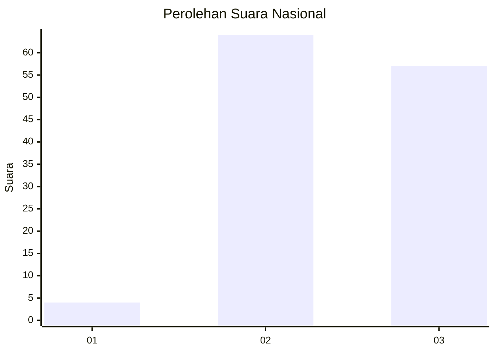
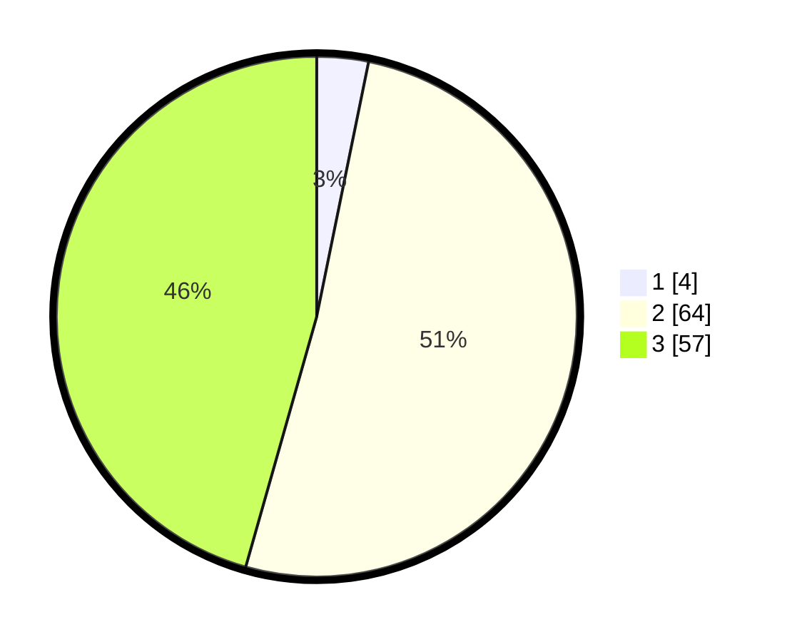

# Hasil

## Grafik

## Tabel

| No.    | Nama Paslon    | Suara | Suara (raw) | Persentase |
|:------ |:-------------- | -----:| -----------:| ----------:|
| 100025 | ANIES MUHAIMIN | 4     | [4][p-1]    | 3,20       |
| 100026 | PRABOWO GIBRAN | 64    | [64][p-2]   | 51,20      |
| 100027 | GANJAR MAHFUD  | 57    | [57][p-3]   | 45,60      |

[p-1]: https://github.com/gigit-pemilu/pemilu-2024/blob/main/pilpres/hitung-suara/sub/31-dki-jakarta/sub/73-jakarta-barat/sub/02-grogol-petamburan/sub/1004-jelambar/sub/091-tps/sub/paslon-1.txt
[p-2]: https://github.com/gigit-pemilu/pemilu-2024/blob/main/pilpres/hitung-suara/sub/31-dki-jakarta/sub/73-jakarta-barat/sub/02-grogol-petamburan/sub/1004-jelambar/sub/091-tps/sub/paslon-2.txt
[p-3]: https://github.com/gigit-pemilu/pemilu-2024/blob/main/pilpres/hitung-suara/sub/31-dki-jakarta/sub/73-jakarta-barat/sub/02-grogol-petamburan/sub/1004-jelambar/sub/091-tps/sub/paslon-3.txt

## Foto C Plano

https://sirekap-obj-formc.kpu.go.id/0d14/pemilu/ppwp/31/73/02/10/04/3173021004091-20240214-211707--b5cd2d73-3b03-47ee-9965-77ea22355b75.jpg

https://sirekap-obj-formc.kpu.go.id/0d14/pemilu/ppwp/31/73/02/10/04/3173021004091-20240214-211333--7c3f75b9-8d03-44fc-83db-c81188b3199a.jpg

https://sirekap-obj-formc.kpu.go.id/0d14/pemilu/ppwp/31/73/02/10/04/3173021004091-20240214-211419--64cb5f84-9963-4049-b234-20e509df0087.jpg

## Metadata

| Key        | Value               |
| ---------- | ------------------- |
| Time Stamp | 2024-02-15 09:00:24 |

