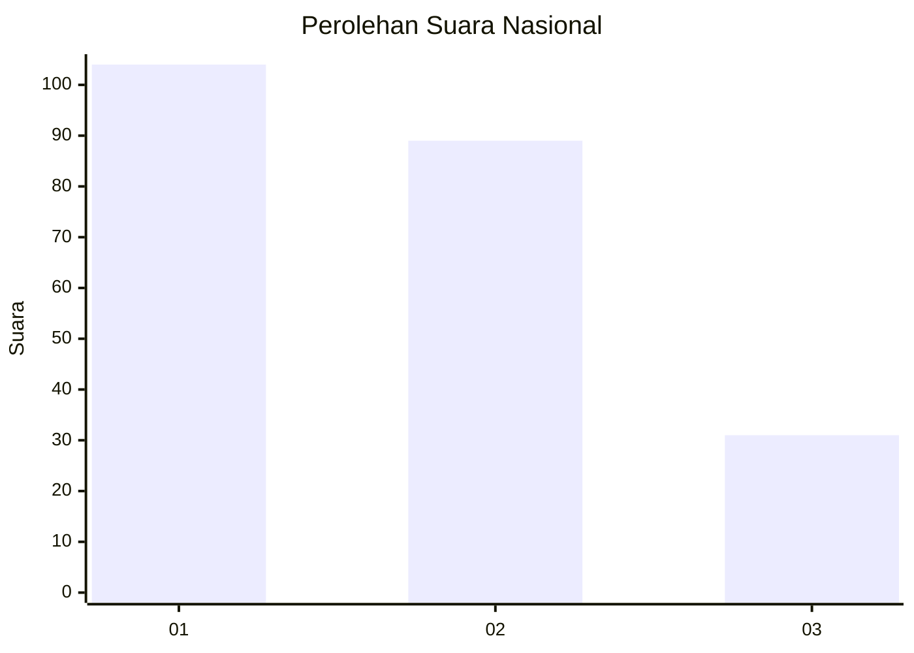
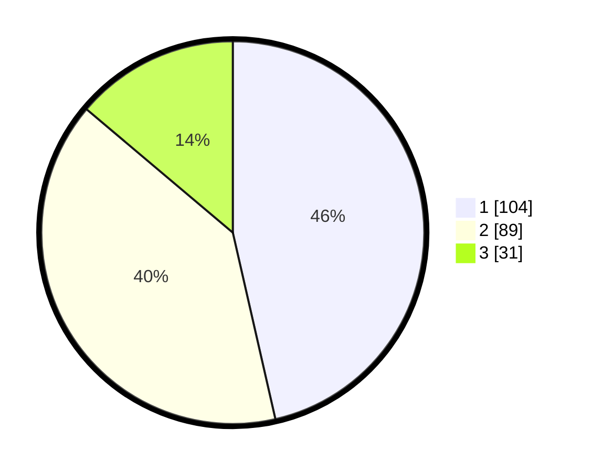

# Hasil

## Grafik

## Tabel

| No.    | Nama Paslon    | Suara | Suara (raw) | Persentase |
|:------ |:-------------- | -----:| -----------:| ----------:|
| 100025 | ANIES MUHAIMIN | 104   | [104][p-1]  | 46,43      |
| 100026 | PRABOWO GIBRAN | 89    | [89][p-2]   | 39,73      |
| 100027 | GANJAR MAHFUD  | 31    | [31][p-3]   | 13,84      |

[p-1]: https://github.com/gigit-pemilu/pemilu-2024/blob/main/pilpres/hitung-suara/sub/31-dki-jakarta/sub/73-jakarta-barat/sub/02-grogol-petamburan/sub/1005-tanjung-duren-selatan/sub/015-tps/sub/paslon-1.txt
[p-2]: https://github.com/gigit-pemilu/pemilu-2024/blob/main/pilpres/hitung-suara/sub/31-dki-jakarta/sub/73-jakarta-barat/sub/02-grogol-petamburan/sub/1005-tanjung-duren-selatan/sub/015-tps/sub/paslon-2.txt
[p-3]: https://github.com/gigit-pemilu/pemilu-2024/blob/main/pilpres/hitung-suara/sub/31-dki-jakarta/sub/73-jakarta-barat/sub/02-grogol-petamburan/sub/1005-tanjung-duren-selatan/sub/015-tps/sub/paslon-3.txt

## Foto C Plano

https://sirekap-obj-formc.kpu.go.id/cf14/pemilu/ppwp/31/73/02/10/05/3173021005015-20240214-212905--1c14fcd8-3dce-4e32-95e6-ed086c74feb9.jpg

https://sirekap-obj-formc.kpu.go.id/cf14/pemilu/ppwp/31/73/02/10/05/3173021005015-20240214-213056--c46077cf-f67c-4f86-b29c-b5250331fd56.jpg

https://sirekap-obj-formc.kpu.go.id/cf14/pemilu/ppwp/31/73/02/10/05/3173021005015-20240214-213144--e670e896-1aa2-4120-9111-4868541c1e95.jpg

## Metadata

| Key        | Value               |
| ---------- | ------------------- |
| Time Stamp | 2024-02-21 16:00:00 |

