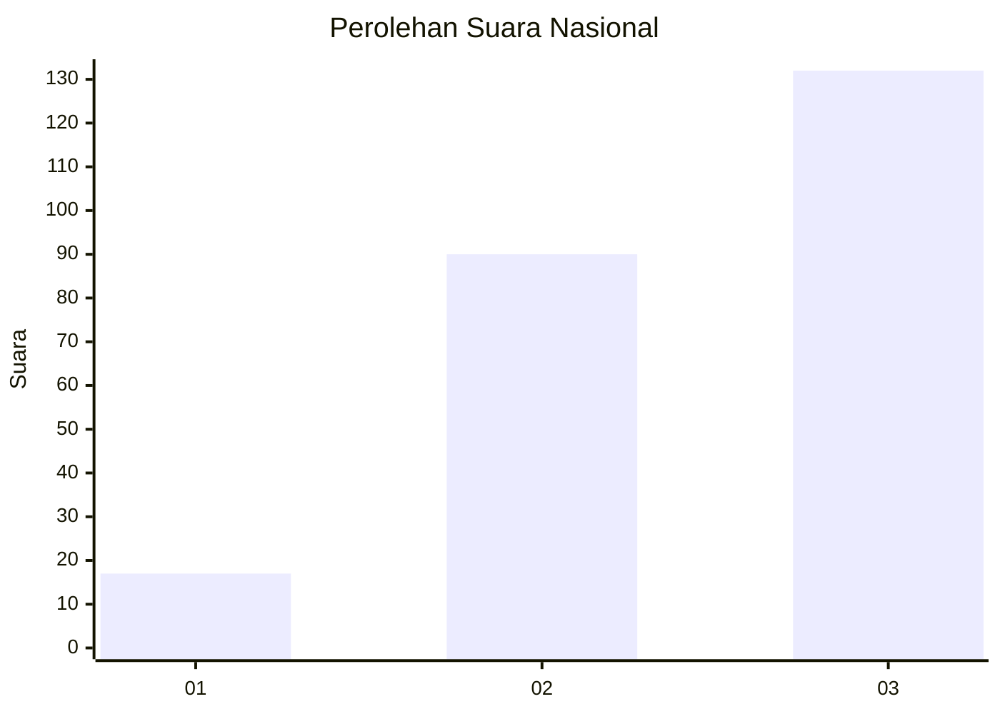
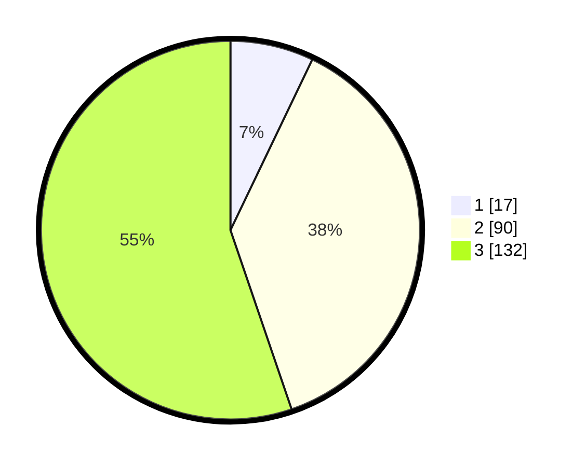

# Hasil

## Grafik

## Tabel

| No.    | Nama Paslon    | Suara | Suara (raw) | Persentase |
|:------ |:-------------- | -----:| -----------:| ----------:|
| 100025 | ANIES MUHAIMIN | 17    | [17][p-1]   | 7,11       |
| 100026 | PRABOWO GIBRAN | 90    | [90][p-2]   | 37,66      |
| 100027 | GANJAR MAHFUD  | 132   | [132][p-3]  | 55,23      |

[p-1]: https://github.com/gigit-pemilu/pemilu-2024/blob/main/pilpres/hitung-suara/sub/31-dki-jakarta/sub/73-jakarta-barat/sub/02-grogol-petamburan/sub/1005-tanjung-duren-selatan/sub/057-tps/sub/paslon-1.txt
[p-2]: https://github.com/gigit-pemilu/pemilu-2024/blob/main/pilpres/hitung-suara/sub/31-dki-jakarta/sub/73-jakarta-barat/sub/02-grogol-petamburan/sub/1005-tanjung-duren-selatan/sub/057-tps/sub/paslon-2.txt
[p-3]: https://github.com/gigit-pemilu/pemilu-2024/blob/main/pilpres/hitung-suara/sub/31-dki-jakarta/sub/73-jakarta-barat/sub/02-grogol-petamburan/sub/1005-tanjung-duren-selatan/sub/057-tps/sub/paslon-3.txt

## Foto C Plano

https://sirekap-obj-formc.kpu.go.id/587c/pemilu/ppwp/31/73/02/10/05/3173021005057-20240215-022813--f75a83af-4e84-4588-898a-51e0913dc0fd.jpg

https://sirekap-obj-formc.kpu.go.id/587c/pemilu/ppwp/31/73/02/10/05/3173021005057-20240214-233442--56c1e175-a13f-474c-8663-60a75e459435.jpg

https://sirekap-obj-formc.kpu.go.id/587c/pemilu/ppwp/31/73/02/10/05/3173021005057-20240215-022912--69797cd3-1039-42bb-bc65-3f8ae35826bd.jpg

## Metadata

| Key        | Value               |
| ---------- | ------------------- |
| Time Stamp | 2024-02-16 03:00:26 |

