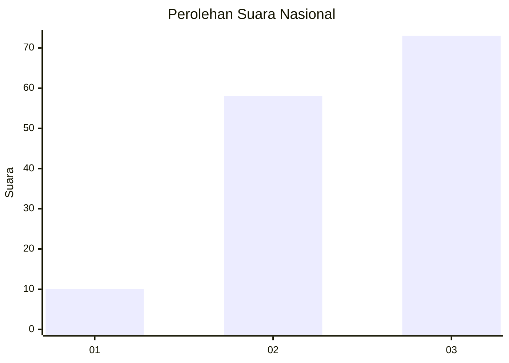
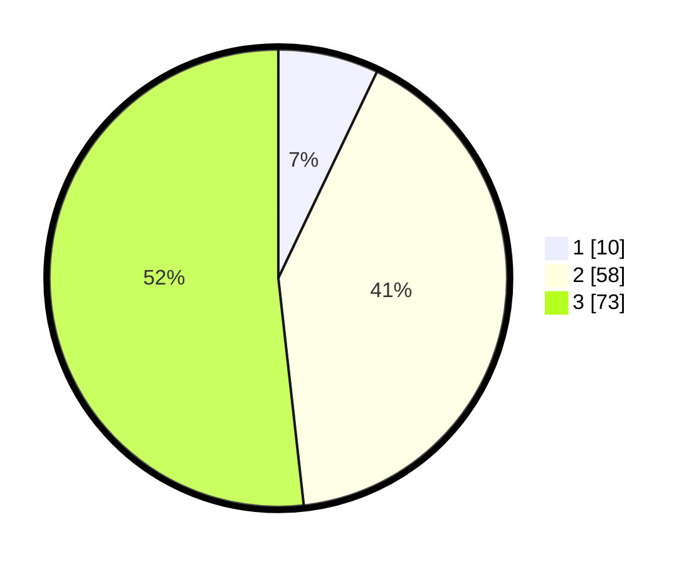

# Hasil

## Grafik

## Tabel

| No.    | Nama Paslon    | Suara | Suara (raw) | Persentase |
|:------ |:-------------- | -----:| -----------:| ----------:|
| 100025 | ANIES MUHAIMIN | 10    | [10][p-1]   | 7,09       |
| 100026 | PRABOWO GIBRAN | 58    | [58][p-2]   | 41,13      |
| 100027 | GANJAR MAHFUD  | 73    | [73][p-3]   | 51,77      |

[p-1]: https://github.com/gigit-pemilu/pemilu-2024/blob/main/pilpres/hitung-suara/sub/31-dki-jakarta/sub/73-jakarta-barat/sub/02-grogol-petamburan/sub/1005-tanjung-duren-selatan/sub/075-tps/sub/paslon-1.txt
[p-2]: https://github.com/gigit-pemilu/pemilu-2024/blob/main/pilpres/hitung-suara/sub/31-dki-jakarta/sub/73-jakarta-barat/sub/02-grogol-petamburan/sub/1005-tanjung-duren-selatan/sub/075-tps/sub/paslon-2.txt
[p-3]: https://github.com/gigit-pemilu/pemilu-2024/blob/main/pilpres/hitung-suara/sub/31-dki-jakarta/sub/73-jakarta-barat/sub/02-grogol-petamburan/sub/1005-tanjung-duren-selatan/sub/075-tps/sub/paslon-3.txt

## Foto C Plano

https://sirekap-obj-formc.kpu.go.id/75ec/pemilu/ppwp/31/73/02/10/05/3173021005075-20240216-080135--8844ac34-006c-45cd-8b31-18884e6e7fda.jpg

https://sirekap-obj-formc.kpu.go.id/75ec/pemilu/ppwp/31/73/02/10/05/3173021005075-20240216-080143--673a17cf-0c03-4c0d-bc62-44ba16f46d68.jpg

https://sirekap-obj-formc.kpu.go.id/75ec/pemilu/ppwp/31/73/02/10/05/3173021005075-20240216-080152--5ca4a570-97a1-4232-b863-942ae2f31ae9.jpg

## Metadata

| Key        | Value               |
| ---------- | ------------------- |
| Time Stamp | 2024-02-16 16:25:10 |

