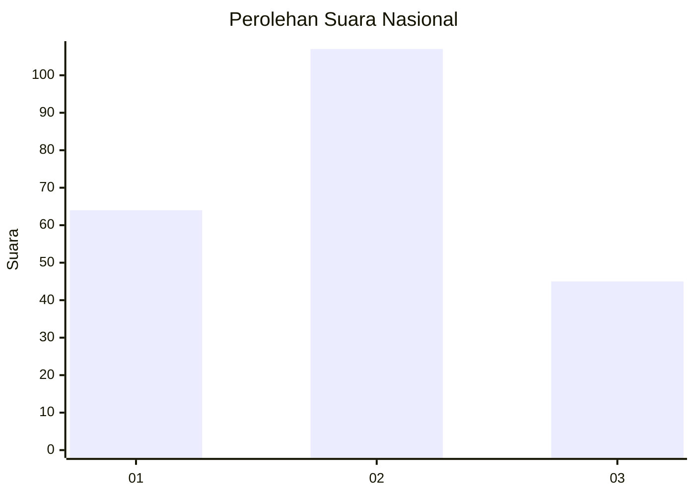
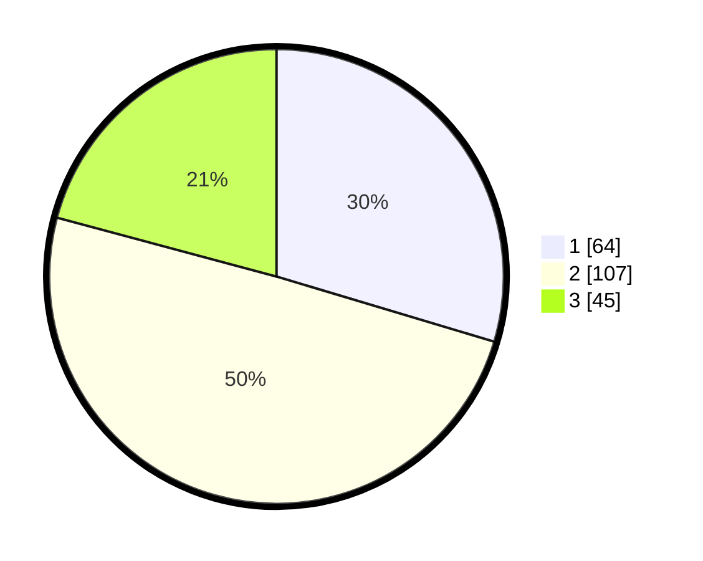

# Hasil

## Grafik

## Tabel

| No.    | Nama Paslon    | Suara | Suara (raw) | Persentase |
|:------ |:-------------- | -----:| -----------:| ----------:|
| 100025 | ANIES MUHAIMIN | 64    | [64][p-1]   | 29,63      |
| 100026 | PRABOWO GIBRAN | 107   | [107][p-2]  | 49,54      |
| 100027 | GANJAR MAHFUD  | 45    | [45][p-3]   | 20,83      |

[p-1]: https://github.com/gigit-pemilu/pemilu-2024/blob/main/pilpres/hitung-suara/sub/31-dki-jakarta/sub/73-jakarta-barat/sub/02-grogol-petamburan/sub/1006-jelambar-baru/sub/004-tps/sub/paslon-1.txt
[p-2]: https://github.com/gigit-pemilu/pemilu-2024/blob/main/pilpres/hitung-suara/sub/31-dki-jakarta/sub/73-jakarta-barat/sub/02-grogol-petamburan/sub/1006-jelambar-baru/sub/004-tps/sub/paslon-2.txt
[p-3]: https://github.com/gigit-pemilu/pemilu-2024/blob/main/pilpres/hitung-suara/sub/31-dki-jakarta/sub/73-jakarta-barat/sub/02-grogol-petamburan/sub/1006-jelambar-baru/sub/004-tps/sub/paslon-3.txt

## Foto C Plano

https://sirekap-obj-formc.kpu.go.id/8602/pemilu/ppwp/31/73/02/10/06/3173021006004-20240214-203712--bf775214-8023-46f8-9f56-1bd1dc6b6ae1.jpg

https://sirekap-obj-formc.kpu.go.id/8602/pemilu/ppwp/31/73/02/10/06/3173021006004-20240214-203952--ba139a49-89df-4e89-a9a2-00bf9506be60.jpg

https://sirekap-obj-formc.kpu.go.id/8602/pemilu/ppwp/31/73/02/10/06/3173021006004-20240214-204148--afcb608d-49ab-4080-9f08-defa6056a5c0.jpg

## Metadata

| Key        | Value               |
| ---------- | ------------------- |
| Time Stamp | 2024-02-16 01:30:27 |

