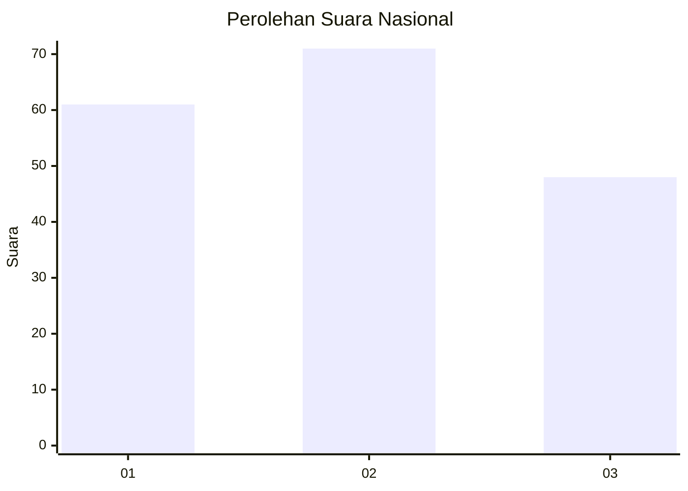
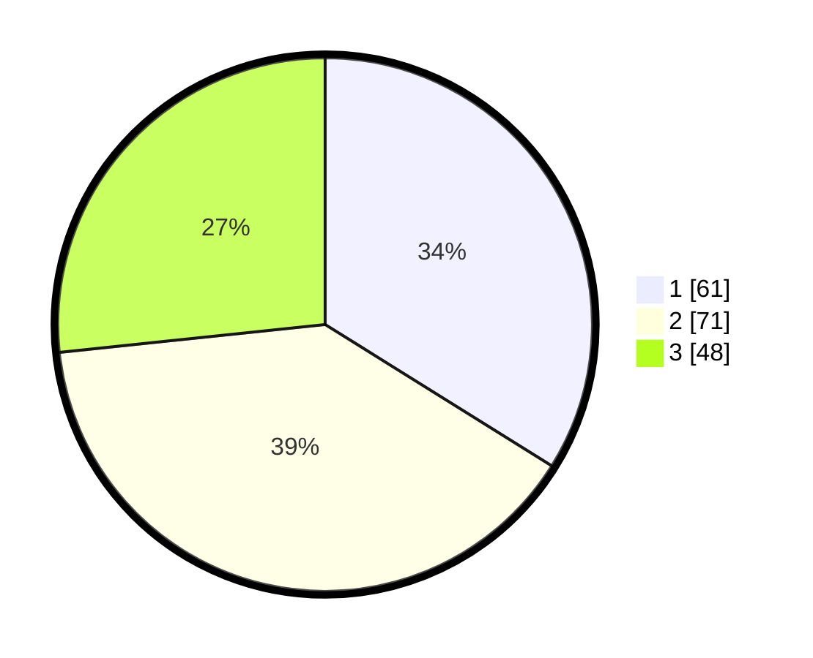

# Hasil

## Grafik

## Tabel

| No.    | Nama Paslon    | Suara | Suara (raw) | Persentase |
|:------ |:-------------- | -----:| -----------:| ----------:|
| 100025 | ANIES MUHAIMIN | 61    | [61][p-1]   | 33,89      |
| 100026 | PRABOWO GIBRAN | 71    | [71][p-2]   | 39,44      |
| 100027 | GANJAR MAHFUD  | 48    | [48][p-3]   | 26,67      |

[p-1]: https://github.com/gigit-pemilu/pemilu-2024/blob/main/pilpres/hitung-suara/sub/31-dki-jakarta/sub/73-jakarta-barat/sub/02-grogol-petamburan/sub/1006-jelambar-baru/sub/007-tps/sub/paslon-1.txt
[p-2]: https://github.com/gigit-pemilu/pemilu-2024/blob/main/pilpres/hitung-suara/sub/31-dki-jakarta/sub/73-jakarta-barat/sub/02-grogol-petamburan/sub/1006-jelambar-baru/sub/007-tps/sub/paslon-2.txt
[p-3]: https://github.com/gigit-pemilu/pemilu-2024/blob/main/pilpres/hitung-suara/sub/31-dki-jakarta/sub/73-jakarta-barat/sub/02-grogol-petamburan/sub/1006-jelambar-baru/sub/007-tps/sub/paslon-3.txt

## Foto C Plano

https://sirekap-obj-formc.kpu.go.id/827f/pemilu/ppwp/31/73/02/10/06/3173021006007-20240216-064639--daa4c3a2-b3fd-427a-bd27-b11399f09bf7.jpg

https://sirekap-obj-formc.kpu.go.id/827f/pemilu/ppwp/31/73/02/10/06/3173021006007-20240217-213500--4f95c6b0-aa61-4a03-9046-a87875cc625d.jpg

https://sirekap-obj-formc.kpu.go.id/827f/pemilu/ppwp/31/73/02/10/06/3173021006007-20240214-155548--04307e36-0350-4208-832b-2bc84b7af0f8.jpg

## Metadata

| Key        | Value               |
| ---------- | ------------------- |
| Time Stamp | 2024-02-19 21:00:00 |

