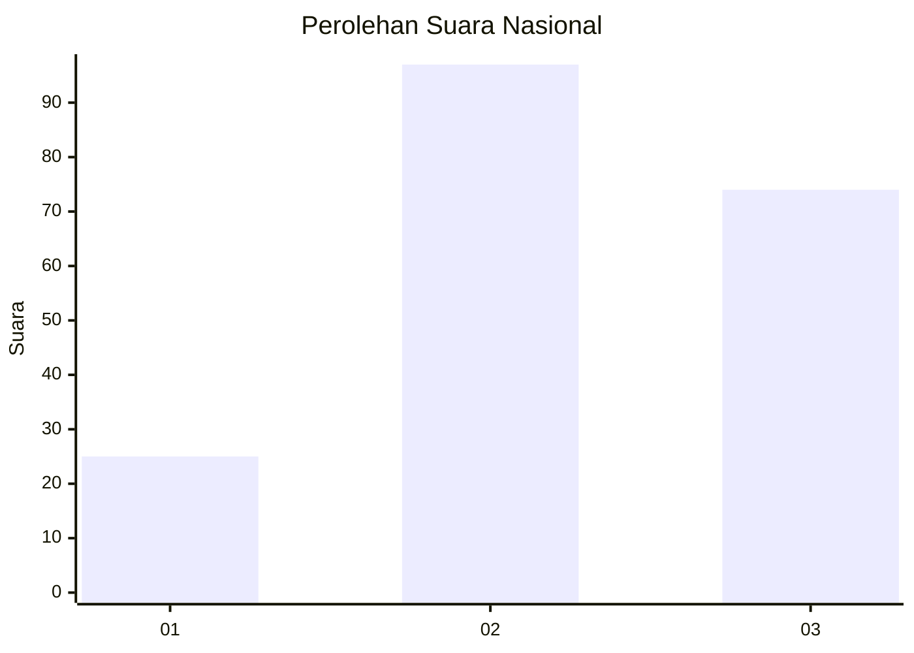
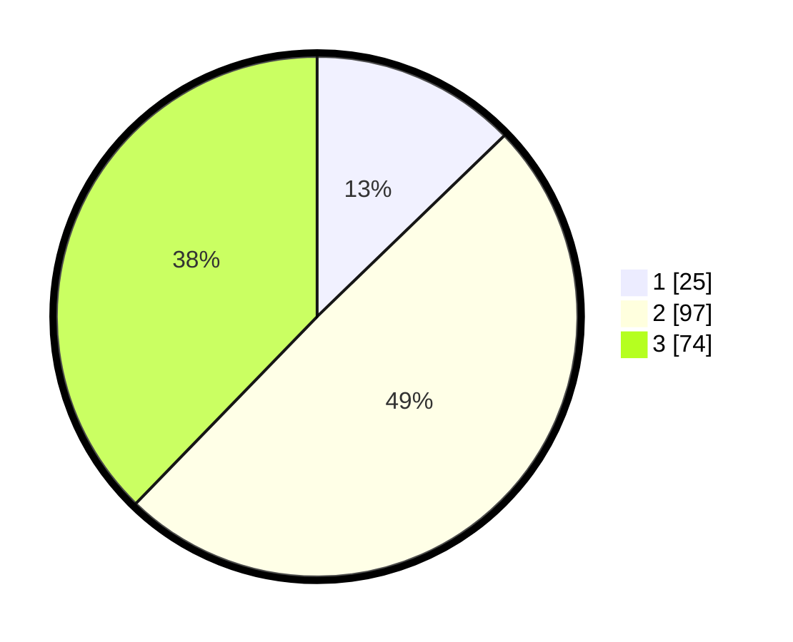

# Hasil

## Grafik

## Tabel

| No.    | Nama Paslon    | Suara | Suara (raw) | Persentase |
|:------ |:-------------- | -----:| -----------:| ----------:|
| 100025 | ANIES MUHAIMIN | 25    | [25][p-1]   | 12,76      |
| 100026 | PRABOWO GIBRAN | 97    | [97][p-2]   | 49,49      |
| 100027 | GANJAR MAHFUD  | 74    | [74][p-3]   | 37,76      |

[p-1]: https://github.com/gigit-pemilu/pemilu-2024/blob/main/pilpres/hitung-suara/sub/31-dki-jakarta/sub/73-jakarta-barat/sub/02-grogol-petamburan/sub/1006-jelambar-baru/sub/037-tps/sub/paslon-1.txt
[p-2]: https://github.com/gigit-pemilu/pemilu-2024/blob/main/pilpres/hitung-suara/sub/31-dki-jakarta/sub/73-jakarta-barat/sub/02-grogol-petamburan/sub/1006-jelambar-baru/sub/037-tps/sub/paslon-2.txt
[p-3]: https://github.com/gigit-pemilu/pemilu-2024/blob/main/pilpres/hitung-suara/sub/31-dki-jakarta/sub/73-jakarta-barat/sub/02-grogol-petamburan/sub/1006-jelambar-baru/sub/037-tps/sub/paslon-3.txt

## Foto C Plano

https://sirekap-obj-formc.kpu.go.id/64ea/pemilu/ppwp/31/73/02/10/06/3173021006037-20240215-001748--76b45cd3-012b-4b5d-92d7-e1fe9132a7a6.jpg

https://sirekap-obj-formc.kpu.go.id/64ea/pemilu/ppwp/31/73/02/10/06/3173021006037-20240215-005149--fdeb9beb-7ddf-4d0d-8e22-f97743b44159.jpg

https://sirekap-obj-formc.kpu.go.id/64ea/pemilu/ppwp/31/73/02/10/06/3173021006037-20240215-005718--1f7d217f-c7aa-47d1-89c8-6a7f5ffa54ba.jpg

## Metadata

| Key        | Value               |
| ---------- | ------------------- |
| Time Stamp | 2024-02-15 12:00:28 |

