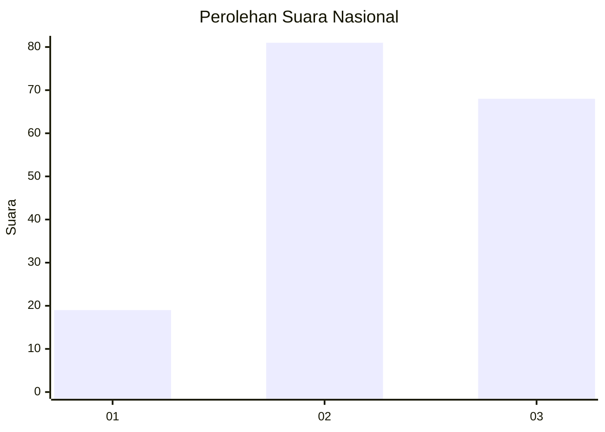
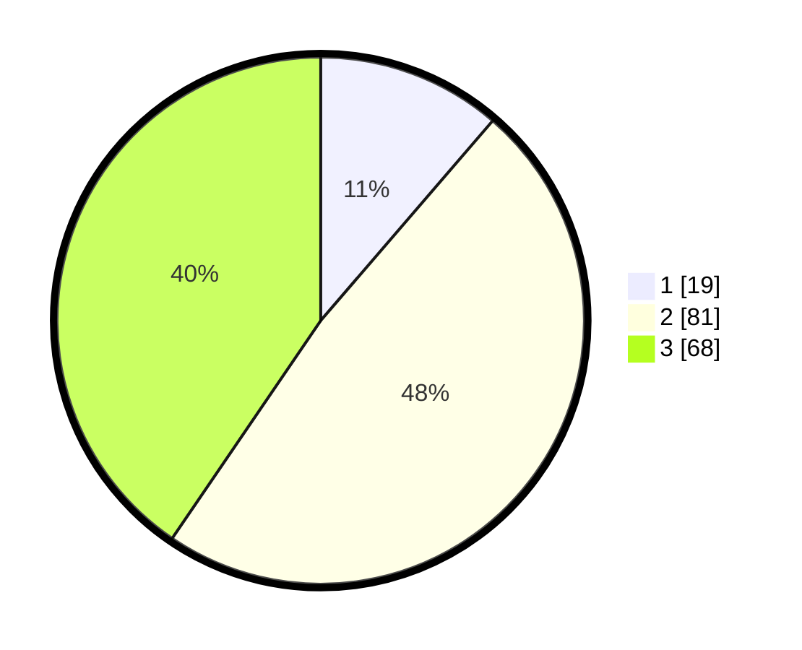

# Hasil

## Grafik

## Tabel

| No.    | Nama Paslon    | Suara | Suara (raw) | Persentase |
|:------ |:-------------- | -----:| -----------:| ----------:|
| 100025 | ANIES MUHAIMIN | 19    | [19][p-1]   | 11,31      |
| 100026 | PRABOWO GIBRAN | 81    | [81][p-2]   | 48,21      |
| 100027 | GANJAR MAHFUD  | 68    | [68][p-3]   | 40,48      |

[p-1]: https://github.com/gigit-pemilu/pemilu-2024/blob/main/pilpres/hitung-suara/sub/31-dki-jakarta/sub/73-jakarta-barat/sub/02-grogol-petamburan/sub/1006-jelambar-baru/sub/038-tps/sub/paslon-1.txt
[p-2]: https://github.com/gigit-pemilu/pemilu-2024/blob/main/pilpres/hitung-suara/sub/31-dki-jakarta/sub/73-jakarta-barat/sub/02-grogol-petamburan/sub/1006-jelambar-baru/sub/038-tps/sub/paslon-2.txt
[p-3]: https://github.com/gigit-pemilu/pemilu-2024/blob/main/pilpres/hitung-suara/sub/31-dki-jakarta/sub/73-jakarta-barat/sub/02-grogol-petamburan/sub/1006-jelambar-baru/sub/038-tps/sub/paslon-3.txt

## Foto C Plano

https://sirekap-obj-formc.kpu.go.id/43af/pemilu/ppwp/31/73/02/10/06/3173021006038-20240214-232124--7d7afb02-f8b0-42d1-b5b5-9c0d9f1273c0.jpg

https://sirekap-obj-formc.kpu.go.id/43af/pemilu/ppwp/31/73/02/10/06/3173021006038-20240214-232322--f17e32b9-3f1d-4e7e-842a-9bed6b21bbc2.jpg

https://sirekap-obj-formc.kpu.go.id/43af/pemilu/ppwp/31/73/02/10/06/3173021006038-20240214-232438--e7dde9ac-cd32-4a6e-bfce-b5922d5ac46d.jpg

## Metadata

| Key        | Value               |
| ---------- | ------------------- |
| Time Stamp | 2024-02-16 01:30:27 |

