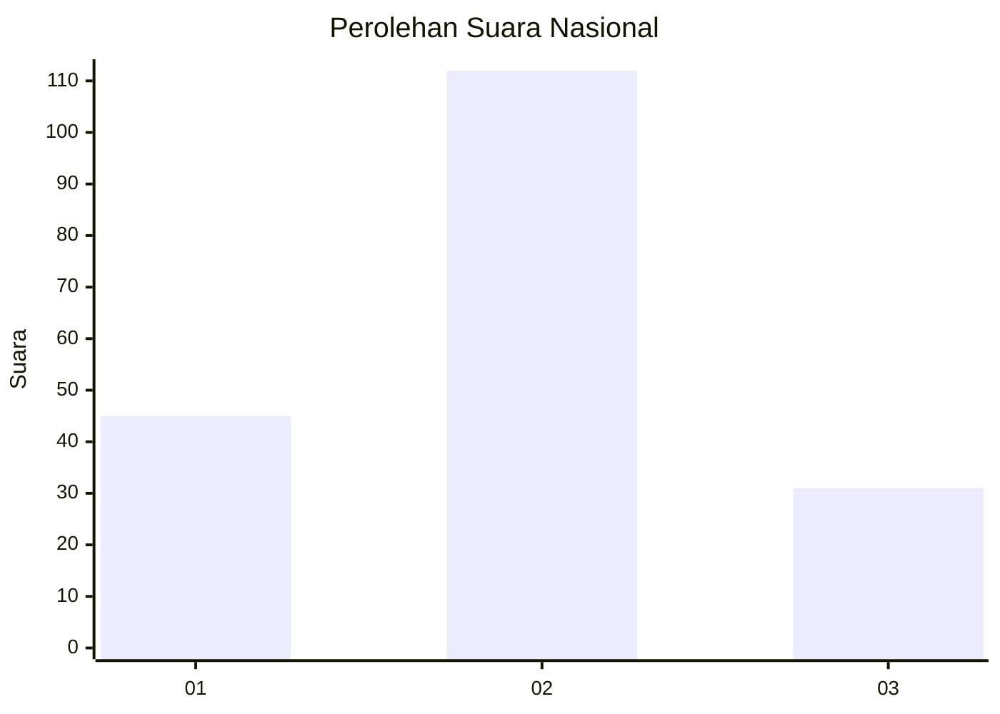

# Hasil

## Grafik

## Tabel

| No.    | Nama Paslon    | Suara | Suara (raw) | Persentase |
|:------ |:-------------- | -----:| -----------:| ----------:|
| 100025 | ANIES MUHAIMIN | 45    | [45][p-1]   | 23,94      |
| 100026 | PRABOWO GIBRAN | 112   | [112][p-2]  | 59,57      |
| 100027 | GANJAR MAHFUD  | 31    | [31][p-3]   | 16,49      |

[p-1]: https://github.com/gigit-pemilu/pemilu-2024/blob/main/pilpres/hitung-suara/sub/31-dki-jakarta/sub/73-jakarta-barat/sub/02-grogol-petamburan/sub/1006-jelambar-baru/sub/048-tps/sub/paslon-1.txt
[p-2]: https://github.com/gigit-pemilu/pemilu-2024/blob/main/pilpres/hitung-suara/sub/31-dki-jakarta/sub/73-jakarta-barat/sub/02-grogol-petamburan/sub/1006-jelambar-baru/sub/048-tps/sub/paslon-2.txt
[p-3]: https://github.com/gigit-pemilu/pemilu-2024/blob/main/pilpres/hitung-suara/sub/31-dki-jakarta/sub/73-jakarta-barat/sub/02-grogol-petamburan/sub/1006-jelambar-baru/sub/048-tps/sub/paslon-3.txt

## Foto C Plano

https://sirekap-obj-formc.kpu.go.id/98c4/pemilu/ppwp/31/73/02/10/06/3173021006048-20240215-020500--b586ae77-2bdd-41e0-a912-85979c598be7.jpg

https://sirekap-obj-formc.kpu.go.id/98c4/pemilu/ppwp/31/73/02/10/06/3173021006048-20240215-021759--4dbf7c4e-1431-46b2-a1f4-b79364f79015.jpg

https://sirekap-obj-formc.kpu.go.id/98c4/pemilu/ppwp/31/73/02/10/06/3173021006048-20240215-021919--ce611820-339d-499c-afff-16c6c9fd97a6.jpg

## Metadata

| Key        | Value               |
| ---------- | ------------------- |
| Time Stamp | 2024-02-19 11:00:00 |

